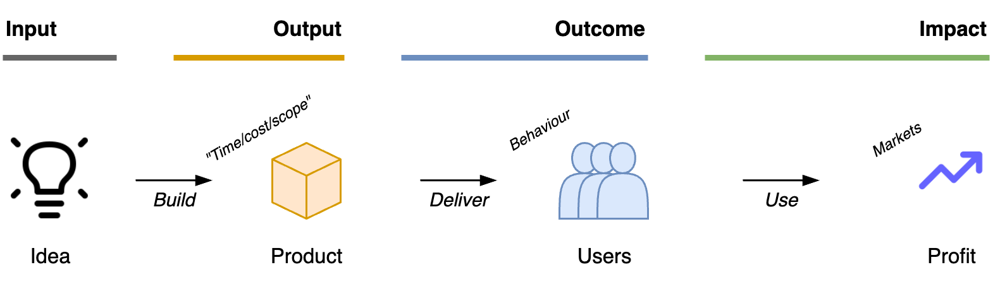
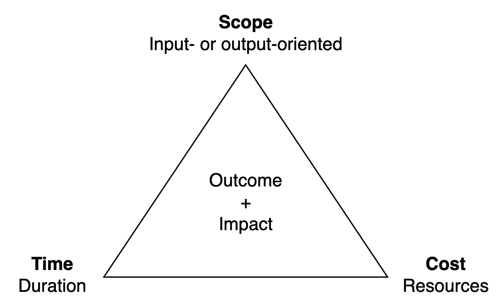

# Project Requirements

This document focusses on requirements for a single *unit* of work. This can be an initiative or a project. It follows a given [objective](../management/goals-planning-strategy.md) and [narrative](../management/results.md). Also see [requirements gathering](./discovery.md).

[toc]

## Overview

Requirements are a form of [documentation](documentation.md). Their primary purpose depends on the audience and the significance of the project or task. This influences the level of detail and any assumptions that should be made.

- Requirements may be hierarchical. E.g. multiple deliverables within a project.
- Requirements may be written from different perspectives. E.g. a functional view, system view or component view.


Standard factors

1. An **objective** or target state. The benefit to the customer or stakeholder. E.g. a problem that is addressed. This includes the identity of the owner of the problem.
2. A **proposal**. A solution or initiative that will change the current state. Ideally this minimizes *output* (cost) and maximizes *outcomes*.
3. **Constraints** on the solution and the process. E.g. acceptance criteria or target conditions. These guarantee a minimum standard of *quality* of the product.
4. **Risks**, uncertainty and potential side-effects. This shows the limits of our understanding of the (future) environment. This can include mitigation of risks.

This can be complemented by media that clarifies the situation.

- An explanation of the **current situation**

- Examples *elaborate* requirements.

- Tests (checks) *verify* requirements.


> Shared documents ≠ shared understanding 

Documents are not supposed to be perfect. Rather, consider if the following questions are anwered.

- How will this help the user or customer?
- What will be the impact of this implementation?


> *Complicated* is just a euphemism for "scary to think about".

Investigate or resolve ambiguity.


### Scope

Typical requirements include time- and cost-bounds, and a *scope*. In theory, only two out of these three can be guaranteed. The scope can be defined in different levels:

- **Input**-based. This bears the least uncertainty, but the output itself may be unpredictable.
- **Output**-based. This leaves some freedom on the implementation side.  If risk materialize, either time or cost would have to be let go.
  - The bias on building something incentivizes over-engineering.
- **Outcome**-based. This focusses on solving a (user-centric) problem, with minimal effort. It incentivizes building the right thing, rather than something.
  - There is an incentive to solve the underlying problem, rather than the initially suggested problem. This can be uncomfortable.

In complex contexts, there is structural *uncertainty*. During execution of a task, more information will be discovered. The plan has to be adjusted when the initial requirements become outdated. The main challenge here is to choose whether to adjust the scope, the end date, or find another solution.

A (in)direct result of the scope is **impact**. E.g. the effect of the initiative on a metric such as revenue. This usually  easier to measure than outcomes.




|                 | 📦 Output        | 👤 Outcome | 💰 Impact             |
| --------------- | --------------- | --------- | -------------------- |
| **Factors**     | Time/cost/scope | Behaviour | Environment, markets |
| **Uncertainty** | Low to high     | High      | High                 |
| **Results**     | Fast            | Delayed   | Indirect             |




**Functional and non-functional requirements (NFR)**

[Functional requirements](https://en.wikipedia.org/wiki/Functional_requirement) specify how a system or component should behave, *as function* of its [inputs](https://en.wikipedia.org/wiki/IPO_model).

- They are designed to be *satisfiable*. I.e. one can (in theory) verify that they are met. E.g. using a metric or proof.

[Non-functional requirements](https://en.wikipedia.org/wiki/Non-functional_requirement) define how a system is supposed to be. E.g. qualities such as being user-friendly and maintainable.


### Types of Requirements

Requirements can be separated into critical and non-critical ones. See [MoSCoW](https://en.wikipedia.org/wiki/MoSCoW_method).

- *Must* have. Critical requirements.
- *Should* have. Functionality that is desired, but that could be replaced by alternative solutions.
- *Could* have. Desirable, but only if time and resources permit.
- *Won't* have. Explicitly excluded from the current scope.


## Specification


**Template: a system**

1. The behaviour of the system; how it reacts to inputs.
   - This part may be complex, but start with an high level, treating the internals as a black box.
2. The boundaries of the system; list all inputs and outputs.
3. The purpose of the system. This may result in some non-functional requirements.

### Tasks

Some tasks can be explained in a single sentence, but (large) tasks can be defined more thoroughly.

Before closing a task an appropriate review may be done to validate whether its purpose has been fulfilled.


#### Template: Project Pitch

For a pitch, focus on the *why*. For the scope, shift to the *how*.

**One-pager**

The top-half explains the objective and purpose. The bottom-half covers the implementation.

```markdown
# Objective
**Why** is this relevant? **Who** will benefit from this? Why **now**?

# Current state
Twofold:
- Provide the necessary **context**. Where are we now?
- The **complication**. The current state may be either *problematic* or contain an *opportunity*.

# Question
What can be different? Allow the audience to consider *alternatives* before handing them a solution. Start believing that change is possible.

# Answer
The proposal. An **outcome** that improves the current state.
Ideally this is hierarchical. From a high-level vision to lower level details.

------------------------------------------------------------------------------

# Tasks
The input effort. Initiatives that should be taken to reach the desired outcome.

# Deliverables
Output / result. Ideally the deliverables provide value incrementally.
The scope and acceptance criteria may be added here at later stage.

# Cost
An estimate of the required time and resources. Include people and their roles.

# Risks
Unexpected problems that would disrupt the plan. Mention options to address each of them.
Include (external) dependencies.
```

**Abstract**

There can be a need for a light alternative of the one-pager. E.g. when informing colleagues, customers or stakeholders.

```markdown
- Why & for whom
- Context, problem, opportunity
- The proposal & the main deliverables
- Any details, relevant to the specific audience. E.g. deliverables or cost
```

#### Template: Small Tasks

**Why** the need for change. Why does a user need this:

- What problem does this task tackle?
  - Why does this need to be done now?
- What is the underlying problem?

**What** is going to happen:

- *Context*: What it the the <u>current</u> conditions?
- *Objective*:  What is the <u>target</u> condition (outcome)? Use acceptance criteria. Make this user-centric.
- *Proposal*: What is the proposed solution? What are the deliverables?
- *Strategy*: To what higher-level goal does this task relate? What are the next steps?

**How** to implement the change:

- Input:
  - What are the (rough) sub-tasks that are involved?
  - What is the minimal scope of the task?

- Outcome:
  - Refer to the acceptance criteria.

#### Template: Larger Task

In addition to the above:

**Why this** investment should be made

- What is the cost in terms of time and effort?
- How much uncertainty is there?
- What are the side-effects?

**When** this investment should be made

- What is the risk of not picking this up?
- How long can this be deferred?

How **success** is going to be measured

- What metrics will be used to track progress?

What **dependencies** are there?

### Template: TODO Lists

Listing everything that's valuable can lead to an impractical number of items. Instead, classify the tasks. Then make the top priority task explicit.

By **time horizon**:

```markdown
- Do later.
- Do sooner.
- Do now.
- Doing
```

By **importance**:

```markdown
- Could do.
- Should do.
- Must do.
- Doing
- Can't do (cancelled).
```

## Estimation

### Story Points

The [many roles](https://twitter.com/johncutlefish/status/1425849975108358147/photo/1) of story-points. Remember; story-points are not real.

- Incentive to write smaller stories, s.t. they more easily fit in the next sprint.
- Make estimations less subjective, e.g. by combining multiple (independent) estimations.
  - Use the abstraction "complexity" to make estimations less personal.
  - Stimulate discussion about the story itself and the number of points assigned to it. Talk about complexity.
- Estimate or report on team-capacity and/or productivity per sprint.
  - Show that the team works hard and consistently. Identify struggling teams.
- Shared value between the team and higher management. Improve reporting towards management.
  - Create burndown charts.
- Make (reasonable) commitments to motivate team members. Improve prioritization.

**Alternatives**

- Units: scope all tasks down until they have a comparable, small and manageable size. Large tasks are a challenge.
- Days per engineer: more specific than story-points but there is a risk of simplification (i.e. the comparison with an *average* engineer)
- Symbols. E.g.  `🐅 🦒 🐘`.
