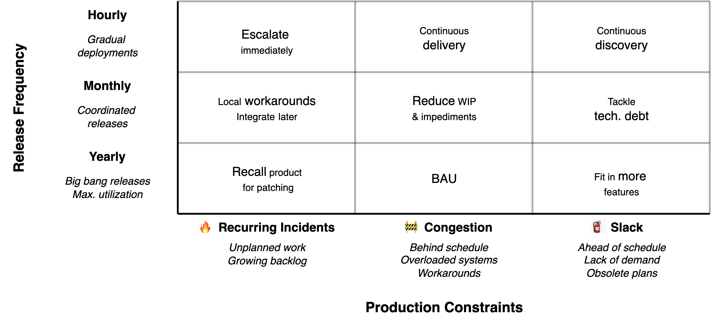

# Release Frequency

Organizations guide productivity by setting a release frequency. Fast releases allow more immediate reactions to competition. In practice, there are various obstacles that prevent such swiftness.

## Batch Size

Release frequency is directly [related](https://en.wikipedia.org/wiki/Little%27s_law) to batch size and efficiency. 

- Greater batch sizes can improve resource utilization, through economies of scale. Repetition allows for optimization.
- Overproduction can be used as a buffer against supply chain disruptions.

There are various downsides to larger batch sizes.

- **Risky big-bang releases:** Large, all-at-once deployments are harder to test and even harder to redirect if things go wrong.
- **Complex coordination:** Bundling many features together requires significantly more planning and cross-team alignment.
- **Incident response:** Long release cycles make it difficult to react to incidents. Urgent patches must be shipped as [hotfixes](https://en.wikipedia.org/wiki/Hotfix), which increases both risk and rework.
- **Incentive to delay:** Longer cycles encourage teams to postpone releases, waiting to include "just one more feature" rather than shipping now.

## Production Constraints

Teams evolve over time. The table below shows the result of operational disruptions and release frequency. See [productivity constraints](../teams/productivity-constraints.md) and [optimizing processes](../guides/optimize-processes.md).

Notes

- ⚠️ Immediate escalation immediately is a feature, rather than a problem. Proper change management and administration makes it easy to connect to the necessary teams and resolve the issue immediately.
- 💣 Large releases are a kind of pressure cooker. Errors go unnoticed, until the release date. Then they show up everywhere all at once.
- ⚙️ "BAU" means: manage projects and dependencies. This is *business as usual* in large software organizations that use large release cycles.
- 📦 Continuous delivery involves *canary deployments*. Releasing changes gradually to user, in order to mitigate the impact of incidents.
- 🧑‍🔬 Continuous discovery refers to the discovery of a product/market fit. Automated experiments allow algorithms to be optimized for specific customer segments.

### Agile and Waterfall Projects

Watefall-type projects start with full requirements. Development and testing happens afterwards, in sequence. Agile approaches start earlier. Initially with (functional) testing and later with incremental improvements.

|                     | Waterfall                 | Agile                   |
| ------------------- | ------------------------- | ----------------------- |
| **Optimize for**    | Throughput (output)       | Market fit (outcome)    |
| **Scope**           | Requirements drive design | Discovery drives design |
| **Decision making** | Theoretical (top-down)    | Empirical               |
| **Testing**         | Eventually                | Continuously            |
| **Worst case**      | Project fails             | Project is insufficient |

This graph shows the granularity of increment verses the development stages. The steepness of the line is associated with risk apetite.

For software projects the increments follow a typical form.

