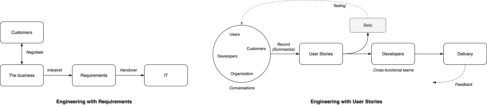

# Requirements Gathering

See [requirements](../management/project-requirements.md) and [results](../management/results.md).

[toc]

## User Stories

> Telling stories > writing stories.

User stories a way of working that is based on *telling stories*. It prioritizes shared understanding, rather than documents and requirements. Stories tend to emphasize people and their purpose.

## Discovering Requirements

> The worst thing you can do is start building immediately.

User stories are an alternative to traditional requirements.

- **Traditional requirements** are formulated after a negotiation. They are then handed over to developers. This works well for predictable environments.
- **User stories** are supposed to written in conjunction with discussions that led to agreements about what to build. These discussions involve the organization, customers, users and developers.

*Static* requirements create an incentive to de-emphasize the user, rather than continuously collecting feedback. 

## Story Mapping

>  Shared documents ≠ shared understanding 

Goals - ordered by importance.

1. Develop a shared understanding.
2. Promote shared ownership. Make team members feel heard. Be inlusive.
3. Create shared documents to remember the conversations.

### Session Format

Attitude: beginner's mind. 

- Be eager to discover and learn. 
- Be open minded, without a hidden agenda or pre-defined plan.

Discovery process.

1. Tell a story, from beginning to [end](../management/results.md). Go wide, rather than deep. Meanwhile, write down *keywords*.
   1. Split up large chunks from small chunks. Focous on the large chunks.

2. Define the context.
   1. Define the product goal and vision.
   2. Define the target market. E.g. persona's of typical users. You can use symbols to remember these.
   3. List any relevant constraints.
3. Build a chain of smaller stories. E.g.
   "As a `user`, I want to ...,
   *(and then)* I want to get ...,
   *(or, I might)* want to see ...."
4. Reflect on this, and determine what increments you can build next.

Delivery process

- Discuss what is technically feasible to build.
- Relate it to what would provide value, based on the original story.

### Example Mapping

This is an example mapping of a webstore. There are a few layers.

1. The **main user flow** is denoted by large cards. It depicts the value chain.
2. **Detailed steps** per link. These are separated by a dashed line.
   1. Bare minimum steps.
   2. Bonus steps. These can be valuable but are not vital.

### Example Increments

Ideally this happens after the market fit is tested.

1. Prioritize a functional, end-2-end flow. This allows validation of the design and its scalability.
2. Make it business meaningful. Replace mocks with real data.
3. Improve user experience. Add toping.

## References

- Patton. *User Story Mapping*

