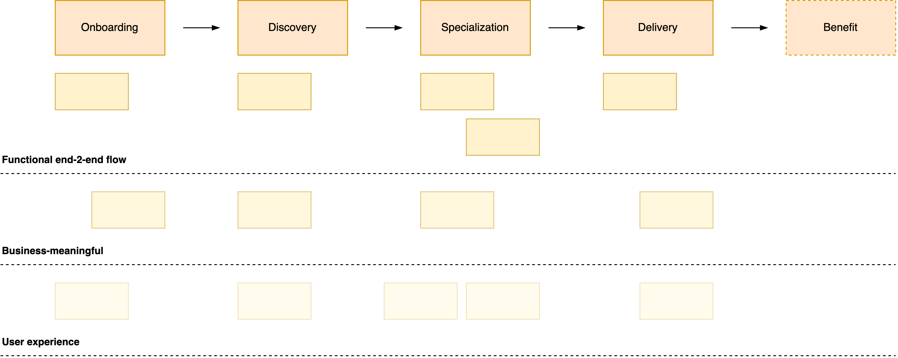

# Story Mapping

Story mapping is a technique to discover what to do. It focusses on providing **shared understanding**. By doing this, problems are deconstructed until the solution becomes clear.

[toc]

## Overview

Story mapping can be used in several phases of the product [lifecycle](lifecycle.md), and it applies to both discovery and delivery phases.

> Shared documents ≠ shared understanding

Purpose.

1. Develop a shared understanding.
2. Promote shared ownership. Make team members feel heard. Be inlusive.
3. Create shared documents to remember the conversations.

### Workshop Template

```markdown
# ⭐ Purpose
Connect and align. Reach a shared understanding together.

# 🚀 Outcome
A shared understanding of the goal and the path towards it.

# 📅 Agenda
A conversation about

- Where will we go?
- Where are we now?
- What lies in in between? What else?
- What's the next step (increment)? 

# 📖 Pre-read
 Any documents that brings everyone up to speed.
```


### Method

Steps

- Initial premise
  - Why. The problem or opportunity.
  - Who. The party that will benefit from the initiative.
- Discovery. Re-discover the problem and objective.
  - The main story. The value chain from start to end.
  - (Missing) details. Intermediate steps.
- Delivery strategies.
  - A release strategy. Deliverables and [results](../legacy/realization.md).
  - A learning strategy. Beliefs and [bets](bets.md). E.g. prototypes.
  - A development strategy. The implementation. See [delivery](delivery.md).

## Session Formats

Attitude: beginner's mind.

- Be eager to discover and learn.
- Be open minded, without a hidden agenda or pre-defined plan.

### Preparation / Context

Opportunity

- What is the idea?
- Who are the customers?
- Who are the users?
- Why do they want it?
- Why are we building it? How does it help us?

### Discovery process

1. Tell a story, from beginning to [end](../legacy/realization.md). Go wide, rather than deep. Meanwhile, write down *keywords*.
   1. Split up large chunks from small chunks. Focous on the large chunks.

2. Define the context.
   1. Define the product goal and vision.
   2. Define the target market. E.g. persona's of typical users. You can use symbols to remember these.
   3. List any relevant constraints.
3. Build a chain of smaller stories. E.g.
   "As a `user`, I want to `...`,
   *(and then)* I want to get `...`,
   *(or, I might)* want to see `...`."
4. Reflect on this, and determine what increments you can build next.

### Delivery process

- Discuss what is technically feasible to build.
- Relate it to what would provide value, based on the original story.

Slicing options

- **Good** enough. Vital components
- **Better**. What investments would make it even better?
- **Best**. What would make it fabulous?

## Example Mapping

This is an example mapping of a webstore. There are a few layers.

1. The **main user flow** is denoted by large cards. It depicts the value chain.
2. **Detailed steps** per link. These are separated by a dashed line.
   1. Bare minimum steps.
   2. Bonus steps. These can be valuable but are not vital.


## Example Increments

Ideally this happens after the market fit is tested.

1. Prioritize a functional, end-2-end flow. This allows validation of the design and its scalability.
2. Make it business meaningful. Replace mocks with real data.
3. Improve user experience. Add toping.



## References

- Patton. *User Story Mapping*
