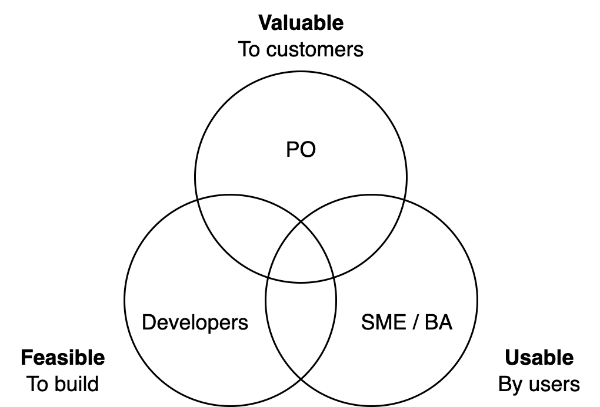

# Terminology

This terminology is borrowed from Agile and Scrum.

[toc]

## Tools

**Backlog**

See [planning](planning.md).

**MVP**
See [product management](../management/product-management.md)

**RFC**
Request for comments. A scalable method to get feedback on an idea.

**North Star Goal**
A high-level, long-term goal that is used to show the direction to work towards. It should still specific and measurable. It may be complemented by shorter-term metrics.

- Ideally this metric is consistent with your definition of success.
- Ideally this metric is clear to the whole organization, such that they can align.

**Output, Outcome and Impact**
See [requirements engineering](../management/requirements-engineering.md).

## Storytelling

This way of working emphasizes storytelling and narratives. It puts an emphasis on purpose and end-results. It promotes shared understanding, natural language and pictures.

**Narrative**
Communal understanding.

Convey the feeling of an ideal state. E.g.*"1000 songs in your pocket"*

- This is independent of the required input effort.

**Narrative collapse**

When stories stop [linking](https://en.wikipedia.org/wiki/Hyperreality) to reality.

- E.g. news programs that debate opinions, rather than covering reality. News seems to lack consequences, similar to episodes from a sitcom.

**Persona**
The main character. A model (or proxy) of the target market or audience. E.g. a typical user with a certain background.

**User Story**
What value a given feature would bring to a given *persona*. See these [templates](../management/requirements-engineering.md).

**Epic**
A collection of user stories that can be finished in at most a handful of months.

**Questions**
Frame topics as questions. E.g. "How will we approach this?" rather than *"Method 1.1.2"*.

## Products

> A product is a vehicle to deliver value.

A *product* is a proxy for the set of [products](https://en.wikipedia.org/wiki/Product_(business)) and [services](https://en.wikipedia.org/wiki/Service_(economics)) that are used by a *user* and paid for by a *customer*. The *stakeholder* supports the products and aims to eventually profit it, either financially or in some other way. The product is usually build and delivered by employees of an organization. The product is optimized for a target market, but can also be delivered to a boundary market.

In order to be valuable a product should be usable and feasible to build. Responsiblity for these qualities can be delegated to the following roles: product owner (PO), developer, SME or BA.

Following this terminology, a successful product would need to fulfill the desires of customers, users, stakeholders and employees. It results in:

1. Delivery: Provide value to users, based on a production process.
2. Transaction: Sell to customers.

**Product Discovery**
Deciding what to build, for whom, when.

**Product Delivery**
Building it (R&D) and delivering it (ops).

**Product Teams**
A product team is supposed to completely manage a single product. The team is autonomous and can take ownership, because it controls the [whole](https://en.wikipedia.org/wiki/Vertical_integration) value chain. See [this template](../documentation.md#Templates).

**Positioning**
Deliver some value to a well-defined set of customers, i.e. a target market.

**Interface**
E.g. a GUI, CLI or API. Any interface has to consider the *user*, the *content* shown to the user, and the *context* in which it is shown.

**Platform**
A product that itself hosts other products. It facilitates *providers* to deliver services to third-party *consumers*. Both of these may be *customers*. A typical example is a [marketplace](https://en.wikipedia.org/wiki/Marketplace).

**Sales**
Sell products or services to customers.

**Hospitality**
Provide good experience. It involves a host and guests. Terms: customer service, tourism, wellness.
