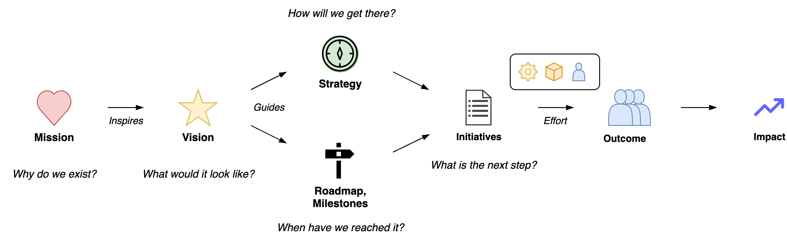

# Value & Production Chains

Value and production chains refer to the steps taken to deliver business value.

[toc]

## Introduction

> *Build the right thing.*

Delivery of value is modelled by a **value chain**. The end-to-end process. Its aim is to balance the preferences of the organization and customers: *what* is produced.

> Build it right.

The value chain is centered around a **production chain**. This is an internal process that aims to optimize production quality and throughput: *how* it is produced.

 In software engineering this process typically has the phases: `requirements, analysis, design, implementation, testing, deployment`.

### Environment

Value creation is done in an environment. Everything within this environment enables value creation and delivery. The environment is also subject to influence from outside.

Activities that **enable** value creation and delivery

- Manage people and resources
- Remove impediments
- Coach teams

## Value Chain

A *value chain* starts just before this production process and ends with the higher-order effects of the product. E.g. the resulting change in quality of life of users, or an increase in market value.

From discovering problems to solving problems.

1. Idea. A new product or feature. Verification of the idea. See [bets](bets.md).
2. Development and its product. An implementation of the idea.
3. Delivery of the product to users.
4. Increase in revenue or growth for the business.

### Planning Level

Planning occurs in the reverse order of the value chain.

### Uncertainty

See [requirements](project-requirements.md).

|                 | 📦 Output        | 👤 Outcome | 📈 Impact             |
| --------------- | --------------- | --------- | -------------------- |
| **Factors**     | Time/cost/scope | Behaviour | Environment, markets |
| **Uncertainty** | Low to high     | High      | High                 |
| **Results**     | Fast            | Delayed   | Indirect             |

Projects and tasks have three key constraints: time, cost and scope.

## Vision

Value chains exist in a context. An organization has a purpose. This is formalized as their identity, mission, vision and strategy.

- Organizations have an **identity** and associated values. *"Who are we?"*
- A **mission** is existential. *"Why does this organization exist?"*
- A **vision** is an alternative to the current reality. *"What future do we envision?"*

See [strategy](../legacy/alignment-strategy.md).

