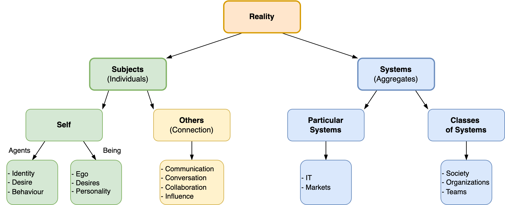
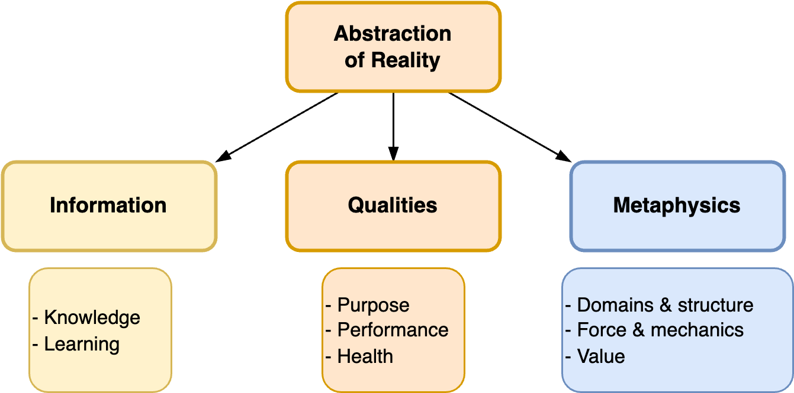

# Maps

[toc]

## Experience

- [Human experience](../subjects/experience.md) and that of [agents](../subjects/experience.md)
- [Quality](../metaphysics/quality.md)
- [Attention](../subjects/attention.md)
- [Activity](../subjects/activity.md)

## Reality and Quality

- Reality. Subjects and systems.
- Abstraction of realiy. Qualities, information, metaphysics.

Language tends to differ per domain. Certain language is more appropriate for particular domains.

|              | Self        | Agent     | System             |
| ------------ | ----------- | --------- | ------------------ |
| **Example**  | A person    | A robot   | A team or business |
| **Identity** | Ego         | Identity  | Identity           |
| **Purpose**  | Desire      | Objective | Vision             |
| **Origin**   | Birth       | Creation  | Shared visiongff   |
| **Action**   | Personality | Behaviour | Performance        |

