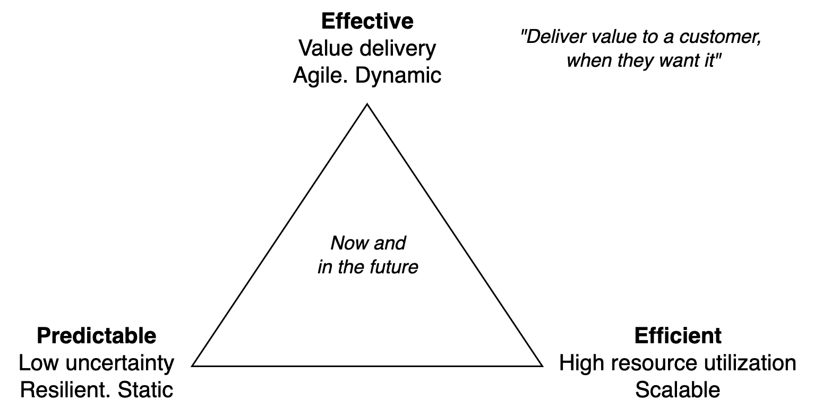
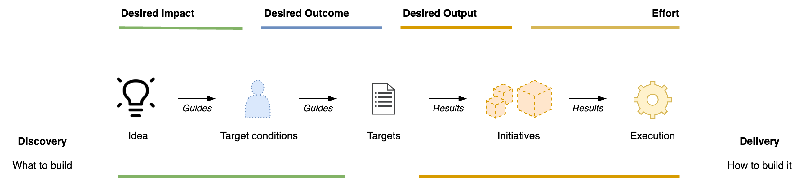

# Realization

Visions are *realized* through discovery and delivery.

[toc]

## Overview

> May our dreams become our plans

Discovery and delivery are about realizing a vision.

- [Discovery](../labour/discovery.md) focusses on learning what to deliver. It involves planning, experimentation and using prototypes.
- Delivery aims to realize the resulting plans.

The two phases re-occur at various scales and phases in a product lifecycle.

At **product** level.

- Product discovery. Phases within the lifecycle of a product.
- Product delivery. Intermediate deliverables within a project or initiative.

At **planning** level. For individual initiatives and projects.

- Discovery phase. *What to build?*
- Delivery phase. *How to build it?*

Realization can happen in increments. Strategies typically optimize for efficiency or predictability. The former takes risk by building large increments. The latter minimizes risk by testing early. See [increments](../labour/increments).

**Effectiveness**

Value delivery can be done effectively, efficiently and predictably.

## Value Chain

The result of a production process is called a product.

 In software engineering this process typically has the phases: `requirements, analysis, design, implementation, testing, deployment`.

A *value chain* starts just before this production process and ends with the higher-order effects of the product. E.g. the resulting change in quality of life of users, or an increase in market value.

From discovering problems to solving problems.

1. Idea. A new product or feature. Verification of the idea. See [bets](../labour/bets.md).
2. Development and its product. An implementation of the idea.
3. Delivery of the product to users.
4. Increase in revenue or growth for the business.

### Planning Level

Planning occurs in the reverse order of the value chain.

### Uncertainty

See [requirements](../labour/project-requirements.md).

|                 | 📦 Output        | 👤 Outcome | 📈 Impact             |
| --------------- | --------------- | --------- | -------------------- |
| **Factors**     | Time/cost/scope | Behaviour | Environment, markets |
| **Uncertainty** | Low to high     | High      | High                 |
| **Results**     | Fast            | Delayed   | Indirect             |

Projects tend to have constraints: time, cost and scope.

## Vision

Concrete ideas tend to originate from underlying desires.

- Organizations have an **identity** and associated values. *"Who are we?"*
- A **mission** is existential. *"Why does this organization exist?"*
- A **vision** is an alternative to the current reality. *"What future do we envision?"*

See [strategy](./alignment-strategy.md).

## References

- Patton. *User Story Mapping*
