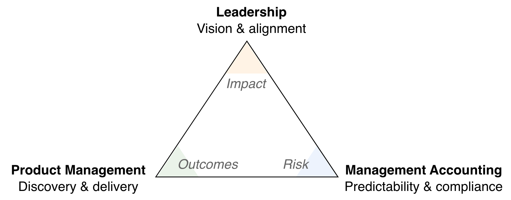
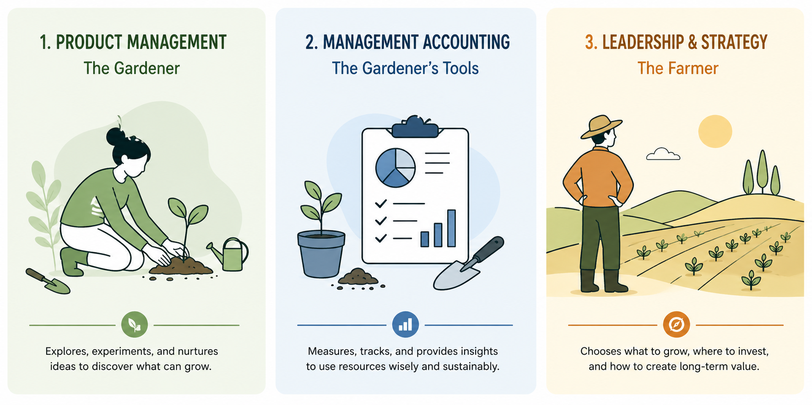
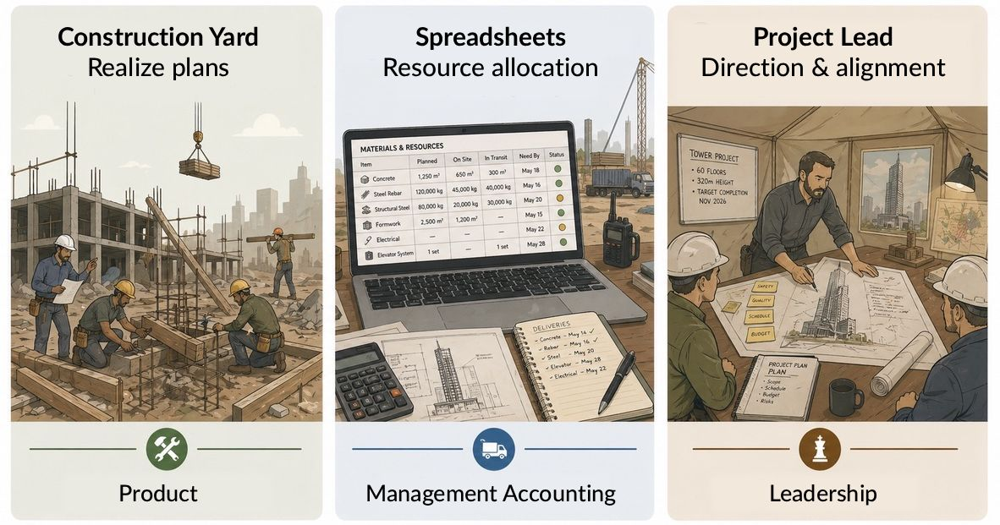
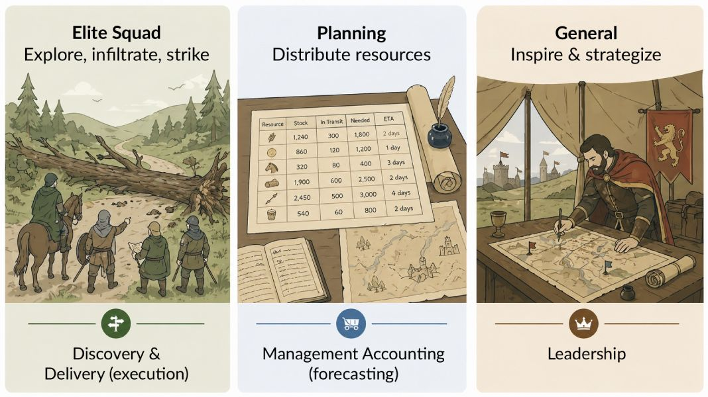
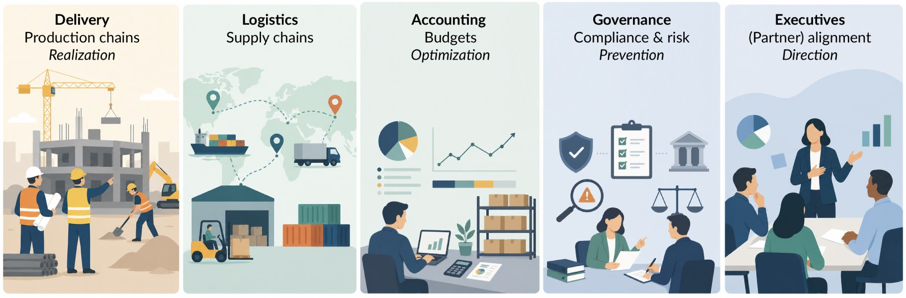
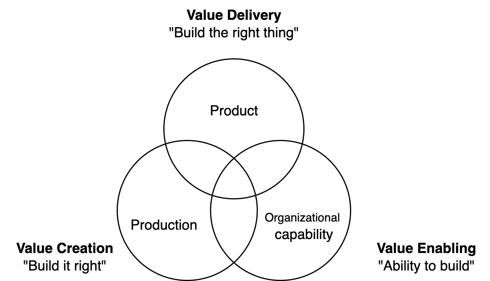

# Accountability Triangle

See also [accountability pyramid](../labour/accountability-pyramid.md) (for internal accountabilities) and [mandate levels](../labour/mandate-levels.md).

[toc]

## Overview

The triangle recognizes three fundamental management accountabilities in organizations.

1. **Leadership** aligns the organization around a vision. 
2. **Product management** is responsible for realization of the vision. The production chain.
3. **Management accounting** aims to provide control and reduce risk.

Ideally all areas are be balanced.

|             | Product Management   | Management Accounting       | Leadership         |
| ----------- | -------------------- | --------------------------- | ------------------ |
| **Purpose** | Realization          | Prevention                  | Direction          |
| **Method**  | Discovery & delivery | Predictability & compliance | Vision & alignment |
| **Target**  | Customers            | Employees & resources       | Partners           |

### Analogies

|                         | Product Management | Management Accounting | Leadership   |
| ----------------------- | ------------------ | --------------------- | ------------ |
| **🪴 Garden**            | Gardener           | Forecast              | Farmer       |
| **🏗️ Construction Yard** | Engineers          | Spreadsheets          | Project lead |
| **⚔️ Army**              | Squads             | Clerks                | Generals     |

#### Gardening Analogy

#### Construction Analogy

#### Army Analogy

## Blurred Lines

Real world organizations hold far more accountabilities.

- Product management may be split into engineering and operations departments.
- Logistics falls between product and management accounting.
- Governance and financial accounting typically have different directors.
- Executives need to ensure both internal and external alignment, as well as providing direction.

### Product Management

Product management usually subdivided into product (marketing), production (engineering, operations) and enabling (HR). See [accountability pyramid](../labour/accountability-pyramid.md).

## Other Management Roles

A general manager may be accountable for "everything". In large organizations, this accountability is split up to dedicated roles.

| Role                        | Accountability                         | Context                       |
| --------------------------- | -------------------------------------- | ----------------------------- |
| Context manager             | Positioning of a system or department. | Stakeholders & customers      |
| Delivery manager            | Value delivery.                        | Customers, resources, chains  |
| Engineering manager         | Engineering quality & predictability.  | Technology & capability       |
| People manager              | Capability of employees.               | Performance & well-being      |
| Project (portfolio) manager | A set of projects                      | Time, scope, cost, risks      |
| Product manager             | Product value. Vision and realization. | Discovery & delivery of value |
