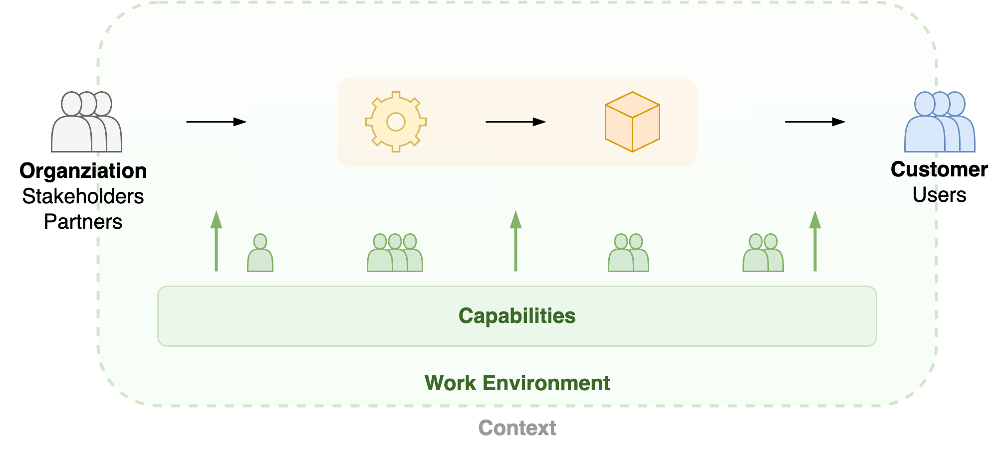

# Accountability

Also see [collaboration](../collaboration/accountability).

## Management Roles

A general manager may be accountable for "everything". In large organizations, this accountability is split up to dedicated roles.

| Role                        | Accountability                         | Context                       |
| --------------------------- | -------------------------------------- | ----------------------------- |
| Context manager             | Positioning of a system or department. | Stakeholders & customers      |
| Delivery manager            | Value delivery.                        | Customers, resources, chains  |
| Engineering manager         | Engineering quality & predictability.  | Technology & capability       |
| People manager              | Capability of employees.               | Performance & well-being      |
| Project (portfolio) manager | A set of projects                      | Time, scope, cost, risks      |
| Product manager             | Product value. Vision and realization. | Discovery & delivery of value |

**Dynamics**

     

## Domains

Value chain

Context & capability

