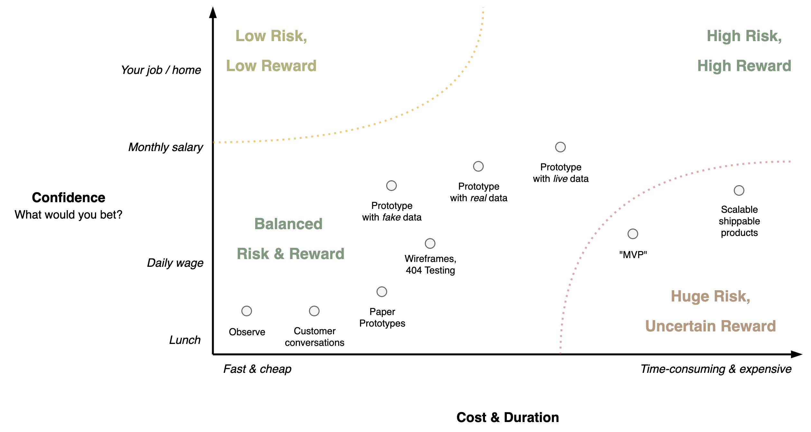

# Bets

Bets are tools to *test beliefs*. They are light-weight versions of experiments that validate and verify hypotheses. They are especially useful in complex environments where higher order effects are common.

Bets can have several forms. They should be sized according to the amount of uncertainty. Otherwise they result in wasted time or reckless risk taking.

