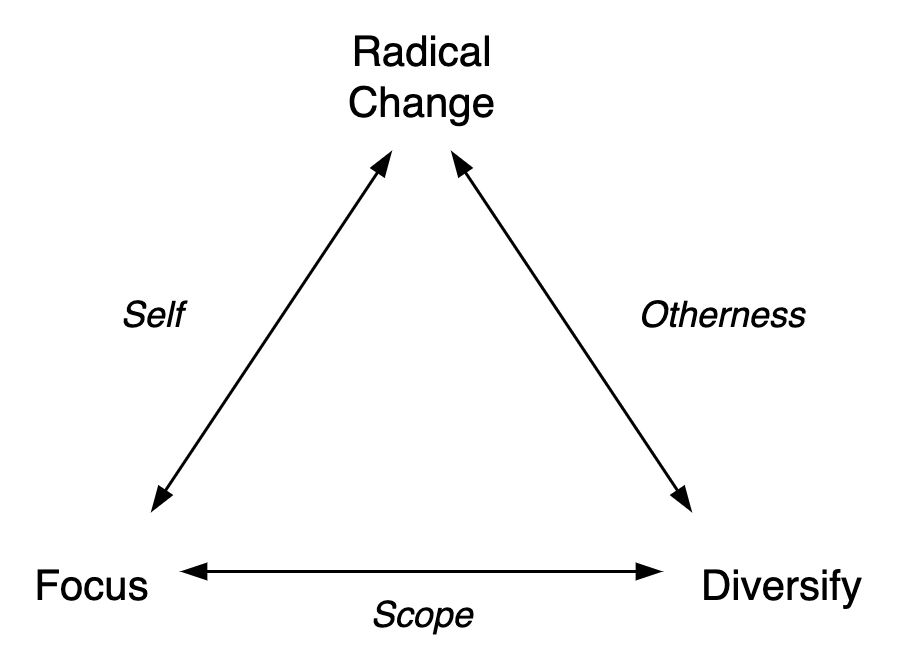

# Change Management

This relates to organizational change. From culture to processes. This is more complex than merely execution of changes.

[toc]

## Overview

**Types of change**

1. Trivial change. This includes improvements that are obviously beneficial and accepted by a majority. They may not need additional attention from a manager.
2. Non-trivial change. This includes change a context of conflicting interests, hidden motives. Presence of inertia or conservatism. Disruptive change.

**Direction of change**

Change covers any activity that falls outside business-as-usual (BAU). Change-objectives can be categorized as follows. See [purpose](../activity/purpose.md).

1. Focus. Improve how effective and efficient the system is. This is about continuation. This includes changes in culture.
2. Diversification. Expand the scope of the system.

3. Radical change. E.g. changing the system's identity, positioning or functioning.

See [requirements](../organization/requirements.md).

## Practice

> Change is about tension and release.

Approaches for implementing change should take into account the structure of an organization.

- In flat organizations the culture (mindset, alignment) may be prioritized over changes in processes.
- In large organizations there can be a mix of top-down and bottom-up incentives. Changes in process may be enforced top-down.

### Proposing change

Changing processes without buy-in is risky. Subordinates may agree with the proposal without acting on in.

**Model: Dynamic & static patterns. Culture & process.**

This model considers a dynamic (disruptive) change, that should be appreciated by a majority. It starts with culture (buy-in) and it ends with process (to protect and maintain the new way).

1. **Awareness** of the environment. Start with why, before jumping to solutions. Ensure shared alignment on the high-level objective.
2. **Culture**: dynamic change. Increase the temperature of the system.
    1. (When). Belief in capability, The belief that "we" can change this, soon. Discuss alternatives and imagine how they would improve the environment.
    2. (What). Experimentation. Changes do not exist in isolation. It takes time for higher-order effects to be understood.

        1. Make room for bottom-up initiatives. Changes may range between two forms:
            1. Continuous improvement, step by step.
            2. Large, disruptive changes, with longer recovery.

3. **Process**: static patterns. Cool down the system.
    1. (When) There is a turning point where the disruption needs to be turned down, in order to prevent the system from spiraling out of control. Without preserving the changes, the benefits may be lost.
    2. (What) Adjust processes to support the new culture. Set guidelines and incentives to preserve the updates.

**Model: Question-Answer**

This model starts with questioning an aspect of the environment (e.g. a team). It's directed towards the questions: *"Why change? For whom? Why now?"*

Given the intent to make a change, start with:

1. **Context**. Appreciation of the environment. Understand the environment and accepts its limitations. Initiate willingness to consider change. An open mindset.
    1. *"What is the complication? What is the problem or opportunity? What is the context?"*

2. **Question**. Pinpoint what can change. The belief that "we" can change this, soon.
    1. *"What can be different? What alternatives do we have? Which assumptions are false?"*

3. **Answers**. Propose actions to take.

Then make a plan.

### Planning change

Determine how to make change possible and worthwhile. Given an *objective*, consider:

- The deliverables
- The initiatives. The in input effort.
- Estimation of the cost
- Risks

**Managing change**

Distinguish day-to-day activities from focus.

- Health [indicators](https://en.wikipedia.org/wiki/Performance_indicator) for *business as usual*.
- Short-term [objectives](https://en.wikipedia.org/wiki/OKR) for *change*.

Visualization

- Kanban or Scrum board. Show work in progress and planned work.
- Heatmap of health indicators.

### Change

Note that these can all involve [*change*](../intelligence/learning.md). A typical challenge is to change processes that are optimized for the status quo. See also [organizational culture](../systems/organization-structure.md).

1. [Influence](https://danluu.com/culture/) people (indirect)
    1. Incentives. Rewards and punishments for behaviour or achievements.
    2. Processes. E.g. regulation, validation.
    3. Culture. "inherent" values. E.g. ideals to strive for.
2. Persuade people (direct). E.g. [transformational leadership](https://en.wikipedia.org/wiki/Transformational_leadership).

**Dimensions of Change**

Reaching goals usually requires change.

1. Direction.
    1. Increase positive effects (e.g. increase profit).
    2. Decrease negative effects (e.g. cut cost).
2. Locality.
    1. Optimize (all) individual components.
        1. Risk: over-production, tunnel-vision, high inventory that can become obsolete.
    2. Optimize the flow of tasks through the system. E.g. manage constraints. Note that this can include worsening the performance of specific components.
        1. Risk: bias for the current goal. E.g. bias for a target market.
    3. Diversify. E.g. diversify the product line for exposure to new markets.
        1. Diversify into new markets.
            1. Risk: lack of focus, lack of efficiency, low margins.
        2. Diversify the current market by creating [segments](https://en.wikipedia.org/wiki/Market_segmentation).

With this in mind, three questions can be asked: What to change? What to change it to? How to do it?

Also see [goals and strategy](./goals-planning-strategy.md).
