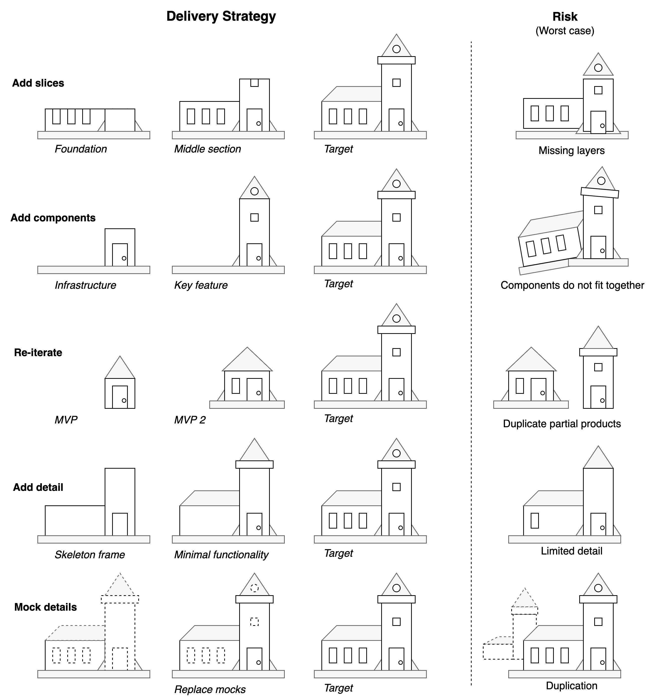
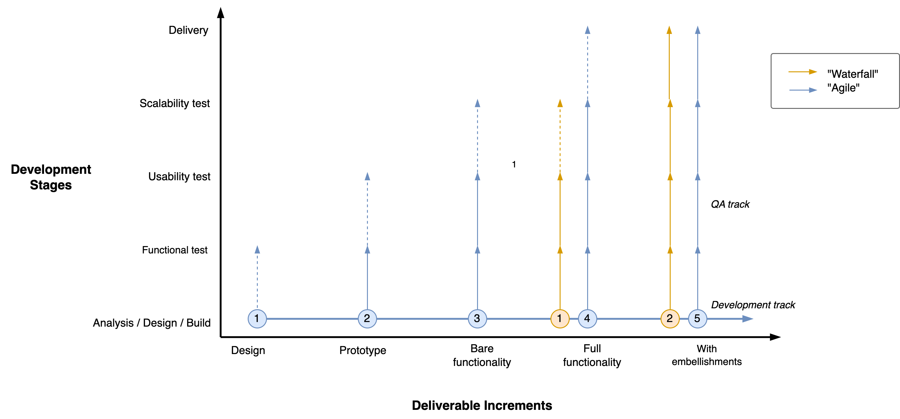

# Delivery

Projects can be delivered in increments. Strategies typically optimize for efficiency or predictability.

[toc]

## Delivery Strategies

Product increments can be designed in several ways. There is a tradeoff between efficiency (throughput) and risk.

|                  | Optimize for             | Risk               |
| ---------------- | ------------------------ | ------------------ |
| **By slice**     | Efficiency               | Missing layers     |
| **By component** | Efficiency (in parallel) | Integration issues |
| **MVPs**         | Speed                    | Mediocre products  |
| **By prototype** | User experience          | Limited details    |

**Components**

Develop each component in parallel by specialists.

**MVP**

Iteratively deliver minimum viable products (MVP) and test them with real customers.

**Prototyping**

>  Prototype for `1x`, design for `100x`, and only then build for `10x`.

Emphasize the discovery phase. Continuously develop better prototypes to ensure the design is valuable.

### Example

The following example visualizes the different increments in the context of building a church.

## Development Phases

The development of increments follows a pipeline. In software engineering the phases are typically: 

- `requirements, analysis, design, implementation, testing, deployment`. 

Projects can be optimized for efficiency or effectiveness.

|                | Optimize Efficiency | Optimize Predictability & Effectiveness |
| -------------- | ------------------- | --------------------------------------- |
| **Name**       | Waterfall           | Agile                                   |
| **Testing**    | Eventually          | Immediately                             |
| **Worst case** | Project fails       | Project exceeds estimation              |

### Agile and Waterfall Planning

Watefall-type projects start with full requirements. Development and testing happens afterwards, in sequence. Agile approaches start earlier with (functional) testing and then improve the design in increments.

|                     | Waterfall                 | Agile                   |
| ------------------- | ------------------------- | ----------------------- |
| **Optimize for**    | Throughput (output)       | Market fit (outcome)    |
| **Scope**           | Requirements drive design | Discovery drives design |
| **Decision making** | Theoretical (top-down)    | Empirical               |

