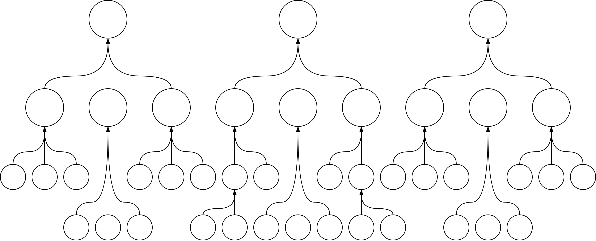
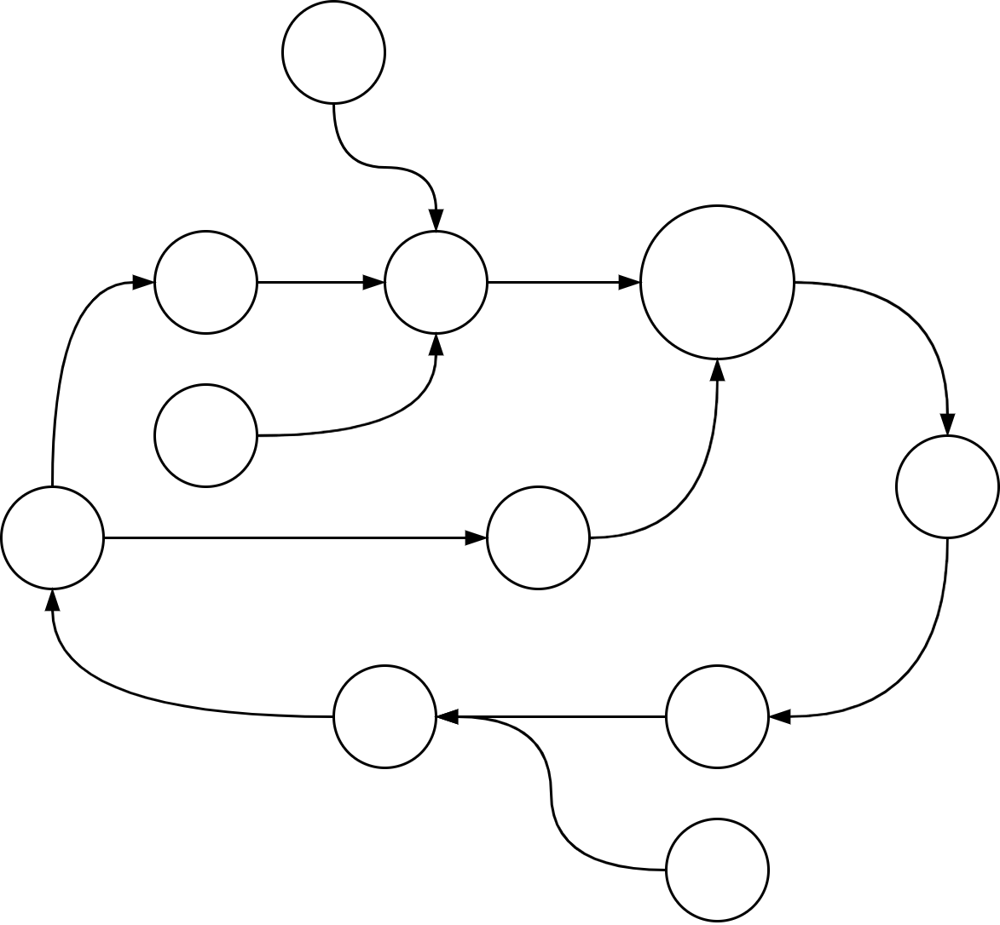

# Goals

This document presents a few models and templates to manage goals. It assumes that goals are decoupled from any implementation. See also [goals](../activity/goals.md).

Mindset

- Distinguish long-term goal from actionable plans.
- Use different models for different contexts.

[toc]

## Deciding

How to make choices. Be informed, open-minded and align expectations.

**Be informed**

- Know the range of choices that are available to a given situation.
- Estimate the cost of each relevant option.
  - Incl. the cost of doing nothing.
- Estimate the consequences of each relevant option.

In addition, evaluate the reliability and consistency of this information.

- Consider the parties involved. E.g. stakeholders, users, customers employees.
- Know who to contact to learn more.

**Be comfortable**

- Set a baseline choice or worst-case scenario. Accept that this may may be realized.
- Update your expectations.

## Templates

### Discovery Templates

> What is important? What options do exist?

#### Template: Signals & Underlying Problems

Awareness of the current landscape is a prerequisite of planning. This template focusses on understanding a complex landscape. It's based on the [scientific method](https://en.wikipedia.org/wiki/Scientific_method). It results in two lists: signals and problems.

**Workflow**

1. Observe **signals**. Which problems are clearly visible. E.g. red flags, pain points or obstacles.
2. Determine the **underlying problems**. Do this based on hypotheses.
    1. What is causing these signals? Why haven't they been addressed before?
    2. Collect data if necessary.

Based on this, it is possible to:

- Define experiments to verify hypotheses.
- Choose initiatives that address these problems.

Review & report in order to maximize learning.

#### Template: Risks

List the major risks and estimate their exposure (probability and probability of materialization). Consider both:

- Threads (external)
- Vulnerabilities (internal)

Use this to decide to invest in mitigation. See [management-principles](management-principles.md).

#### Template: Desired States

Start with a number of categories or themes. E.g. security, incident management, operations or efficiency. For each one, define the current state and the desired state.

- Emphasize the *problem* with the current state.
- The desired state is not necessarily a *target*, but rather an *idealistic outcome*.

This template focusses on the range of outcomes and <u>excludes how to reach them</u>. This avoids the overhead of up-front planning, and reduces the risk of plans becoming outdated.

The template:

``` markdown
# Theme A

Current State
> What is currently lacking.

Desired State
> What outcome is envisioned.


# Theme B

Current State
> What is currently lacking. Link to the current design.

Desired State
> What outcome is envisioned. Read more here.

...
```

### Ordering Goals

> Where are you? Where will you go next?

#### Template 3: Path

Format for a pitch:

1. Start with the **main** goal. Ensure that there is agreement on both the need for change, and the end-result.
2. Add the **path** to reach it. The steps can represent e.g. initiatives or full releases. Cover the earlier steps in detail. Leave later steps abstract if possible.
3. Emphasize the flexibility of the plan by highlighting secondary **options**. Show optional paths that could be taken in case of changes to the environment.

In case of technology-based projects this can be complemented with suggestions for **prototypes**.


#### Template: Maps

**Purpose**

- Visualize where you are and show the current state will change.
- The format forces the strategy to be broken down into the most vital components.

**Method**

- Given two objectives X and Y, create a two-dimensional map. Add the current, intermediate and target states.
- Visualize obstacles (inertia) as red blocks and movement (initiatives) as green arrows.


> Maps don't tell you what to do. Instead they show you your options.

A visualization of points in space. They allow you to explore routes.

They give insight into the environment and into how the environment is changing.

Components

- Anchor. Central, stable point.
- Legend. What does space mean

Dimensions that can be used:

- Time. E.g. [value added](https://en.wikipedia.org/wiki/Value_added), up to value delivery.
- Visibility to end-users.
- Dependencies. Needs of end-users.
- Level of [commoditization](https://en.wikipedia.org/wiki/Commoditization). From custom to standard to commodity. From uncharted to industrialized.

#### Template: Choosing Sub-Goals

Different ways to set goals

**Legend**

- A. Current state
- B. Next target state, which will help towards Y and Z.
- Y. Required objective for Z.
- Z. North star goal


#### Template 2: Goal Cascade

(anti-pattern, from [here](https://cutlefish.substack.com/p/tbm-4151-why-goal-cascades-are-harmful))

A hierarchy of targets that is updated every quarter.

1. A few organization-wide, high level goals.
2. Department-specific goals that contribute towards the first goals.
3. Team-specific goals that  contribute towards the departmental goals.

**Risks**

- Over-simplification at the top. Reality is modeled as a tree-like graph, with independent sub-goals. This creates an incentivize for local optimization.
- Fragile, high fluctuation in goals. Each goal is a piece of work and has to be replaced after the work has been executed.

<details>
<summary><b>Goal Structures (Patterns)</b></summary>
<br>
<p><b>Tree Structure</b><br/>
  Problem: assumption of independence is an oversimplification.</p>

<br/><br/>
<p><b>Complex Structure</b><br/>
  Problem: too chaotic.</p>

<br/><br/>
<p><b>Double Tree Structure</b><br/>
  Sub-goals map to multiple high-level goals.</p>

</details>
