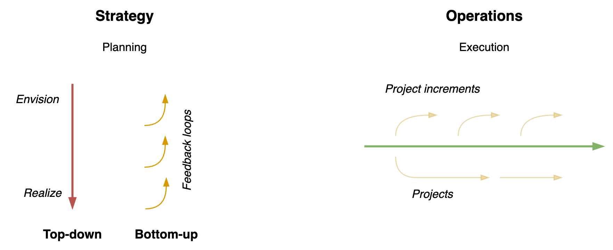
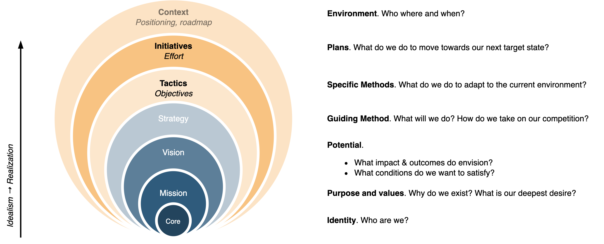
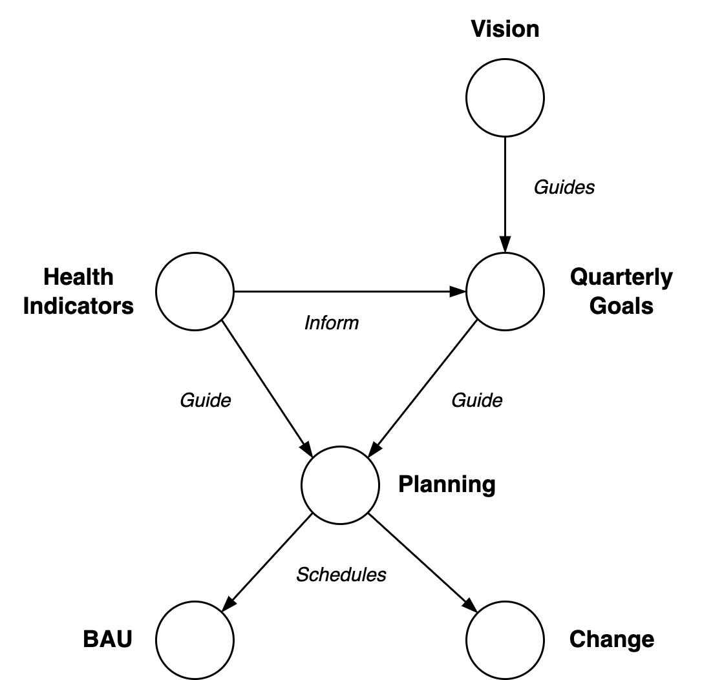
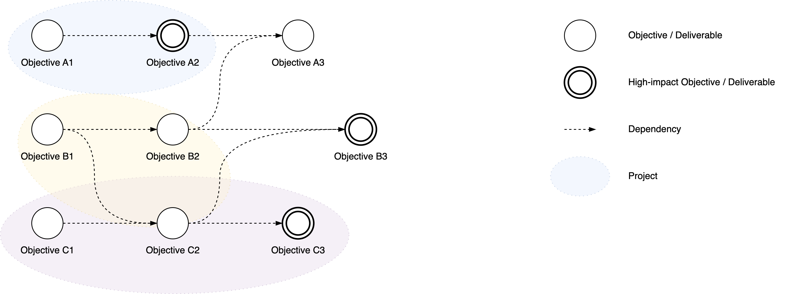
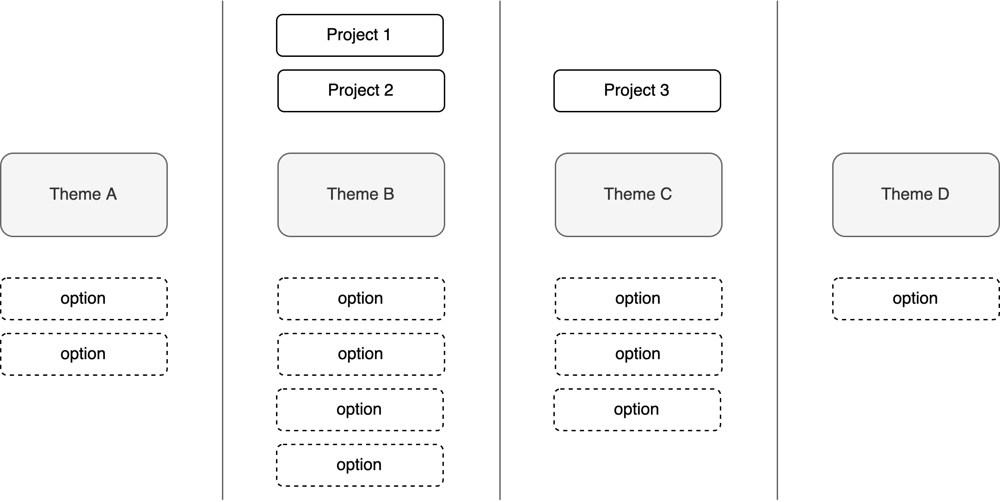

# Strategy & Planning

Making plans, following plans and updating plans. Also see [goals](../organization/goals.md), [results](../labour/realization.md), [templates](goal-templates.md) and [planning](../labour/planning.md).

[toc]

## Overview

> Plans are worthless, but planning is everything. Execution > strategy.

> Good strategy means saying no.

Strategy has a top-down and a bottom-up component. Plans are usually created high level, and thought out in detail down the line.

Operations consists of repetition. It may involve lengthy projects and agile project increments.

## Terminology

<table>
<tr>
  <th>

</th>
  <th>
Type
</th>
  <th>
Subtype
</th>
  <th>
Meaning
</th>
</tr>
<tbody>
  <tr>
      <td rowspan="4">
<b>Purpose</b>
</td>
      <td rowspan="4">
<b>Why</b>
</td>
      <td>
Mission
</td>
      <td>
Why do we <b>exist</b>? What is our purpose? Why we are investing in this?
</td>
  </tr>
    <tr>
      <td>
Vision
</td>
      <td>
Evidence or result. What our ideal world (state) looks like.
</td>
  </tr>
  </tr>
    <tr>
      <td>
Outcome
</td>
      <td>
A specific result that you want to see. This is oriented towards <em>impact</em>.
</td>
  </tr>
    <tr>
      <td>
Objective
</td>
      <td>
A concrete goal. This can be idealistic or realistic.
</td>
  </tr>
  <tr>
      <td rowspan="2">
<b>Approach</b>
</td>
      <td rowspan="2">
<b>What</b>
</td>
      <td>
Strategy
</td>
      <td>
How to achieve the mission / realize the vision (<em>external</em> factors).
</td>
  </tr>
    <tr>
      <td>
Tactic
</td>
      <td>
How to achieve the mission / realize the vision (<em>internal</em> factors).
</td>
  </tr>
  <tr>
      <td rowspan="3">
<b>Plan</b>
</td>
      <td rowspan="2">
<b>How</b>
</td>
      <td>
Deliverables
</td>
      <td>
What good results look like. E.g. milestones, saga's, episodes, epics.
</td>
  </tr>
  <tr>
      <td>
Initiatives
</td>
      <td>
Specfic actions that are taken to achieve (sub-)goals.
</td>
 </tr>
    <tr>
      <td rowspan="1">
<b>When</b>
</td>
      <td>
Roadmap
</td>
      <td>
When we deliver milestones or increments.
</td>
  </tr>
  <tr>
      <td rowspan="2">
<b>Context</b>
</td>
      <td rowspan="1">
<b>Who</b>
</td>
      <td>
Segmentation
</td>
      <td>
Who (the target market)
</td>
  </tr>
  <tr>
      <td rowspan="1">
<b>Where</b>
</td>
      <td>
Positioning
</td>
      <td>
Where (the product stands)
</td>
  </tr>
</tbody>
</table>

Note that these can be chosen for an *organization* and for each *product* within that organization.

In an organization, these may be combined in a single information management system (e.g. JIRA). The challenge is to

- Organize "everything" and keep it up to date.
- Use a limited level of detail.
- Present different views of the same data. E.g. at different levels of abstraction and different time horizons.

**Separation of roles**

Activities

- Goal setting. A direction or target state.
- Planning. Scheduling work.

Metrics

- Confidence levels for OKRs. Change-oriented
- Health indicators. BAU-oriented.

## (Planning) Living Roadmap

> Great outcome > meeting initial requirements.

> A goal is nothing without a good system to reach it.

A roadmap is a prototype of a strategy, rather than a list of everything that will be done. Make it flexible. Design for failure. It may contain the following components

- End-goal. A vision.
- The direction in which to move. The next step.
- Sub-goals that help towards the end-goal. E.g. initiatives.

**Living Roadmap**

A roadmap becomes outdated over time due to:

- Internal changes. E.g. learning as part of the pre-planned progression.
- External changes. Changes in the environment.

Hence, use a format that is resilient to change. This can be done by combining high-level and low-level descriptions.

**The messy middle**

Long-term goals are generally stable and short-term plans can be made continuously. Everything in between is inherently messy. The "middle" is based on the current worldview, but because it is specific it will become more and more obsolete as the environment changes. Hence it has to adjusted be from time to time.

A major strategy for this is diversification. Consider multiple initiatives that will help to reach your goal from different angles. Design these to be *replaceable*. Ensure that they can at least be adjusted over time. Note that this still allows focus on a single initiative at a time.

A common tool to address the complexity of this area are [OKRs](https://en.wikipedia.org/wiki/OKR). Do note that this works best as a *complement* to a long-term outcome.

**Time horizon & Scope**

Time horizon ([source](https://twitter.com/nathanbaugh27/status/1554101737736519680)):

- Dream in years
- Plan in months
- Evaluate in weeks
- Ship daily

Scope:

- Prototype for `1x`. E.g. a single user.
- Engineer for `100x`. E.g. design a system to support many users.
- Build for `10x`. Focus on a large enough subset of users.

Follow up questions:

- What's required to cut the timeline by half?
- What required to double the impact?

#### Template 1: Persistent Outcomes

> Separate goals from dreams

A template for a one-pager roadmap. This can be complemented with external sources. Note the similarity to the "Now Next Later" roadmap.

1. A mission or vision. A perfect outcome.
2. North star goal. A great outcome. The minimum investment you want to make. This takes in cost and time constraints.
3. Current state and target state.
4. A list of next target states. Avoid a strict ordering, but do include a preference based on current circumstances.

In addition, it may be useful to include *anti-goals*: the activities that are excluded. This makes trade-offs explicit and forces the authors to investigate their choices.

This can be accompanied with the following:

- A list of initiatives. I.e. the work that needs to be done to reach a target state.

- A list of desired outcomes over time, on an exponential timescale. E.g. a month, quarter, year and 4 years.

## Alignment

**Tools**

- Documentation/text/email. Very efficient one way of communication.
- Meetings. Fast feedback in groups.

### Meetings

Setting up dedicated ceremonies can help to ensure regular reflection, at the right timescale. E.g. in the form of meetings:

- Daily check-in meeting. Align and improve awareness. E.g. of work or people.
- Weekly tactical meeting. React to short-term issues.
- Monthly strategic meeting. Decide on long-term adjustments. Prepare topics beforehand.
- Quarterly off-site review. Take an outside-view and reflect.

See [meetings](../collaboration/meetings.md).

### Visualize

#### Organization or Team Health

KPI's

#### Work in Progress (WIP)

Visualizing work has a few benefits:

- Alignment by making progress explicit.
- Show bottlenecks that impede flow.

This can be done with a [kanban](https://en.wikipedia.org/wiki/Kanban_board) board. Such a board consists columns such as: `to-do, doing, done`. Each column may contain cards, which represent actions or tasks. See [product management](product-management.md).

## Project Portfolio

Before creating a roadmap, one must choose the right projects or initiatives.

Individually, each projects may seem valuable. The challenge is to maintain a balanced portfolio of projects. A typical chicken-egg problem is that projects need to be prepared before they can be prioritized. Doing too much preparation increases WIP and thus reduces focus. This template attempts to avoid this by defining high level outcomes and excluding details.

This is especially useful w.r.t technical work that is not visible to end users. Although it is valuable, it can be easily be postponed without affecting promises to stakeholders.

Below are a few templates

- Signals
- Desired States
- Option pool. A mapping from initiatives to higher-level goals.

### Template: Portfolio / Option pool

1. Determine & align on a *set* of core objectives. Avoid ordering this set by importance. E.g. `deliver value` now, and `contain cost`, `be agile` to be able to keep doing this in the future.
2. Create an option pool of initiatives. Show how each initiative relates to a core objective.
3. Compare the ROI, risk and compatibility of the initiatives.

### Visualizations

**Mapping of initiatives to core objectives**

**Comparison of Projects**

Express the *cost* of each initiative or project in vertical space. Each box indicates an increment. Ideally these can be delivered to customers to generate revenue. The arrows indicate dependencies between increments.

**Comparison of Projects and Objectives**

Decouple objectives from projects. Some projects may bring you closer to multiple objectives. Emphasize objectives that have exceptional impact or value.

**Projects per Theme**

This is again based on categories or themes, but this template emphasizes the option pool. The shape of the visualisation (when zoomed out) gives an indication of the amount of focus.

