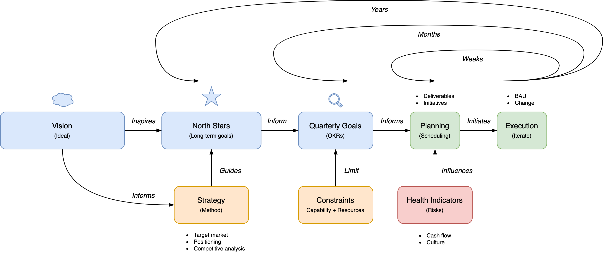
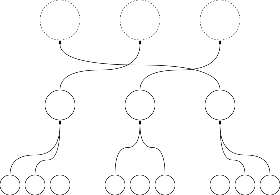
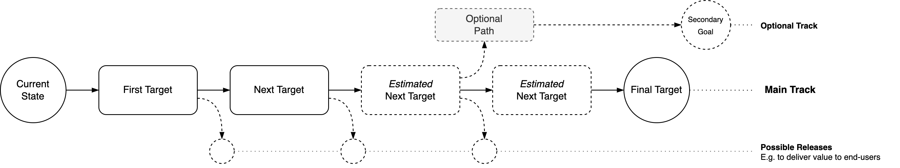
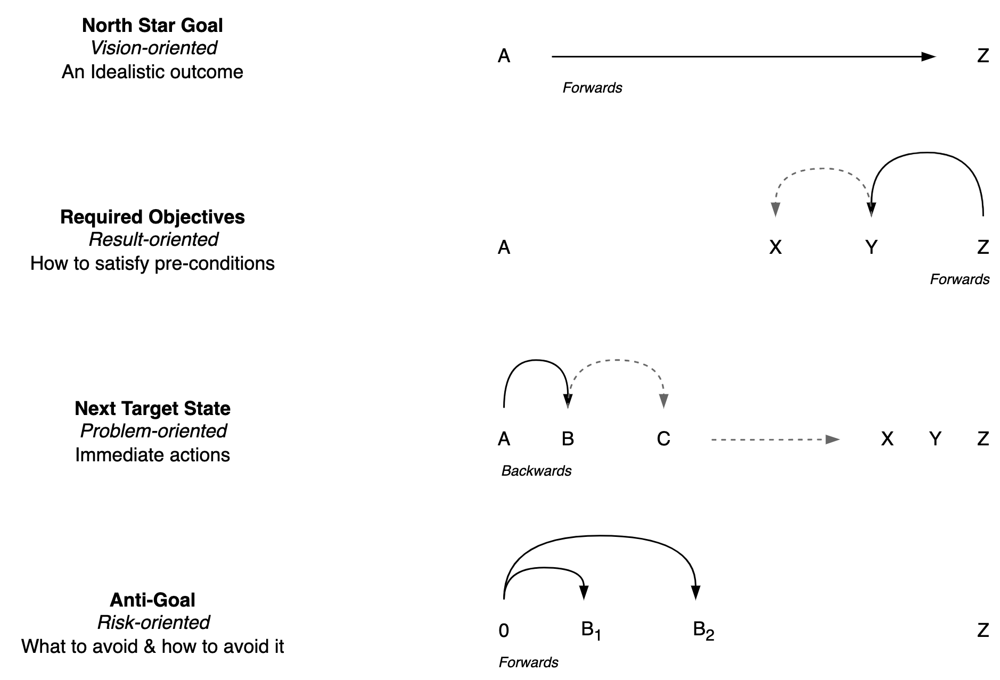

# Goals & Strategy

[toc]

## Introduction

> Plans are worthless, but planning is everything. Execution > strategy.

> Good strategy means saying no.

**Goals**

Goals are a tools that can be used to:

- ⭐ North star. Align on a direction.
- 💡Enlighten. Inspire and amplify performance.
- 🔦 Shine light on ... Understand performance.
- 🚦 Warn. Asses performance or progress.

**Planning**

Different modes of planning:

- **Top-down**. Follow a vision. Then fill in the remaining steps. Address any obstacle.
  - 🧭 Goal-oriented. Define a clear direction or **outcome**.
    - 🎲 Then work on **positioning** and make bets that will help to achieve your goals.
  - 🎯 Optimize for **point estimates**. Breakdown tasks into concrete sub-tasks. Focus on output.
- **Bottom-up**. Focus on needs. Understand the current problems. Then address them. E.g. remove bottlenecks.

The ideal type of planning depends on the environment. In many contexts, the steps that are required to reach an objective are not intuitive.

**Types of goals**

Goals do not have to be *coupled* to plans

- They can be higher level and longer term.
- They can point to an ideal state, without requiring an explicit pre-determined path to get there.

**Idealistic** goals. Decouple long-term goals from plans. Direction > position.

- This improves agility. More flexibility to add initiatives that will bring you closer to a goal.
- This avoids premature optimization. First define where you want to go, before considering the limitations.

**Realistic** goals. Couple short term goals with a planning. Make them [s.m.a.r.t.](https://en.wikipedia.org/wiki/SMART_criteria).

- Make them realistic. Minimize scope and contain risk. Consider the available resources.
- Make them time-bound. Ensure there is enough urgency.

### Terminology

<table>
<tr>
  <th><p></p></th>
  <th><p>Type</p></th>
  <th><p>Subtype</p></th>
  <th><p>Meaning</p></th>
</tr>
<tbody>
  <tr>
      <td rowspan="4"><p><b>Goal</b></p></td>
      <td rowspan="4"><p><b>Why</b></p></td>
      <td><p>Mission</p></td>
      <td><p>Why we exist (our purpose). Why we are investing in this.</p></td>
  </tr>
    <tr>
      <td><p>Vision</p></td>
      <td><p>Evidence or result. What our ideal world (state) looks like.</p></td>
  </tr>
  </tr>
    <tr>
      <td><p>Outcome</p></td>
      <td><p>A specific result that you want to see. This is oriented towards <em>impact</em>.</p></td>
  </tr>
    <tr>
      <td><p>Objective</p></td>
      <td><p>A concrete goal. This can be idealistic or realistic.</p></td>
  </tr>
  <tr>
      <td rowspan="2"><p><b>Approach</b></p></td>
      <td rowspan="2"><p><b>What</b></p></td>
      <td><p>Strategy</p></td>
      <td><p>How to achieve the mission / realize the vision (<em>external</em> factors).</p></td>
  </tr>
    <tr>
      <td><p>Tactic</p></td>
      <td><p>How to achieve the mission / realize the vision (<em>internal</em> factors).</p></td>
  </tr>
  <tr>
      <td rowspan="3"><p><b>Plan</b></p></td>
      <td rowspan="2"><p><b>How</b></p></td>
      <td><p>Deliverables</p></td>
      <td><p>What good results look like. E.g. milestones, saga's, episodes, epics.</p></td>
  </tr>
  <tr>
      <td><p>Initiatives</p></td>
      <td><p>Specfic actions that are taken to achieve (sub-)goals.</p></td>
 </tr>
    <tr>
      <td rowspan="1"><p><b>When</b></p></td>
      <td><p>Roadmap</p></td>
      <td><p>When we deliver milestones or increments.</p></td>
  </tr>
  <tr>
      <td rowspan="2"><p><b>Context</b></p></td>
      <td rowspan="1"><p><b>Who</b></p></td>
      <td><p>Segmentation</p></td>
      <td><p>Who (the target market)</p></td>
  </tr>
  <tr>
      <td rowspan="1"><p><b>Where</b></p></td>
      <td><p>Positioning</p></td>
      <td><p>Where (the product stands)</p></td>
  </tr>
</tbody>
</table>

Note that these can be chosen for an *organization* and for each *product* within that organization.

In an organization, these may be combined in a single information management system (e.g. JIRA). The challenge is to

- Organize "everything" and keep it up to date.
- Use a limited level of detail.
- Present different views of the same data. E.g. at different levels of abstraction and different time horizons.



**Separation of roles**

Activities

- Goal setting. A direction or target state.
- Planning. Scheduling work.

Metrics

- Confidence levels for OKRs. Change-oriented
- Health indicators. BAU-oriented.


## Models

Insights

- Distinguish long-term goal from actionable plans.
- Use different models for different contexts.

| Model            | Optimizes for | Ideal Time horizon |
| ---------------- | ------------- | ------------------ |
| North Star Model | Alignment     | Years              |
| OKR Model        | Focus         | Months             |

### North Star Model

1. **North star** goal. An amazing outcome - yet far away.
2. **Current state**. Where you are now.
3. Next **target state(s)**. The <u>path</u> you want to take. Avoid a strict ordering, but do include a preference based on current circumstances.
4. **Initiatives** that will bring you to the next target state.

Visually:


### OKR Model

> When I go forwards you go backwards - and somewhere we will meet.

OKRs separate qualitative motivational goals from tangible goals. OKRs can be defined per product and target market, but also on an individual level.

**Mission**
Why does this organization exist. A *persistent*, long term goal.

**Objective**
That <u>what you want</u> to achieve in the next quarter or year. A time-bound, *qualitative* goal that is ambitious, inspirational and motivational.

- (for projects) A target state that differs from the current state.
- This can be an hypothesis.

**Key Results**
<u>How you know</u> that you are achieving the objective. *Quantitative* goals that are [measurable](https://en.wikipedia.org/wiki/SMART_criteria). These are results of actions that you might take, not the actions themselves.

- They should be so optimistic that only 2/3 of them will be reached.

- These may be time-based. E.g. the churn-rate at a given date.
- (for projects) Target conditions that need to be satisfied in order to reach the target state.

Assign a confidence score to each key result track progress.

**Initiative**
An action that will bring you closer to a result. These should be flexible, in order to be able to respond to surprises.

- E.g. steps that can be taken in sequence to reach target states.

**Risks**
Similar to [MBO](https://en.wikipedia.org/wiki/Management_by_objectives), there is a risk of optimizing for metrics (proxies), instead than targets. This is countered by choosing new metrics (KRs) periodically and chaining them to qualitative objectives.

**Health Indicators**

Perpetual objectives or metrics that are kept stable. Any change induced by the current set OKRs should not degrade these.

#### Guide

How to design OKRs, given an initial idea.

1. Exploration
    1. Define the problem space and the desired state.
    2. List realistic and unrealistic goals.
    3. List potential initiatives that are realistic
2. Exploitation
    1. Narrow down the objective. 
    2. Deconstruct the desired state into key results.


## Formulating Goals

> Think big, work small

Criteria for good goals.

- Motivation and incentives. Think big.
  - Outcome > problem. Focus on where to go, rather than what to avoid.
  - Chain outcomes together. Show what the current objective will make possible.
- Make it realistic. Minimize scope.
  - Restrict the outcome to what is in your control.
  - Make it specific. Add conditions. Define when the goal is achieved.
  - Consider the available resources.

In addition, ensure the following.

- High awareness of the main goal, at multiple levels and time scales.
- Urgency. E.g. by committing to deadlines.

**Dimensions**

Inspired by [John](https://twitter.com/johncutlefish/status/1653114991527198720).

- Time-horizon. E.g. days, weeks, months, years, decades.
- Distance to customer. Oriented towards internal tools, platforms, teams, end-users, customers.
- Depth. E.g.
  - Level of abstraction: conceptual or concrete (actionable).
  - Level of detail: generic (visionary) or specific.
  - Strictness: Guiding or focussed.
  - Scope: Broad (holistic) or narrow.

**Anti-patterns**

- Give all goals the same priority. Lack of an preeminent goal.
- Low awareness of the goal. The goal get's lost in day to day activities.
- Lack of repetition and iteration. Switching directions without learning from past results.
- Goals are create purely top-down. There is no consideration for local problems.
- Goals are create purely bottom-up. It is biased to local optimization.
- "Do the same as last year, but more efficient".

## (Planning) Living Roadmap

> Great outcome > meeting initial requirements.

> A goal is nothing without a good system to reach it.

A roadmap is a prototype of a strategy, rather than a list of everything that will be done. Make it flexible. Design for failure. It may contain the following components

- End-goal. A vision.
- The direction in which to move. The next step.
- Sub-goals that help towards the end-goal. E.g. initiatives.

**Living Roadmap**

A roadmap becomes outdated over time due to:

- Internal changes. E.g. learning as part of the pre-planned progression.
- External changes. Changes in the environment.

Hence, use a format that is resilient to change. This can be done by combining high-level and low-level descriptions.

**The messy middle**

Long-term goals are generally stable and short-term plans can be made continuously. Everything in between is inherently messy. The "middle" is based on the current worldview, but because it is specific it will become more and more obsolete as the environment changes. Hence it has to adjusted be from time to time.

A major strategy for this is diversification. Consider multiple initiatives that will help to reach your goal from different angles. Design these to be *replaceable*. Ensure that they can at least be adjusted over time. Note that this still allows focus on a single initiative at a time.

A common tool to address the complexity of this area are [OKRs](https://en.wikipedia.org/wiki/OKR). Do note that this works best as a *complement* to a long-term outcome.

**Time horizon & Scope**

Time horizon ([source](https://twitter.com/nathanbaugh27/status/1554101737736519680)):

- Dream in years
- Plan in months
- Evaluate in weeks
- Ship daily

Scope:

- Prototype for `1x`. E.g. a single user.
- Engineer for `100x`. E.g. design a system to support many users.
- Build for `10x`. Focus on a large enough subset of users.

Follow up questions:

- What's required to cut the timeline by half?
- What required to double the impact?

#### Template 1: Persistent Outcomes

> Separate goals from dreams

A template for a one-pager roadmap. This can be complemented with external sources. Note the similarity to the "Now Next Later" roadmap.

1. A mission or vision. A perfect outcome.
2. North star goal. A great outcome. The minimum investment you want to make. This takes in cost and time constraints.
3. Current state and target state.
4. A list of next target states. Avoid a strict ordering, but do include a preference based on current circumstances.

In addition, it may be useful to include *anti-goals*: the activities that are excluded. This makes trade-offs explicit and forces the authors to investigate their choices.


This can be accompanied with the following:

- A list of initiatives. I.e. the work that needs to be done to reach a target state.

- A list of desired outcomes over time, on an exponential timescale. E.g. a month, quarter, year and 4 years.

#### Template 2: Goal Cascade

(anti-pattern, from [here](https://cutlefish.substack.com/p/tbm-4151-why-goal-cascades-are-harmful))

A hierarchy of targets that is updated every quarter.

1. A few organization-wide, high level goals.
2. Department-specific goals that contribute towards the first goals.
3. Team-specific goals that  contribute towards the departmental goals.

**Risks**

- Over-simplification at the top. Reality is modeled as a tree-like graph, with independent sub-goals. This creates an incentivize for local optimization.
- Fragile, high fluctuation in goals. Each goal is a piece of work and has to be replaced after the work has been executed.

<details>
<summary><b>Goal Structures (Patterns)</b></summary>
<br>
<p><b>Tree Structure</b><br/>
  Problem: assumption of independence is an oversimplification.</p>

<br/><br/>
<p><b>Complex Structure</b><br/>
  Problem: too chaotic.</p>

<br/><br/>
<p><b>Double Tree Structure</b><br/>
  Sub-goals map to multiple high-level goals.</p>

</details>

#### Template 3: Path

Format for a pitch:

1. Start with the **main** goal. Ensure that there is agreement on both the need for change, and the end-result.
2. Add the **path** to reach it. The steps can represent e.g. initiatives or full releases. Cover the earlier steps in detail. Leave later steps abstract if possible.
3. Emphasize the flexibility of the plan by highlighting secondary **options**. Show optional paths that could be taken in case of changes to the environment.

In case of technology-based projects this can be complemented with suggestions for **prototypes**.



## Alignment

**Tools**

- Documentation/text/email. Very efficient one way of communication.
- Meetings. Fast feedback in groups.

### Meetings

Setting up dedicated ceremonies can help to ensure regular reflection, at the right timescale. E.g. in the form of meetings:

- Daily check-in meeting. Align and improve awareness. E.g. of work or people.
- Weekly tactical meeting. React to short-term issues.
- Monthly strategic meeting. Decide on long-term adjustments. Prepare topics beforehand.
- Quarterly off-site review. Take an outside-view and reflect.

See also [management-principles](management-principles.md#Meetings).

### Visualize

#### Organization or Team Health

KPI's

#### WIP

Visualizing work has a few benefits:

- Alignment by making progress explicit.
- Show bottlenecks that impede flow.

This can be done with a [kanban](https://en.wikipedia.org/wiki/Kanban_board) board. Such a board consists columns such as: `to-do, doing, done`. Each column may contain cards, which represent actions or tasks. See [product management](product-management.md).


## Project Portfolio

Before creating a roadmap, one must choose the right projects or initiatives.

Individually, each projects may seem valuable. The challenge is to maintain a balanced portfolio of projects. A typical chicken-egg problem is that projects need to be prepared before they can be prioritized. Doing too much preparation increases WIP and thus reduces focus. This template attempts to avoid this by defining high level outcomes and excluding details.

This is especially useful w.r.t technical work that is not visible to end users. Although it is valuable, it can be easily be postponed without affecting promises to stakeholders.

Below are a few templates

- Signals
- Desired States
- Option pool. A mapping from initiatives to higher-level goals.

### Template: Signals & Underlying Problems

Awareness of the current landscape is a prerequisite of planning. This template focusses on understanding a complex landscape. It's based on the [scientific method](https://en.wikipedia.org/wiki/Scientific_method). It results in two lists: signals and problems.

**Workflow**

1. Observe **signals**. Which problems are clearly visible. E.g. red flags, pain points or obstacles.
2. Determine the **underlying problems**. Do this based on hypotheses.
    1. What is causing these signals? Why haven't they been addressed before?
    2. Collect data if necessary.

Based on this, it is possible to:

- Define experiments to verify hypotheses.
- Choose initiatives that address these problems.

Review & report in order to maximize learning.

### Template: Risks

List the major risks and estimate their exposure (probability and probability of materialization). Consider both:

- Threads (external)
- Vulnerabilities (internal)

Use this to decide to invest in mitigation. See [management-principles](management-principles.md).

### Template: Desired States

Start with a number of categories or themes. E.g. security, incident management, operations or efficiency. For each one, define the current state and the desired state.

- Emphasize the *problem* with the current state.
- The desired state is not necessarily a *target*, but rather an *idealistic outcome*.

This template focusses on the range of outcomes and <u>excludes how to reach them</u>. This avoids the overhead of up-front planning, and reduces the risk of plans becoming outdated.

The template:

``` markdown
# Theme A

Current State
> What is currently lacking.

Desired State
> What outcome is envisioned.


# Theme B

Current State
> What is currently lacking. Link to the current design.

Desired State
> What outcome is envisioned. Read more here.

...
```

### Template: Portfolio / Option pool

1. Determine & align on a *set* of core objectives. Avoid ordering this set by importance. E.g. `deliver value` now, and `contain cost`, `be agile` to be able to keep doing this in the future.
2. Create an option pool of initiatives. Show how each initiative relates to a core objective.
3. Compare the ROI, risk and compatibility of the initiatives.

### Template: Matrices

**Projects vs. Objectives**

|                  | Objective A | Objective B | Objective C |
| ---------------- | ----------- | ----------- | ----------- |
| Project X        | o           |             | o           |
| Project Y        | o           | o           |             |
| Project Z        |             |             | o           |
| ***Dependency*** | X, Y        | Y           | X,Z         |

**Cost vs. Urgency**

|                          | Not urgent | -         | Urgent    |
| ------------------------ | ---------- | --------- | --------- |
| **High risk / low cost** | Project X  |           |           |
| **-**                    |            |           | Project Y |
| **Low risk / High cost** |            | Project Z |           |

### Visualizations

**Mapping of initiatives to core objectives**


**Comparison of Projects**

Express the *cost* of each initiative or project in vertical space. Each box indicates an increment. Ideally these can be delivered to customers to generate revenue. The arrows indicate dependencies between increments.


**Comparison of Projects and Objectives**

Decouple objectives from projects. Some projects may bring you closer to multiple objectives. Emphasize objectives that have exceptional impact or value.


**Projects per Theme**

This is again based on categories or themes, but this template emphasizes the option pool. The shape of the visualisation (when zoomed out) gives an indication of the amount of focus.


## Formulating a Goal

Goals can be used to both motivate and guide a person or organization.

The goal itself should be skewed towards the *Why* instead of the *What*. It should be an optimistic vision or mission.

- This includes a understanding of the relevant assumptions.
- Goals that are too optimistic lead tend to lead to short term optimization. E.g. trying to survive instead of investing in long-term solutions.
- Goal that are not challenging enough lack a motivational effect. This may lead to a lack of focus.

A goal may be accompanied with an *initiative* (input), *target* (output, result) and a *target condition* (objective, outcome) and an estimation of the *impact*.

**Initiative & Target**

Global optima are usually unknown in advance.

- Initially the target condition can be be a vague *challenge*. Missing details can be filled step by step, after reflection and experimentation. In fact, it is inevitable that you find new information when moving forward.
- Define the minimum amount of work that is required to reach an outcome and start there.

- Beware of changing the target condition to fit the current state.

**Metrics**

Use metrics as a tool to track incremental progress. Expectations for metrics should be ambitious but not impossible.

- Note that all metrics are flawed. They cannot be both generic and specific.
- Optimize targets and not [the measure](https://en.wikipedia.org/wiki/Goodhart%27s_law) (avoid [perverse incientives](https://en.wikipedia.org/wiki/Perverse_incentive)).

- Use different goals per timescale: `days, weeks, months, years, decades`. Relate shorter term goals to longer term goals.

**Estimating**

Reasoning with probabilities and large numbers is harder than reasoning with small, discrete numbers

- `1 out of 8` is more intuitive than `12.5%`.
- Conglomerations are easier than continua and numeric values.

- Predict complexity of a tasks by the estimating the number of subtasks

Avoid personal bias. Instead of estimating your personal work (or your team), estimate what an other or similar person/team could achieve.

**Flow of Work**

The optimal size of batches, number of batching steps and the size of subtasks is context-dependent. Hence it should be optimized to current conditions, in concurrence with any target conditions.

**Choosing Goals**

Prioritization requires de-prioritization. This is inherently difficult. A few tools that can be used are:

- Select a single goal, that is absolutely necessary. E.g. address (or identify) the main constraint.

- Create a plot of the benefits as result of the effort required, for each possible goal.

Defining goals

- Bottom-up: First list features or desires, then define metrics.
- Top-down: Define a desired outcome, then define metrics to track progress towards that outcome, then list immediate actions.

**Assumptions & Facts**
For each goal, denote the assumptions and rationale. Be explicit in what's an assumption or uncertain.

### Template: Choosing Sub-Goals

Different ways to set goals

**Legend**

- A. Current state
- B. Next target state, which will help towards Y and Z.
- Y. Required objective for Z.
- Z. North star goal



## Documentation

> Use documentation to recall conversations rather than as an alternative for them.

The goal of documentation is to externalize thinking. This helps with aligning the whole organization.

Summarize higher level in one-pages, but do use appendices (for details) and link to additional sources. See also [documentation](../documentation.md).

### Tools

**Narrative**
Convey the feeling of an ideal state. E.g.*"1000 songs in your pocket"*
This is independent of the required input effort.

**Persona**
A model (or proxy) of the target market or audience. E.g. a typical user with a certain background.

**User Story**
What value a given feature would bring to a given *persona*. See these [templates](requirements-engineering.md).

**Epic**
A collection of user stories that can be finished in at most a handful of months.

**MVP**
See [product management](product-management.md)

**RFC**
Request for comments. A scalable method to get feedback on an idea.

**North Star Goal**
A high-level, long-term goal that is used to show the direction to work towards. It should still specific and measurable. It may be complemented by shorter-term metrics.

- Ideally this metric is consistent with your definition of success.
- Ideally this metric is clear to the whole organization, such that they can align.

**Output, Outcome and Impact**
See [requirements engineering](requirements-engineering.md).

### Map

> Maps don't tell you what to do. Instead they show you your options.

A visualization of points in space. They allow you to explore routes.

They give insight into the environment and into how the environment is changing.

Components

- Anchor. Central, stable point.
- Legend. What does space mean

Dimensions that can be used:

- Time. E.g. [value added](https://en.wikipedia.org/wiki/Value_added), up to value delivery.
- Visibility to end-users.
- Dependencies. Needs of end-users.
- Level of [commoditization](https://en.wikipedia.org/wiki/Commoditization). From custom to standard to commodity. From uncharted to industrialized.
