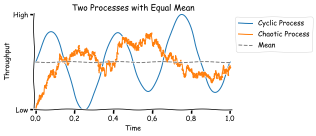

# Management Principles

Inspired by [various sources](#references). See also [goals & strategy](./goals-planning-strategy.md).

[toc]

## Overview

> Good management is situational

Management *an sich* is a theoretical domain. In the real world, one would encounter management of a *subject*. For example: management of a project or a department.

This *subject* can be framed as a [theoretical system](../systems/systems-management.md). The purpose of a manager is to ensure that the system achieves it purpose - both now and in the future. A prerequisite for this is ensuring the quality and availability of the system's resources. The performance of a manager is interconnected with the performance of a system.

At minimum, management involves alignment, communication, facilitation, orchestration and prioritization. Depending on the scale of the subject, a manager may also contribute in secondary tasks such as planning, execution and coaching. Hence the role of a manager may extend from facilitator to director.

Management consists of **balances**. For example:

- Learning and adjusting.
  - Being adaptive (pragmatic) or being consistent (conservative) and making use of experience. Based on the environment.
- Focussing and diversifying.
  - E.g. improving a process versus outsourcing a process.
- Time horizon.
  - Pursue an optimistic ideal or a realistic planning.
  - Optimizing for the next quarter or for multiple decades.
- Delegating much but not everything.

See also [organization-structure](../systems/organization-structure.md) and [systems-management](../systems/systems-management.md).

**Properties**

1. At an abstract level, management lies between the roles of an *administrator* and an *operator*. The latter requires a higher level of domain knowledge.
2. Type of leadership. The role can vary from being a *leader* to a *facilitator*.
3. The nature of the target: *projects* or *processes*. The former focusses on reaching a goal within a time or cost bound. The latter is focusses on maximizing value.
    1. Project (time- and cost-bound). Focus on reaching a goal, completing requirements.
    2. Process (bound by opportunity cost). Focus on maximizing value (often profit). E.g. management of [products](./product-management.md) or people.

There is a tradeoff between adapting to the current team, and seeking out employees that accept a certain management style.

It involves a few *buckets*:

- Purpose (why). From existential questions to goals and alignment.
- People (who). Motivation and trust.
- Process (how). How the organization makes, executes and adapts plans.

**Activities**

1. Set *optimistic* goals, prioritize them and make a *realistic* planning/estimation.
    - Be great at setting expectations (e.g. to stakeholders).
    - Communicate a clear vision.
    - Adapt over time. Revisit past decisions.
    - Decide what [*not*](https://en.wikipedia.org/wiki/Opportunity_cost) to do.
2. Create (nurture) an environment where employees can reach those goals.

    - Employees should have agency and be incentivized to be pro-active. Allow them to question everything.
    - The organization should be a community, where people interact.
    - Remove roadblocks.
    - Perceive the need.
3. Ensuring the availability of resources (incl. in the future).

**General approach**

- Know what *you* want
- Know what *others* want
- Find *ways* in which you can get it

### Performance

See [systems-management](../systems/systems-management.md).

**Effectiveness**

The two main directions to be effective are:

- Deliver (maximize) value to customer. This may require investment and innovation (change).
  - Now or sooner.
  - In the future or long-term. Be sustainable and be able to adapt to the environment.
  - Do this in a happier or safer way.

- Eliminate (minimize) waste. This doesn't just demand reliability and stability, but it also requires an investment to remove obstacles.
  - Waste is defined as "anything that isn't part of the value chain"

This involves

- Continuous improvement of purposes, people, processes.
- Continuous discovery of value and waste.

**Measure of Success**

Define a proper measure of success. Evaluate whether the assignment could be successful (outcome-based) without meeting the requirements.

Typical components:

- Total returns. Delivered value - rather than produced value. E.g.
  - Profit minus expenses and inventory.
  - Quality: high quality and low variance.

- Relative returns. Delivered value relative to the effort or cost put into the system.
  - Efficiency: of the system as a whole or individual components (e.g. resources). This consists of resource utilization and throughput.

- Agility: be able to adapt. Typical influences are lead time, batch sizes.
  - E.g. minimize the cost of change.

Note that measures of success can be biased by how a component is perceived. E.g. a cost center of a profit center.

- Cost world: make local improvements (cut costs), that add up linearly to a global optimum.
- Throughput: focus on the weakest link in the critical chain.

Timeline, scope and capacity are related. If one changes, then at least one of the others will too.

**In business**

Components

- Increase revenue, now and in the future.
- Protect revenue, in the future.
- Reduce cost, now and in the future.
- Avoid cost, now and in the future.
- Increase leverage (eg platforms, automation), in the future.


### Change

Note that these can all involve [*change*](../intelligence/learning.md). A typical challenge is to change processes that are optimized for the status quo. See also [organizational culture](../systems/organization-structure.md).

1. [Influence](https://danluu.com/culture/) people (indirect)
    1. Incentives. Rewards and punishments for behaviour or achievements.
    2. Processes. E.g. regulation, validation.
    3. Culture. "inherent" values. E.g. ideals to strive for.
2. Persuade people (direct). E.g. [transformational leadership](https://en.wikipedia.org/wiki/Transformational_leadership).

**Dimensions of Change**

Reaching goals usually requires change.

1. Direction.
    1. Increase positive effects (e.g. increase profit).
    2. Decrease negative effects (e.g. cut cost).
2. Locality.
    1. Optimize (all) individual components.
        1. Risk: over-production, tunnel-vision, high inventory that can become obsolete.
    2. Optimize the flow of tasks through the system. E.g. manage constraints. Note that this can include worsening the performance of specific components.
        1. Risk: bias for the current goal. E.g. bias for a target market.
    3. Diversify. E.g. diversify the product line for exposure to new markets.
        1. Diversify into new markets.
            1. Risk: lack of focus, lack of efficiency, low margins.
        2. Diversify the current market by creating [segments](https://en.wikipedia.org/wiki/Market_segmentation).

With this in mind, three questions can be asked: What to change? What to change it to? How to do it?

Also see [goals and strategy](./goals-planning-strategy.md).

### Attitude

Knowledge: Be a generalist

> I don't know, but I'll find out

Role

> Outcome > specific activities

Inspire

> How did you find the blueberries?

- Focus on success. E.g. opportunity and potential. Use positive goals. Emphasize what went well, rather than listing countless problems.
- Learn from experiments.

**Integrity**

From Jim Dethmer

- Take responsibility.
- Feel your feelings.

- Speak authentically and candidly.

- Be impeccable with your agreements

Effects

- Withholding leads to withdrawing and rejecting
- Revealing leads to connecting

### Leadership

Management often requires leadership. It may consist of:

- Vision. Show a direction. Set an example. Motivate others. Advocate the why.
- Execution. Facilitation. Achieve outcomes.
- Culture. Trust. Set the tone for the team.

Situational leadership model. Dependent on skill, motivation, urgency.

1. Directing / guiding. **Tell** people what to do.
2. Selling / coaching / explaining. **Sell** an vision to autonomous teams.
3. Participating / facilitating. **Participate** in problem solving.
4. Delegating / empowering / monitoring. **Delegate** tasks.

## Collaboration

**Focus**

Reaching consensus on what *needs* to be done is easier than reaching consensus on what *can* be done.

Determine whether a team needs to **adjust** or whether it needs to **change**. Two different approaches can be:

- Use ceremonies & tools for team alignment (i.e. slight adjustment), until the desired behaviour or culture has been reached.
- Apply the concept of a "fresh start" whenever you want to change or disrupt the current way of working. E.g. formulate former practices or habits as something the "old" team would do, and the new practice as something you would do from now on.

Make sure there is regular reflection, both on the level of individuals and the level of teams.

Make goals and problems **visible**. E.g. using Scrum or Kanban boards, milestones, dashboards, alerts, red/green builds. This incentivizes attention and reflection (and re-think our approach).

**Role Assignment**

There exist multiple models for [role and responsibility assignment](https://en.wikipedia.org/wiki/Responsibility_assignment_matrix). A few fundamental roles:

- Accountable for the end-result.
- Responsible for execution.
- Consulted. E.g. providing consultancy or support.
- Informed. Following along.

Roles can be official and persistent, or informal and dynamic.

**Persistence**

One-pagers. One page is enough to introduce an idea but does forces the writer to be concise. In addition they are well-suited for collaboration. Although they are abstract, the corresponding idea should be measurable in order to be effective. See [planning](./goals-planning-strategy.md).

**Team Performance**

Based on the Lencioni model (Five dysfunctions of a team):

1. Level of **trust**. Can team members be open/vulnerable?
2. Acknowledgement and resolution of **conflict**. Is conflict suppressed? How long does it take for issues to appear?
3. Level of **commitment** and dedication.
4. Acceptance and avoidance of **accountability**. Do team members hold each other accountable? Is the team being held accountable?
5. (In)attention to - collective - **results**. Do collective goals corresponds to personal goals?

### Meetings

Generic goals. Ranging from content-oriented to relation-oriented.

- Discover the range of relevant **options** for a decision or problem.
- Explore a subject and **determine** the right approach - while involving the group.
- Improve the **relationship** of the group. Make everyone feel valued. Improve the group dynamics.

Specific goals (focus)

- Make a **decision** and get everyone on board. E.g. stakeholders or colleagues.
- Share information.
  - Convey a key **message** clearly and memorably.
  - Invoke an **emotion**. E.g. inspiration, trust, pride, courage, empathy.
- Provide feedback. Reflect.
  - **Align** on definition of success.
  - **Represent** the current state and recent changes.
  - Explore up risks and open questions.
  - Define next steps.
- Strengthen **relationships**.
  - Gain better understanding and improve trust.
  - Culture of openness and being authentic.
- Brainstorming. Think out of the box. Come up with novel insights.

> Lack of conflict is an indicator that the right topics aren't being addressed.

Signs of good meetings

- Structure / scope

  - Key participants take time to do preparation and post-preparation.
  - Expectations have been set at the beginning of the meeting.
  - There is either a good structure or a good agenda.
  - The scope is specific and appropriate.
  - Out-of-scope topics are saved for later. Action points are written down.
  - A decision is made at the end.

- Diversity / interaction

  - The chair makes decisions, despite absence of consensus.
  - Apparent conflict is addressed (openly). Differences are accepted rather than suppressed.

  - All participants pay attention and are engaged.

  - All participants feel heard / welcome.

See also [goals-planning-strategy](./goals-planning-strategy.md#Meetings).

#### 1:1 Meetings

Scope

- Align on top priorities and focus.
- Calibrate the definition of great
- Bidirectional feedback
- Reflect on longer term developments

Expectation management

- Define a great/mediocre/bad job, in personal context
- Advice to start with. Pitfalls
- Feedback. What do do more and less.

Key topics

- Content. The work itself.

- Relation. Roles and collaboration.

- Process. Meta.

**Discovery**

Identify relevant topics

- What’s the best use of your time today?
- What on top of your mind right know?

Understand the other

- What is the ideal outcome?
- What is the worst case scenario?
- What is a good action to take?
- What’s blocking?

Support

- How can i help?
- What was the most useful part of this conversation?

### Feedback

> Giving feedback = disclosing hidden information about you

Types

- Task-specific. Frequently.

  - Non-personal, local, specific to an action or event.
  - May be send via chat.

- Behavioural feedback. Thoughtfully and regularly.

  - About themes and patterns. Subjective, eye of the beholder

- 360 degree feedback. From multiple angles/people.

  - E.g. questionnaires.

  - What is X doing well and what should X do more of? What behaviour from X bears risks?

Attitude

- Give compliments regularly to show your appreciation.
- Present options over solutions. If the someone finds a solution themselves then they’ll tend to remember it better.
- Don't say: "You must change this". Rather say: "If you change this then I would support it".

Tools

- Event-effect-you.
  - Bring up an *objective* event. *"I noticed ..."*
  - Describe the subjective effect it had - on yourself. Free of judgement. *"This caused me to feel ..."*
  - Relate back to the other. *"Do you recognize this?"*
- Event-effect-pause. Give the other space to accept, interpret and react.
- Event-effect-need-request. Accept beforehand that request may be denied, unlike demands. *"I noticed .... This resulted in .... I need .... Could you ...?"*

**Anti-patterns**

Compliment sandwich. Pack criticism in between seemingly softening compliments, instead of being straightforward and sincere.

### Departments

Traditional conflicts between departments

**Development & Operations**

- Development wants to change and innovate
- Operations wants stability and predictability

Typical solutions: DevOps, product-teams.

**Operations & Sales**

- Operations prefers small changes over large ones (e.g. slow supply lines).
- Sales prefers bulk orders due to costs

Typical solutions: ship orders in increments, vertical integration, store resources in a central location

## Management per Type

Levels

- Operational level. E.g. (autonomous) functional, product or feature teams.
- Coordination level. Relations between teams.
- Strategic level. Which directions, what priority.

Levels of assignments

- Execute a plan
- Develop a plan / find a solution to a given problem
- Discover the right problem

**Organization Management**
 [organization-structure](../systems/organization-structure.md)

**Crisis management**

- Dealing with risk after they've materialized.

**Stakeholder management (managing up, opdrachtnemerschap)**

> Ask for advice, not for feedback

In general, this involves: organizing, monitoring, improving interactions and relations with stakeholders.

Specifically:

- Discovering who your stakeholders are. Evaluating their relative importance. E.g. based on urgency, power and legitimacy.
- Discovering the needs of these stakeholders. Evaluate these needs based on relevance.
- Communicate expectations to these stakeholders.

Ascertain:

- Their goals, their expectations
- How they want to be kept in the loop
- Be transparent. Share challenges.

Communication - based on a request:

1. Send acknowledgement
2. Send planning. E.g. the estimated date of the change.
4. Confirm success - after the change has been done.

Communication - based on change

- Update stakeholders when new information has become available.
- Update stakeholders periodically with the current status.
- Display a status board that is continuously updated.

Managing up

- My problem
- What I tried
- What would you do if you were me?

**Expectation management**

Ensure expectations are aligned at the beginning.

- Under-promise (and over-deliver) to stakeholders. Avoid uncertainty and build trust.
  - Focus on *long-term*, abstract goals. Rely on *minimal* requirements.
  - Add in slack as a buffer against risks.

- Over-promise internally, in order to motivate employees.
  - Include a *short-term* planning, that is specific. Include *full* requirements.
  - In addition, prefer learning over blaming.

Technique:

1. What *do* you expect?
2. This is what you *can* expect. This is what *we* will do.

**Time management**

Let the other accept your schedule. Not everything is possible, so force the client to choose explicitly. Communicate transparently.

There is never enough time, but there are three ways to manage it: prioritization, efficiency and multiplication.

Priority can be based on motivation, desire or purpose.

Prioritize *core* activities and defer, drop or delegate (outsource) *contextual* activities.

Sometimes efficiency can be improved by changing processes or technology.

Time can be multiplied.

- Teach others *why* and *what* instead of *how*. Empower others to do it independently.
- Broadcasting instead of point-to-point communication. E.g. write a blog post or wiki instead of a long email.

**Performance management**

See [reinventingorganizationswiki.com](https://reinventingorganizationswiki.com/en/theory/feedback-and-performance-management/).

| Type of Organization | Method                                                       |
| -------------------- | ------------------------------------------------------------ |
| Power-oriented       | Rewards and punishment by the boss                           |
| Rule-oriented        | Monitor conformation to rules and roles.                     |
| Performance-oriented | Track progress towards targets. Incentivize excellence.      |
| Value-oriented       | Focus on team performance and collaboration and personal development. |

Goals setting - types of people

- Tendency to underestimate
- Tendency to overestimate

**Performance and Trust**

|                | Low Performance    | High Performance |
| -------------- | ------------------ | ---------------- |
| **Low Trust**  | Poor               | Toxic / risk     |
| **High Trust** | Growth opportunity | Optimum          |

### Process Management

Based on the properties of [systems](../systems/systems-management.md) the following steps can be derived. See also [TOC](https://en.wikipedia.org/wiki/Theory_of_constraints).

1. Identify the main constraint in the system.
    1. Identify the [critical chain](https://en.wikipedia.org/wiki/Critical_path_method).
    2. Identify the critical component. This can be either a policy or a physical constraint.
2. Assuming there is no simple solution, *exploit* the constraint. Ensure that the resource is used for the right job and then maximize its throughput.
3. *Subordinate* everything else. Let dependent components run at partial capacity. This avoids wasteful over-production.
4. *Elevate* the constraint. E.g. increase the capacity of the critical components.
5. Repeat all the previous steps, until the constraint has moved *outside* of the system. Note that lifting a bottleneck may change the functioning of the whole system.
6. Two remaining challenges are:
    1. [Risk management](#Risk Management). E.g. finding optimal buffer-sizes.
    2. [Product management](./product-management.md). Adjust the target market. E.g. increase diversification or market segmentation.

### Risk Management

> Yesterday’s problem is tomorrow’s risk

Definitions:

- Risk: a future undesirable event and events that precede it.

- Risk management: dealing with unpleasantness, instead of counting on luck.

```
Total Risk = threads (external) + vulnerabilities (internal)
```

The main *prerequisite* is a certain corporate culture: Think in probabilities & decriminalize risk. Uncertainty should be preferred over being wrong (or overly optimistic).

- Prefer mean-variance optimization over point-estimates. A typical prediction should include (un)certainty bounds. E.g. "We need at least 4 months, and it may take up to 1 year (in the worst case). We estimate a 80 % chance of finishing it in 6 to 8 months."
  - Usually point estimate overestimate in order to compensate for uncertainty. This can result in an [increase](https://en.wikipedia.org/wiki/Parkinson's_law) in the amount of work

- Express projects success not as an absolute (success or fail), but as progression (number of features delivered at end of time period).
  - Build in slack, i.e. the flexibility to skip/add/change features during the project.

A secondary prerequisite is a list of assumptions. These are (usually show-stopping) risks that are delegated upwards to the employer. This reduces the change of overlooking "unthinkable" risk.

**Types of Strategies**

1. General strategies:
    1. Avoid or limit tail-risk rather than focussing on winning.
    2. Diversify to handle idiosyncratic (unsystematic) risk. I.e. make multiple small bets instead of a single large one.
2. Specific strategies that don't address risk:
    1. Avoidance: don't take risks at all (but miss out on potential wins).
    2. Evasion (retainment): count on luck, assume low-probability events won't occur.
3. Specific strategies that do address risk:
    1. Containment: decrease impact of risk when they do materialize. E.g. reserve *buffers*.*
    2. Mitigation: reduce containment cost. E.g. though insurance. This has an up-front cost, independent of whether the risk will materialize.

*Given a set of independent risks, the risk exposure per risk is the product of the probability of occurrence and the cost of occurrence. A conservative*buffer* is strictly higher then the total exposure.

```
Risk Exposure = probability x materalization cost
```

**Types of Containment Strategies**

- Isolate; use layering.
- Minimize
- Monitor; collect information about the incident and the second-order effects. E.g. uncommon patterns.
- Active Defense

**Types of risks**

- Planning-related:
  - Inherent flaws in the schedule. E.g. an unrealistic, aggressive schedule
  - Requirements inflation; an increase in requirements over the scope of the project.
  - Ambiguity in the specification. Design decision that are deferred until implementation time.
  - Dependencies.
- Employee-related:
  - Employee turnover.
  - Poor productivity. E.g. due to lack of motivation, poor working conditions, problems with communication, collaboration or coordination.
- User-related
  - Usability (user interaction).
- Context-related
  - Adaptability (to new environments). E.g. scaling up.
  - Supply chain / dependencies.

## Miscellaneous

Fundamental characteristics of the world (from [Buddhism](https://en.wikipedia.org/wiki/Three_marks_of_existence)):

1. Change. Nothing is permanent (time moves forward). As a result, systems degrade and expire. Hence there is a need to adapt, transform and sometimes start over. Naturally, even methods itself have to be adapted.
2. [Interdependence](https://en.wikipedia.org/wiki/Systems_theory). Consider components and connections. Hence we should embrace collaboration over isolation.
3. Dissatisfaction. Repetition is boring. Hence there is a need to iterate, learn and improve.

In addition, learning (adapting) takes practice. Both at the individual and organizational level.

**Gaining knowledge**

- Start with a prior belief, formulate, collect data (experiment), update your belief, and repeat.
- Value [falsifiability](https://en.wikipedia.org/wiki/Falsifiability).
- Think in probabilities. Absolute certainty should be a red flag.

**Types of work**

> Work needs to be defined before it can be delegated.

There are three types of work.

1. Unplanned work. Firefighting. E.g. incidents, recovery work.
2. Planned work or pre-defined work.
    1. Business projects. E.g. directly related to customer demand.
    2. Internal projects. Enable business projects.
    3. Changes. E.g. maintenance.
3. Planning work. E.g. defining, refining , adjusting or changing plans.

**Knowledge**

Four types of knowledge

- Known knowns: mastery
- Known unknowns: self-awareness
- Unknown knowns: hidden potential
- Unknown unknowns: blind spots

**Stability / Reliability**

Single point estimates (e.g. the mean) are a poor predictor of stability. The following image shows that chaotic (random) and cyclical processes - which are fundamentally different - can have the same mean.



## References

Books

- DeMarco. *Peopleware*
- Goldrat. *The Goal*
- Lencioni. *Death by Meeting*
- Rother. *Toyota Kata*
- Wodtke. *Radical Focus*
- Zhuo. *The Making of a Manager*
