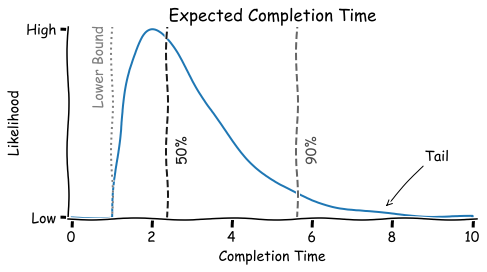

# Product Management

This document explores the management of [products and projects](../labour/products-projects-initiatives.md). It excludes [business operations](https://en.wikipedia.org/wiki/Business_operations). See also [goals and strategy](./goals-planning-strategy.md),  [management principles](../management-principles.md) and [requirements-engineering](../requirements-engineering.md) and [results](../labour/results.md).

[toc]

## Overview

Product management revolves around:

1. Designing a product vision and strategy.
2. Discovering the market fit. Understanding the users and customers.
3. Delivering the product customers. 

It requires continuous collaborating with specialists.

**From project to product**

> Product management combines short term projects with long-living products.

**Not project, but project<u>s</u> management**
Often, projects are executed in conjunction to each other. To avoid local optimization, the portfolio of products must be taken into account.

**The problem of uncertainty**
In uncertain environments, projects will usually fail to meet either time, cost or initial requirements. In the presence of both [idiosyncratic](https://en.wikipedia.org/wiki/Idiosyncrasy) and [systematic risk](https://en.wikipedia.org/wiki/Systematic_risk) there can be a need for flexibility or agility. Moreover, the behaviour of users and market dynamics are even more difficult to predict. This can be address in several ways.

- A product strategy may consists of [multiple](https://en.wikipedia.org/wiki/Diversification_(finance)) initiatives that are designed to create a competitive edge.
- Continuous product discovery. Iteratively testing beliefs.
- Fast delivery of product increments.

## Strategy

Ansoff's matrix. Product-Market Expansion Grid. Uncertainty increases from top-left to the bottom-right.

|                      | Existing Products  | New Products                   |
| -------------------- | ------------------ | ------------------------------ |
| **Existing Markets** | Market penetration | Product development            |
| **New Markets**      | Market development | Product/Market diversification |

[Porter's generic strategies](https://en.wikipedia.org/wiki/Porter's_generic_strategies): market and competitive advantage

|                                      | Uniqueness / value                                           | Cost position                                                |
| ------------------------------------ | ------------------------------------------------------------ | ------------------------------------------------------------ |
| **Industrywide / mass scope**        | Differentiation leadership (marketing, branding, quality) | Overall cost leadership (economies of scale, efficiency) |
| **Particular segment / niche scope** | Differentiation focus (target/respond to specific customer needs) | Cost focus (limit scope/complexity)                     |

Philosophy

- MVP. Then iterate
- Be insanely great (Apple).

## Background

**Software as a service**

- [SaaS](https://en.wikipedia.org/wiki/Software_as_a_service): the customer manages the (application) data and access to it.
- [PaaS](https://en.wikipedia.org/wiki/Platform_as_a_service): the customer manages the application themselves.
- [IaaS](https://en.wikipedia.org/wiki/Infrastructure_as_a_service): the customer manages the application and its runtime (e.g. the OS).

- [B2B](https://en.wikipedia.org/wiki/Business-to-business): Sell to a business
- [B2C](https://en.wikipedia.org/wiki/Direct-to-consumer): Sell directly to a consumer

**Marketing**

- Focus, sell one idea. Kort en bondig.
- Analogies to fuel imagination.
- Present features as solutions

**Product Portfolio**

Three innovation horizons. From exploitation to exploration.

1. Current cash-flow (value): profitable now. Risk: they may become a commodity.
2. High-growth businesses: will become cash-flow.
3. Growth options: will potentially become growth.

**Types of Customers and Stakeholders**

For software products.

- The product-owner or project-manager
- The business (the rest of the organization)

- The users of a platform (e.g. sellers on ebay)
- The end-users (e.g. buyers on ebay)

**Market**

> Good strategy means saying no.

Don't expect to satisfy all possible customers. Instead optimize for a limited subset of them.

- Target market: optimize product for this market
- Boundary: additional sales, but don't optimize product for this markter
- Excluded from target

[Market segmentation](https://en.wikipedia.org/wiki/Market_segmentation) is key because perception of value is subjective. In non-segmented markets, customers with high value perception pay just the average price and customers with relatively low value perception will not pay at all. Ideally products are optimized for a single user, at scale.

**Lifecycle Mangement**

Designing products and leading product-based teams is one thing. A next challenge is managing complexity, which might increase as systems and codebases evolve.

Solutions include:

- Move from product-based teams to functional teams (or back).
- Scope down applications, outsource non-core activities.

**Innovation**

The main constraints are:

- Capital. Expected rate of return of an investment should exceed the interest rate (weighed by risk).
- Human capital. E.g. organization size.

Similar to markets, processes may have to be adjusted constantly. Do have regular conversations about the tooling and way of working. Don't rely on just metrics.

**Timeline**

## Patterns & Anti-patterns

[Agile Product Ownership](https://www.youtube.com/watch?v=502ILHjX9EE) - overview by Henrik Kniberg

**Customer chasing development**
Optimize on satisfying a single customer, instead of a market.

**Feature Factory**
Bias for releasing features, rather than solving customer problems. See [software-engineering](../software-engineering.md%5D).

**Pet Projects**
Build something in secret to avoid the administrative or collaborative overhead.

**Promotion driven development**
Bias for optics & complexity. Build interesting stuff tools of useful tools.

**Shadow Strategy**
A [locally optimized, simplified version](https://twitter.com/johncutlefish/status/1574851694348750849) of a greater strategy. It may be created by ignorance or on purpose (for motivational reasons).

**Zombie product**
A product that is kept alive for political or personal reasons rather than market demand.

**Bottlenecks**

- What is holding you back?
- What patterns do you see developing?
- Where would you focus more/less on?

### Possible Processes from Idea to Implementation

From objective to discovery to delivery. Note that these phases could happen in parallel.

Formal steps

1. Initial idea.
2. Let it grow. Re-think it or share it with other people.
3. Prioritize it.
4. Build it. This requires development capacity.
5. Release it. This requires stakeholder and/or customer management.

**Implementation agnostic idea**

1. Narrative: `I wish my app would do X`
2. Short preparation `Is this technically feasible?`, `Can this be split up?`
3. Prioritization, then specification, then re-evaluation.
4. Implementation, then (gradual) release

**Low-hanging fruit / technical  possibility**

1. Technical possibility: `We could connect X to Y`
2. Brain-storm of implications and possibilities: `What are the advantages for the user?`
3. Prioritization
4. Implementation, then (gradual) release.

**Risk-based**

1. Signal of a risk.
2. Analysis of exposure and possible counter-strategies.
3. Prioritization of chosen strategy.
4. ...
