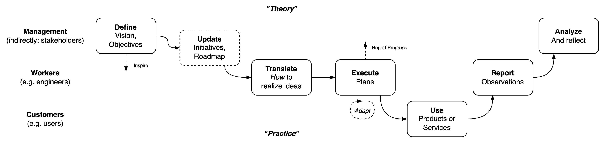
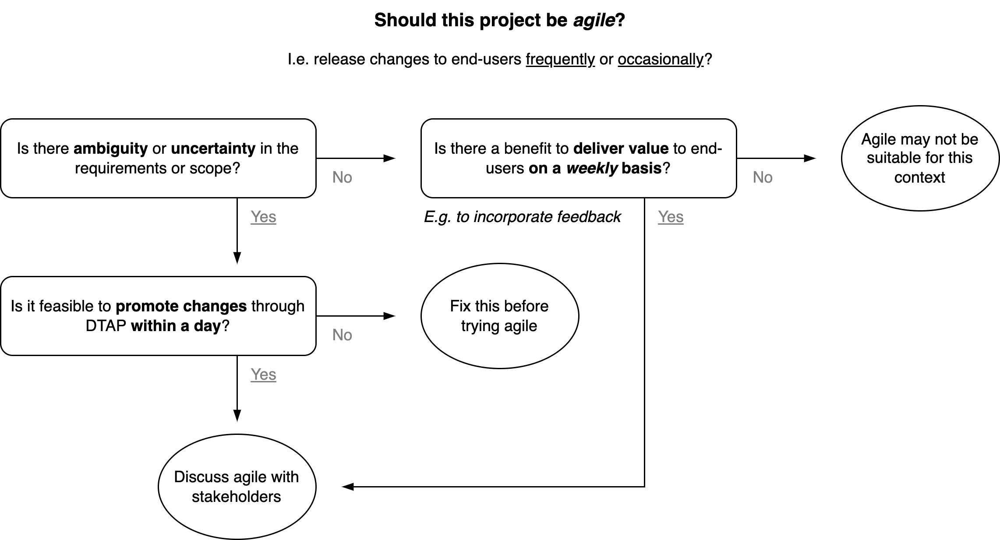

# Project Management

This document is about refining and implementing an assignment. Such an assignment can be for example a project or user-story. See also [wikipedia](https://en.wikipedia.org/wiki/Outline_of_project_management), [product-management](./product-management.md)  [management principles](./management-principles.md) and [requirements-engineering](../requirements-engineering.md).

[toc]

## Overview

There are a few phases that can be distinguished in a typical assignment.

- **Refining** the assignment to ensure that for example the right feature will be build.
  - It is likely that *your interpretation* of the initial requirements is imperfect.
  - There can be *ambiguity* - or even imperfection - in the initial requirements. It may be beneficial to analyze the problem in advance.
  - During the implementation of the project the context may *change* - which could require deviations for the planning. Hence there is some risk management involved.
- **Execution** of the refined assignment. This phase may reveal surprises. This may lead to deviations.
  - This may include resourcing.
- **Review** of the implementation. This includes communication to stakeholders.

### Delegation and Specialization

**Dual-track Model**
The structure of an organizations can be reduced to a management (planning) and worker (execution) layer. These two work together to deliver value to an external customer. Usually the boundary lies between the *what* and the *how*.

#### Autonomy

In order to run a project, a certain level of autonomy is required. This is a balance of supply and demand.

| Demand         | Supply     |
| -------------- | ---------- |
| Objective      | Capability |
| Constraints    | Resources  |
| Accountability | Authority  |

**Anti Pattern**: Learned helplessness

### Refinement

Alignment with:

- Stakeholders. E.g. the assigner or sponsor.
- [Customers](https://en.wikipedia.org/wiki/Customer). E.g. the ones that will recipient some service or product.
- Employees and hires.

#### Planning

An assignment can be broken down into sub-tasks. For both these levels there is a certain amount of [requirements engineering](../requirements-engineering.md) involved.

#### Sizing

Projects can usually be split up into smaller parts that are delivered immediately - to customers. Deliverables may be released to a subset of the target market. The major benefits of small deliverables are:

- Provide revenue *sooner*.
- Be able to avoid unexpected side-effects.
  - Learn to what extend the deliverable matches expectations.
  - Allow subsequent iterations to incorporate *feedback* from customers.
  - Avoid investment in *unused* features.

This is an alternative to delivering the whole project in one go - and never looking back. This iterative way of working is considered to be [*agile*](../collaboration/scrum-guide.md). It is especially beneficial in the context of the following problems:

- There is uncertainty in the demand from customers. This creates a risk of building the wrong product.
- There is uncertainty w.r.t the progress of the project. Any problems that arise might be discovered too late.
- There are risk associated with the duration or scope of project. E.g. when missing a deadline would be catastrophic.

**Example: vertical slice of an API**

Suppose there is a need to build an API. This typically involves two phases

1. The end-to-end flow, which covers networking and security. E.g. authentication and authorization.
2. The set of endpoints and methods. E.g. `placeOrder, cancelOrder`.

A minimal customer-oriented deliverable would include 1. and a single element of 2.

**Evaluating risk and uncertainty**

- Is the demand from customers clear?
- Is the proposal technically feasible? If not, then consider starting with experiments.
- Will progress be measurable?
