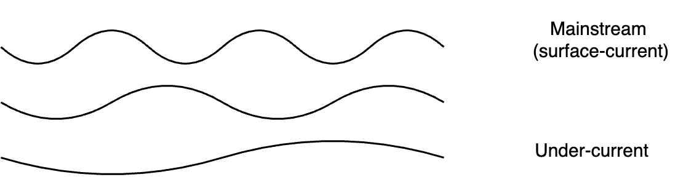

# Systems Management

Systems contain components that interact. Management involves:

- Orchestration
- Expectation management
- Attention management

## Overview

There are three fundamental types of systems.

System components can be categorized as supplies and demands. Supplies enable functining. Demands guide (limit) functioning.

| Supply              | Demand         |
| ------------------- | -------------- |
| Capability          | Objective      |
| Resources           | Constraints    |
| Take responsibility | Be accountable |

**Control**

**Dependencies**

**Anti-pattern**

- Take a component out of a system, fix it, and put it back.

## Expectation Management

- ⭐ Vision.
- 💭 Dreams. Idealistic objectives.
- ☑️ Key results. Target conditions.
- 📅 Planning. Initiatives. `A → B → C`

## Attention Management

> Attention is a [scheduling](https://en.wikipedia.org/wiki/Scheduling_(computing)) problem

Attention is where the system improves itself.

- Directing attention to a specific part of a value chain optimizes that part

In a system with limited resources, there is a need to balance attention.

- Strong focus requires saying no.
- Distributed focus lacks power.

### Principles

>  Slow down to speed up.

- 👣 Rondjes lopen. Daily,weekly, monthly.
- 🚪 Step outside. Take a step back. *Slow down to speed up.*
- 🗣️ Tell stories. Have conversations. *Say things out loud.*
  - Practice, iterate and be perceptive. Listen and feel.
- 🗺️ Create maps. Appreciate your environment, rather than focussing on goals. #nogoals
  - User story mapping, value chain, production chain.
- 📝 Take notes. Write things down on paper. Rewrite your stories. Use pictures.
- 🫐 Follow the blueberries. Reinforce what works well. Follow success. Share success stories.

