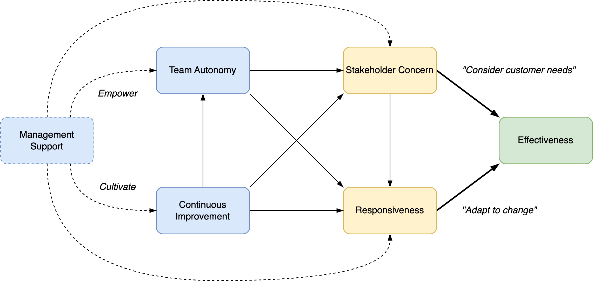

# Team Management

[toc]

## Overview

> Management is just expectations.

Management involves the realization of **expectations**. Team expectations are shaped by the team's [identity](../collaboration/identity.md) and origin.

- Team vision. *How the team wants to be.*
- Team purpose. *What the team aims to deliver.*

These desires drive progress. They result in initiatives, engagement and improvement.


Team management may emphase capability or delivery. See team [performance](../collaboration/team-performance.md) and [success](../collaboration/team-success.md).


Team performance is contingent on the quality of the team itself.


## Team Dynamics: Roles

A team consists of **people** that realize **projects**. They do so using **capabilities**. Large organizations tend to split these up into accountabilities. Capabilities may include technology (engineering) and infrastructure (networks).


## Team Work

Team management involves the following components. See also [administration](../collaboration/administration.md).

```
Context
- The organization. Sponsering, strategy.
Change
- Team objectives.
BAU
- Backlog. Priority of initiatives.
- Roadmap. Planning of initiatives.
- Processes. Guard rails, runbooks, ceremonies.
- Culture. Behaviour, beliefs, expectations.
- Quality standards. Expectations on work and interaction.
```

In the context of a team, work and projects are considered to be *business as usual* (BAU). The term *change* is reserved for radical changes. E.g. changes in the structure of the team itself.


## Team Effectiveness

In theory, effectiveness is most strongly influenced by responsiveness and stakeholder concern. The latter factors are influenced by team autonomy and continuous improvement. Management support influences all factors, but indirectly.



