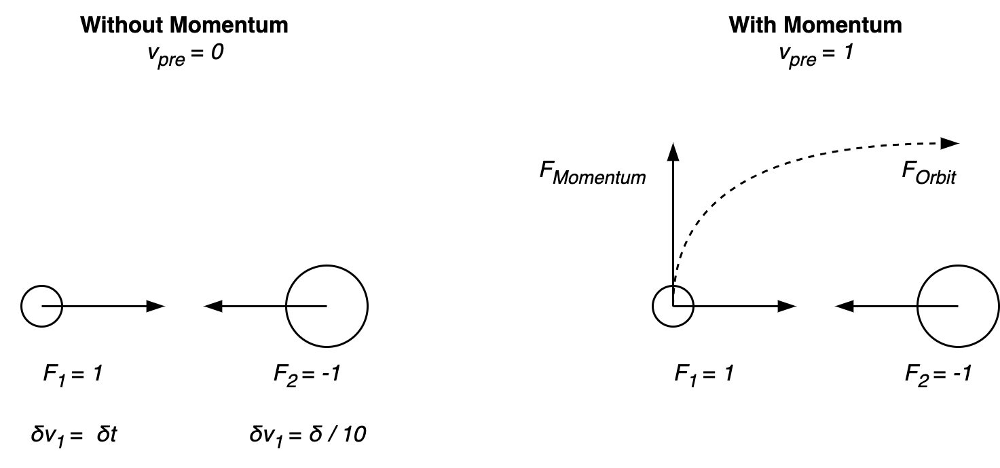

# Force

[toc]

## Gravitational Force

A symmetric force between two masses, in inverse directions.

## Normal Force

[Normal force](https://en.wikipedia.org/wiki/Normal_force)

- Direction is perpundicular to a surface.
- Magnitude is equal to the inverse of the incoming force in the opposite direction.

## Drag and Resistance

Resistance can be caused by inertia or [drag](https://en.wikipedia.org/wiki/Drag_(physics)).

