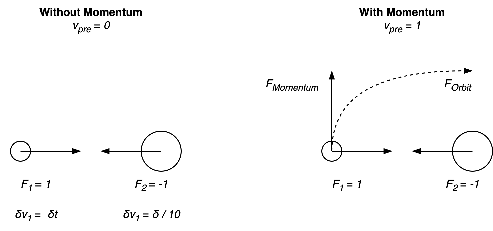
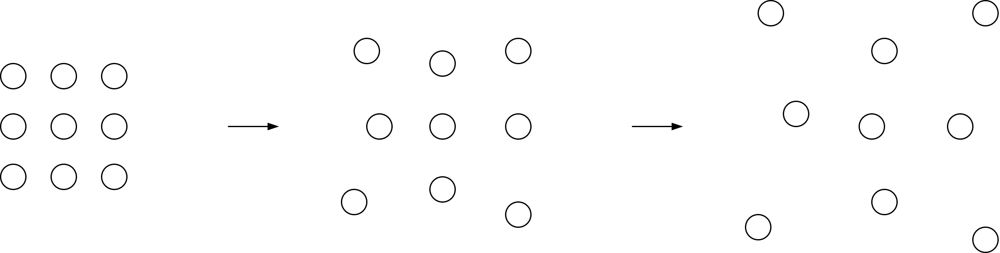
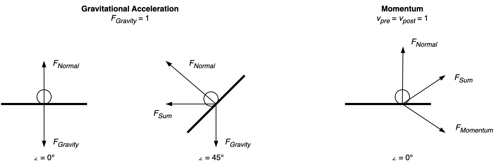
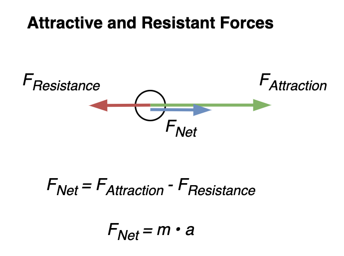
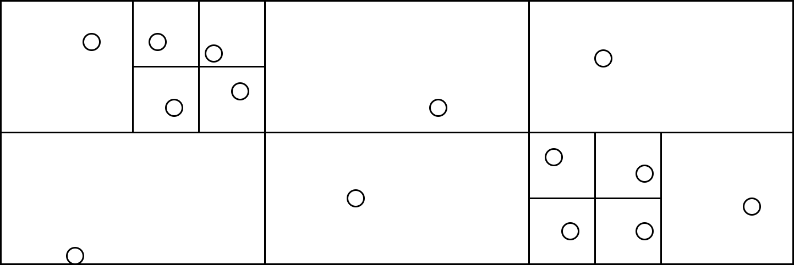
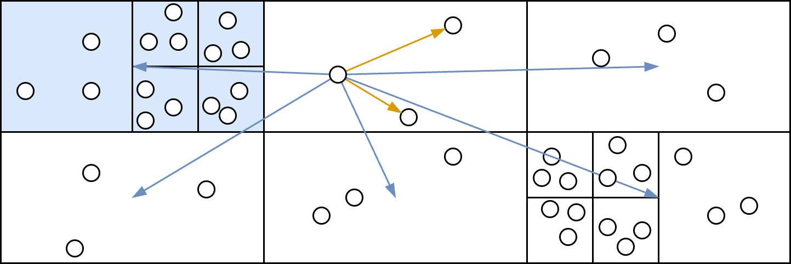

# Force

[toc]

## Net Forces

The net force is the linear sum of forces.

```
F = ∑ f
```


## Attractive Force (Gravity)

A symmetric force between two masses, in inverse directions. This force contributes to acceleration. The total acceleration of an object is the result of the net force divided by its mass.

```
F = m · a
a = ∑ F / m
```





## Repulsive Force (Diffusion)

Particles in fluid and gas states behave like a concentration that diffuses or disperses over the available volume (space). As a whole, the concentration has mass, but a local level it has density. The concentration will disperse until it reaches an equilibrium.




## Normal Force

[Normal force](https://en.wikipedia.org/wiki/Normal_force)

- Direction is perpundicular to a surface.
- Magnitude is equal to the inverse of the incoming force in the opposite direction.





## Drag and Resistance

Resistance can be caused by inertia or [drag](https://en.wikipedia.org/wiki/Drag_(physics)). Forces may attract or repel.



## Change

The position of an object can be defines as a function of time. In absense of acceleration, the position `x` at timestamp `Δt` is equal to the sum of its initial position and the product of its velocity and the duration `Δt`. Formally:

```
x(Δt) = x(0) + v(0) · Δt
```

The general form of this is a [Taylor series](https://en.wikipedia.org/wiki/Taylor_series).


## Particle Field (Flow field)

A large group of particles can form a field. The numer of interactions of particles is the square or cube of the number of particles, for 2D and 3D spaces.

Forces between particles can be approximated by averaging the force of group of particles.


### Quadtree

The computational complexity of the approximation can be reduced by contructing a quadtree (octtree). This structure divides the space in squared (cubed) regions. Each region contains at most `M` particles. The tree can be calculated with a single iteration over the particles (`O(N)`). The number of regions is proportional to `N`, but only a fraction of regions is visited per iteration.

```python
for p in particles:
  insert(tree, p)

def insert(tree, p):
  if tree.children:
    for c in tree.children:
      if c.x[0] < p.x < c.x[1] and child.y[0] < particle.y < child.y[1]:
        insert(c, p)
  else:
    tree.particles.add(p)
    if tree.particles > M:
      tree.split()
```




The number of interactions is the sum of the interactions within a region and the interactions with other regions. For a quadtree this results in`M + 6` in interactions per particle. This reduces the total complexity from `N × N` to `N(M + 6)` which is`O(N)`.



