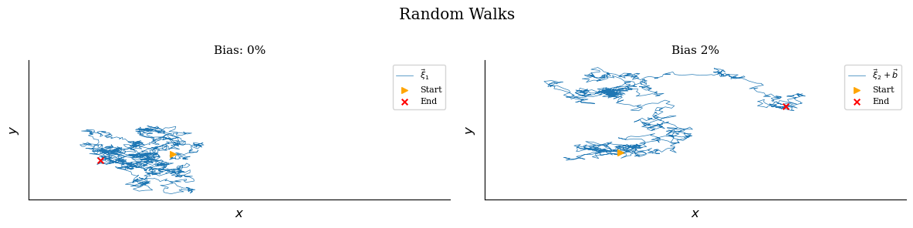

# Fractal

[Self-similarity](https://en.wikipedia.org/wiki/Self-similarity)

[Scale invariance](https://en.wikipedia.org/wiki/Scale_invariance)

<https://en.wikipedia.org/wiki/Patterns_in_nature#Trees,_fractals>

**Mass of an object**

`M = L^D` for mass `M`, length `L`, dimension `D`

| Shape  | L      | D    |
| ------ | ------ | ---- |
| Line   | Length | 1    |
| Square | Area   | 2    |
| Cube   | Volume | 3    |

### Noise

Computer graphics

- Gradient noise
- Perlin noise
- Simplex noise

**White noise**

Uniformly distributed.

**Fractal (pink) noise**

Each octave interval carries an equal amount of noise energy. [wiki](https://en.wikipedia.org/wiki/Pink_noise)

**Random walk**

