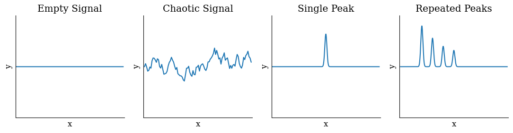
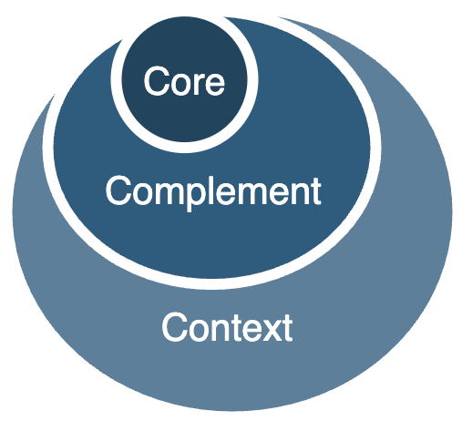

# Mathematical models

See [modelling](../intelligence/modelling.md).

[toc]

## Spectra & Dimensions

Values can be:

- Singular. E.g. `nothing`.
  
- Discrete: Binary or categorical. E.g. `left` or `right`.
  
- Continuous. E.g. [real numbers](https://en.wikipedia.org/wiki/Real_number).

| Type          | Question                                                     | Action                      |
| ------------- | ------------------------------------------------------------ | --------------------------- |
| *Unity*       | What happens in a different perspective?                     | Change the perspective.     |
| *Binary*      | [What if](https://en.wikipedia.org/wiki/Mu_(negative)) neither option is applicable? | Refine boundary conditions. |
| *Categorical* | What sits between categories?                                | Find intermediate steps.    |
| *Continuous*  | What are the limits? What affects the function?              | Reflect.                    |

Questionioning dimensions

- E.g. focus on X or de-focus. 
- E.g. in organizations: focussing on specialization (efficiency) vs focussing on features (quality) vs focussing on simplicity.

**From binary to categorical**

**Independent or dependent dimensions**

Tradeoffs of independent dimensions

**Correlation**

Objects can be grouped into clusters, which behave as objects. See [statistics](statistics.md).

### Junctions

Options

1. Continue as planned. Optimize.
2. Deviate or expand. Diversify.
3. Do something radically different

### Signals

## Core-Context

The core is most important quality of a subject. Second, there are complementing qualities that make it more diverse / flexible. Third, the context maps the subject to other subjects.

### Pyramid

Each layer is contingent upon the previous layers.

## Growth

Growth of populations. See [statistics](statistics.md).

- Linear: constant increase in size.
- Exponential: relative increase in size.
- Hyperbolic: nonlinear increase in size.
- Logistic: diminishing returns.

**Compounding**

Exponential growth can result in strong compounding.

- This shows how powerful continuous improvement can be.

## Entropy

## Series

**Statistics**
A random variable (r.v.) `X` can be approximated in several levels of detail, which are called *moments*.

0. [Mean](https://en.wikipedia.org/wiki/Mean) or [expected value](https://en.wikipedia.org/wiki/Expected_value). `E[X]`
1. [Variance](https://en.wikipedia.org/wiki/Variance). `Var[X]`. See also [covariance](https://en.wikipedia.org/wiki/Covariance).
2. [Skewness](https://en.wikipedia.org/wiki/Skewness) or asymmetry.
3. [Kurtosis](https://en.wikipedia.org/wiki/Kurtosis) or tailed-ness.

**Taylor Series**
[Taylor series](https://en.wikipedia.org/wiki/Taylor_series). Knowing all higher order derivatives at a certain point `f(x)` allows you to infer the whole function `f(x+a)`.

In physics, the following terms are used:

0. **Position**. The current state of the system
1. [**Velocity**](https://en.wikipedia.org/wiki/Velocity). The change of the system over time (or space).
2. [**Acceleration**](https://en.wikipedia.org/wiki/Acceleration). How fast the system is changing.

**Fourier Series**
[Fourier series](https://en.wikipedia.org/wiki/Fourier_series).
