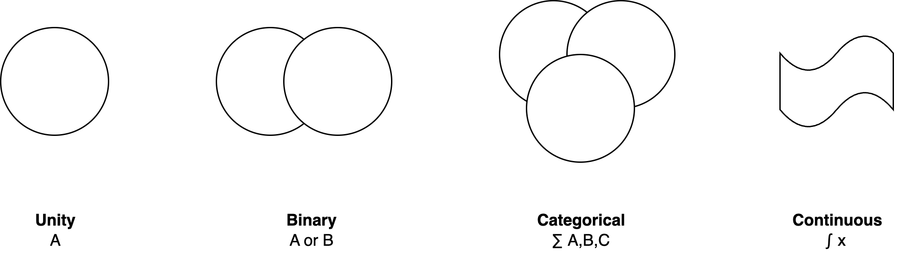
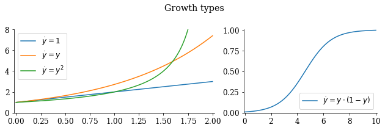
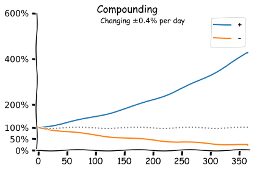
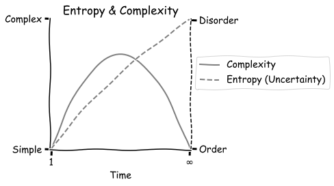

# Mathematical models

See [modelling](../intelligence/modelling.md).

[toc]

## Spectra & Dimensions

Values can be:

- Discrete
    - Binary
    - Categorical

- Continuous

They may span over multiple dimensions
- Dimensions may be correlated or uncorrelated. E.g.
  - The *performance* of an algorithm may be correlated to *complexity*.
  - *Messiness* can be correlated to *creativeness*.

If a value is unity:

- Change the perspective.

If a value is binary:

- Question whether neither or both options can be true.
- Find a third category

If a value is categorical:

- Find steps that fall in between categories.

## Distributions (Statistics)

**Statistics**

Three fundamental probability distributions.

1. Uniform. E.g. the result of flipping a fair coin or a roll of a fair dice.
2. A bell curve. The average of averages [follows](https://en.wikipedia.org/wiki/Central_limit_theorem) a normal distribution.
3. A [power law](https://en.wikipedia.org/wiki/Pareto_distribution), where 80% of the results are caused by 20% of the participants.
    - Or, 10% of the results [outweigh](https://en.wikipedia.org/wiki/Sturgeon's_law) the other 90%.

Many probabilistic processes are [ergodic](https://en.wikipedia.org/wiki/Ergodicity); i.e. *time* average = *ensemble* average. Equality may not hold for higher-order moments.

- In such processes, anything that can happen [will happen](https://en.wikipedia.org/wiki/Murphy's_law) (eventually).

**Equilibria**

Long-term stable distributions (but not necessarily without tension).

- Uniform, 50-50. Equally sized components. Typically self-organizing, but up to a certain boundary. A large deviation may disrupt the balance.
- Skewed: majority-minority. E.g. Microsoft and Apple market shares.
  - Size-effects make it difficult for the majority party to conquer the whole.

## Growth

Growth of populations.

- Linear: constant increase in size.
- Exponential: relative increase in size.
- Hyperbolic: nonlinear increase in size.
- Logistic: diminishing returns.

**Compounding**

Exponential growth can result in strong compounding.

- This shows how powerful continuous improvement can be.

### Queueing Theory

**Terminology**

Utilization is the relative amount of time that a resource is busy (i.e. not idle). Variability is the variance in service time of a specific component.

**Theories**

[Little's law](https://en.wikipedia.org/wiki/Little's_law) states that for a stationary system, the long-term average:

> Mean lead time =  number of items in the system / mean arrival rate (of items)

[Kingma's formula](https://en.wikipedia.org/wiki/Kingman's_formula) predicts that given certain constraints, full system utilization results in infinite lead time.

## Game Theory

Interaction of rational agents.

In the real world, agents are always constrained.

- Bounded rationality: asymmetric information causes agents to act sub-optimally.
- Limited influence over environment.

## Entropy

## Series

**Statistics**
A random variable (r.v.) `X` can be approximated in several levels of detail, which are called *moments*.

0. [Mean](https://en.wikipedia.org/wiki/Mean) or [expected value](https://en.wikipedia.org/wiki/Expected_value). `E[X]`
1. [Variance](https://en.wikipedia.org/wiki/Variance). `Var[X]`. See also [covariance](https://en.wikipedia.org/wiki/Covariance).
2. [Skewness](https://en.wikipedia.org/wiki/Skewness) or asymmetry.
3. [Kurtosis](https://en.wikipedia.org/wiki/Kurtosis) or tailed-ness.

**Taylor Series**
[Taylor series](https://en.wikipedia.org/wiki/Taylor_series). Knowing all higher order derivatives at a certain point `f(x)` allows you to infer the whole function `f(x+a)`.

In physics, the following terms are used:

0. **Position**. The current state of the system
1. [**Velocity**](https://en.wikipedia.org/wiki/Velocity). The change of the system over time (or space).
2. [**Acceleration**](https://en.wikipedia.org/wiki/Acceleration). How fast the system is changing.

**Fourier Series**
[Fourier series](https://en.wikipedia.org/wiki/Fourier_series).	
