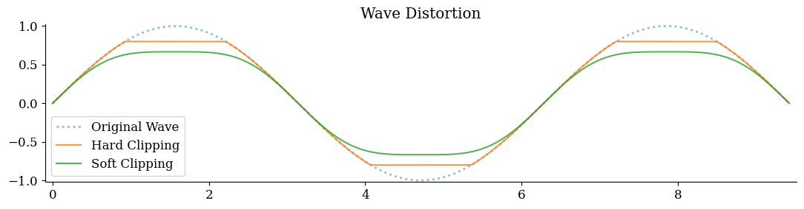
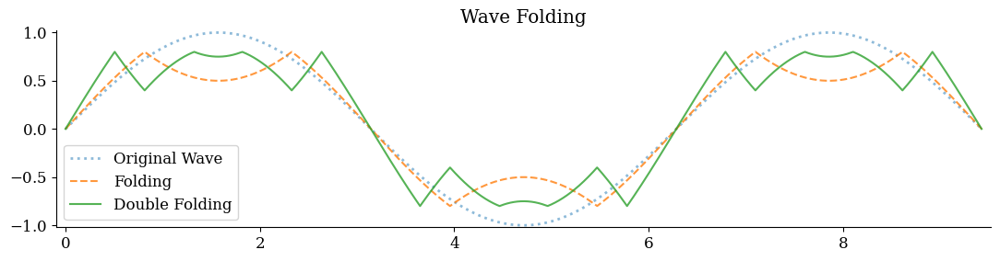
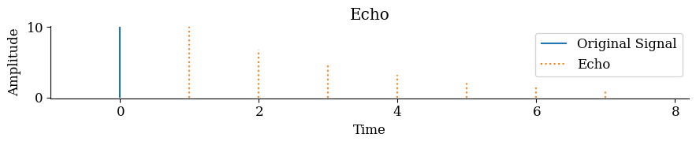

# Signal Processing

See [waves](waves.md).

[toc]

## Distortion

**Clipping**

Soft clipping

`f(y) = y - 1/κ · y^κ` for an odd integer `κ`.

**Wave folding**

`f(y) = τ - (y-t) if y > 1 else y`

## Delay

Feed an old copy of the signal back.

`f(t) = signal[t] + α · f(t - dt)`

For if the delay is in a specific range, then it will alter the frequency spectrum. It will emphasize and de-emphasize harmonics.

Ranges: chorus - flange - delay

## Reverb

Combine multiple tuned delay lines.
