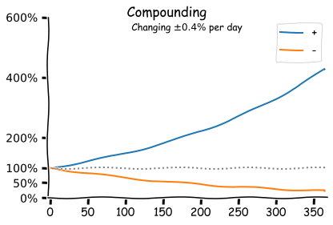

# Statistics

Statistical models. Regression and classification.

[toc]

## Probability

### Expected Value

The likelihood of events.

- The probability of all possible events: `P[X]`
- The expected (average) value: `E[X]`
- The variance (variability): `Var[X]`

These properties can be understood at a deeper level. Consider:

- The conditional expectation: `E[X | Y=y]`
- The conditional variance: `Var[X | Y=y]`

### Correlation

Values may span over multiple dimensions. Dimensions may be correlated or uncorrelated. E.g.

- The *performance* of an algorithm may be correlated to *complexity*.
- *Messiness* can be correlated to *creativeness*.

A set of particles can be discretized over space, and transformed into a density function.

Alternatively, particles can be grouped into clusters.

## Probability Distributions

Three are three fundamental probability distributions.

1. **Uniform**. E.g. the result of flipping a fair coin or a roll of a fair dice.
2. A **bell curve**. The average of averages [follows](https://en.wikipedia.org/wiki/Central_limit_theorem) a normal distribution.
3. A [**power law**](https://en.wikipedia.org/wiki/Pareto_distribution), where 80% of the results are caused by 20% of the participants.
   - Or, 10% of the results [outweigh](https://en.wikipedia.org/wiki/Sturgeon's_law) the other 90%.

Many probabilistic processes are [**ergodic**](https://en.wikipedia.org/wiki/Ergodicity); i.e. *time* average = *ensemble* average. Equality may not hold for higher-order moments.

- In such processes, anything that can happen [will happen](https://en.wikipedia.org/wiki/Murphy's_law) (eventually).

**Equilibria**

Long-term stable distributions (but not necessarily without tension).

- Uniform, 50-50. Equally sized components. Typically self-organizing, but up to a certain boundary. A large deviation may disrupt the balance.
- Skewed: majority-minority. E.g. Microsoft and Apple market shares.
  - Size-effects make it difficult for the majority party to conquer the whole.

## Population Growth

Growth of populations.

- Linear: constant increase in size.
- Exponential: relative increase in size.
- Hyperbolic: nonlinear increase in size.
- Logistic: diminishing returns.

**Compounding**

Exponential growth can result in strong compounding.

- This shows how powerful continuous improvement can be.

## Model Performance

### Bias-variance tradeoff

There is no [free lunch](https://en.wikipedia.org/wiki/Bias%E2%80%93variance_tradeoff); making models specific to one dataset decreases the performance on all others (i.e. generalization).

Models are exclusive by nature. They are biassed to a given scenario and context.

### Class Imbalance

In classification, data may not be distributed equally. E.g. a model that classifies any patient as healthy is useless, but it will still have a high accuracy for rare disseases.

Alternative metrics are [precision and recall](https://en.wikipedia.org/wiki/Precision_and_recall). Model performance can be tuned towards specifc metrics, based on its intended application.

| Metric               | Targets                        |
| -------------------- | ------------------------------ |
| Accuracy             | Correctness of predictions     |
| Precision            | Relevancy of findings          |
| Recall (sensitivity) | Ability to find relevant items |

A [confusion matrix](https://en.wikipedia.org/wiki/Confusion_matrix) can be used to summarize the performance.

<table><tbody>
<tr>
  <td rowspan="2" style="border:none;"></td>
  <td style="border:none;"></td>
  <td colspan="2"><b>Prediction</b></td>
</tr>
<tr>
  <td><b>Total population: P + N</b></td>
  <td><b>Positive</b></td>
  <td><b>Negative</b></td>
</tr>
<tr>
  <td rowspan="2"><b>Reality</b></td>
  <td><b>Positive (P)</b></td>
  <td>True positive (TP)</td>
  <td>False negative  (FN)</td>
</tr>
<tr>
  <td><b>Negative (N)</b></td>
  <td>False positive (FP)</td>
  <td>True negative (TN)</td>
</tr>
</tbody></table>

