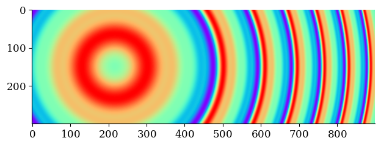

# Waves

[toc]

## Introduction

A *wave* is a propagating disturbance. Movement may happen across temporal and spatial dimensions.

An *oscillation* is a wave with a periodic disturbance.

- Waves have a period `T` and a frequency (rate)  `f = 1/T`.
- Sinoids have an amplitude `A` and a phase offset `δ`.

An *harmonic* is a wave with a frequency that is a multiple of a given fundamental frequency.

Waves with unrelated frequencies produce *noise*.

**Types**

- Traveling wave. Wave moves in one direction.
- Standing wave. Multiple superimposed waves that travel in different directions?
  - Longitudinal wave. Through a different medium?
  - Transverse wave.

**Fractals**

Geometric patterns that exhibit self-similarity. They repeat a pattern over different time-scales. E.g. a snowflake.

## Simulations

### Traveling Waves

**Harmony**

Waves that are in tune produce an distinct or characteristic output (when superimposed). Unrelated waves produce noise.

#### One Spatial Dimension

`f(x) = Σ A sin(f x + φ)` for each amplitude `A` and frequency `f`.

Arbitrary or unrelated frequencies product **noise**.

Frequencies that are in tune produce a **sawtooth** wave.

Frequencies with alternating phases produce a **square**-shaped wave.

#### Two Spatial Dimensions

[Lissajous-curve.mov](https://voschezang.github.io/img/Sine.mov)

<video width="500" controls autoplay>
  <source src="https://voschezang.github.io/img/Sine.mov">
</video>

#### Color

Using color to show the amplitude of a two-dimensional wave.

`c(x, y) = sin(f * (ax + by))`

**Unrelated waves**

**Tuned waves**

**Radial waves**

`c(x, y) = sin(f * (axx + byy)`

### Standing Waves

See [holography](https://github.com/voschezang/Holographic-Projector-Simulations).

#### Vibrating Membrane

[drum.mp4](https://voschezang.github.io/Scientific-Computing-Models/img/set-3/Membrane-cond-1_(3d).mp4)

<video controls autoplay>
  <source src="https://voschezang.github.io/Scientific-Computing-Models/img/set-3/Membrane-cond-1_(3d).mp4">
</video>

### Non-linear Systems

Non-linear differential equations.

**Predator-prey Model**

[src](https://en.wikipedia.org/wiki/Lotka%E2%80%93Volterra_equations)

Growth of two populations. Their growth is inversely related.

**Lorenz System**

[src](https://en.wikipedia.org/wiki/Lorenz_system)

### Diffusion Systems

[Gray-scott](https://en.wikipedia.org/wiki/Reaction-diffusion_system) diffusion systems.

[gray-scott-jet.mp4](https://voschezang.github.io/Scientific-Computing-Models/img/set-2/Gray-Scott_sq%20jet.mp4)

<video width="320" controls autoplay>
  <source src="https://voschezang.github.io/Scientific-Computing-Models/img/set-2/Gray-Scott_sq%20jet.mp4">
</video>

[gray-scott.mp4](https://voschezang.github.io/Scientific-Computing-Models/img/set-2/Gray-Scott_sq%20pink.mp4)

<video width="320" controls autoplay>
  <source src="https://voschezang.github.io/Scientific-Computing-Models/img/set-2/Gray-Scott_sq%20pink.mp4">
</video>

[Navy-Stokes](https://en.wikipedia.org/wiki/Navier%E2%80%93Stokes_equations)

...

## Real World Systems

### Periodic Systems

See [periodic structures](../reality/periodic-structures.md).

### Unstable systems

See [critical points](https://en.wikipedia.org/wiki/Critical_phenomena), [self-organized criticality](https://en.wikipedia.org/wiki/Self-organized_criticality).

- Boom And Bust Cycle (years)
  - Expansion, crisis (critical point), recession, recovery
- Pandemics
- Forest fires
- Avalanches
- Lightning / blizzards
- Pendulum / swing set
