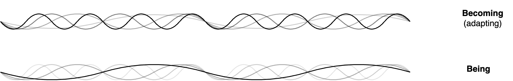
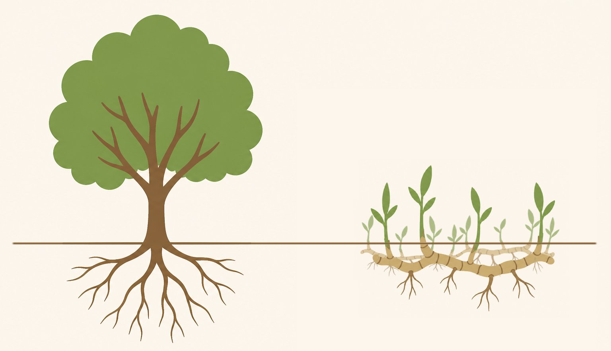

# Being and Becoming

Reality consists of the present. The presents exists within time and space. Being and Becoming refer to that what exists and its identity. What's what.

[toc]

## The Present

**Spatial view**

In practice, we think of the present as all of space at a fixed moment in time. Adding the dimension of time, we can expand reality is by the past and the future. A spatial view considers the present to be a *moment* in time.

**Temporal view**

The spatial view assumes that time is separate from space. Lifting this assumption allows us to consider time and space as arbitrary dimensions. Consequently, the present can be defined as an *area* within the dimensions of space and time.

## Being

Now that we have introcuded the *present*, let us consider *existence*. Out of the many things that exist, some are perpetual. E.g. numbers can be said to exist, and to never change. They are static and have a static identity. Let **Being** denote all things that exist in the present in a stable, static fashion. In this definition, time and space are bounded.

Being may be synomous with Plato's world of Forms, Lacan's symbolic world.

## Becoming

> Everything flows

Next, consider the dynamic nature of reality. Most things in reality are not static. E.g. seawater becomes a cloud which becomes rain which becomes a river. A kingdom becomes an empire and after centuries falls apart. The identity of these objects is ambiguous. Identities are multicplicities rather than unities. Let **Becoming** denote everything that changes and evolves. In this light, Being is merely a snapshot of the universe.

> All things are one

Many discourses claim that everything that exists is part of a single being. A unity. All things are reflections of the one. Reality consists of Being, and Becoming is merely there in our perception. Like Plato's shadows in the cave.

Contrarywise, Deleuze claims that the world full with multiplicities, examplified by the rhizome. The structure of a tree is hierarchical. A rhizome is a network of roots, without a beginning and or end.

