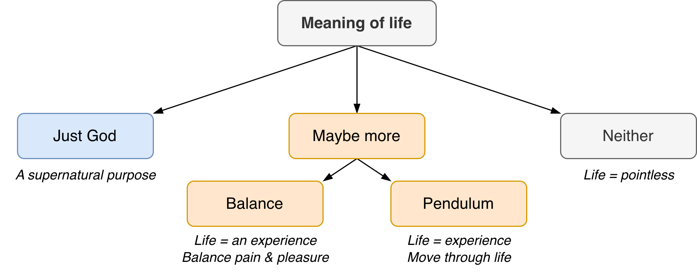

# The Meaning of Life

Most answers fall into these [categories](https://hackage-content.haskell.org/package/base-4.22.0.0/docs/Data-Maybe.html). See also [lifestyle](.../psychology/lifestyle.md).

- Just God. The belief that God is the center of everything. That there is a supernatural purpose.
- Maybe more. The belief that life is an experience or an activity.
- Neither. The belief that life is pointless

