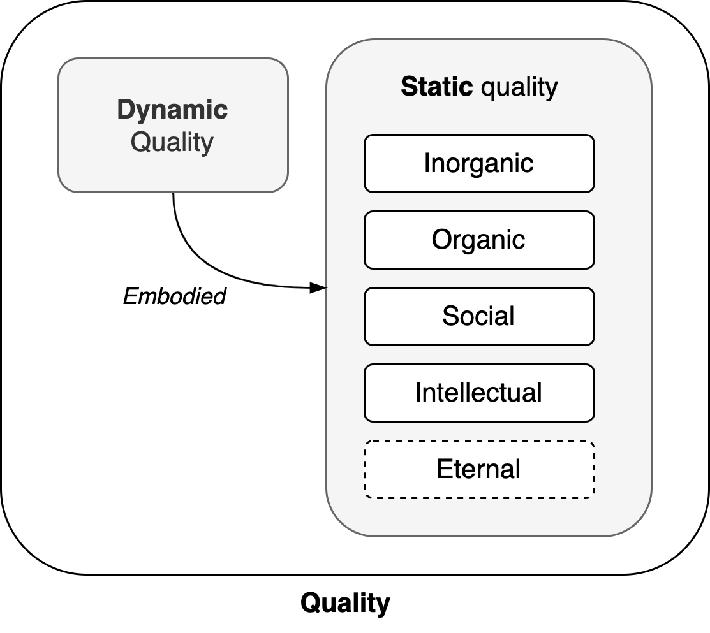

# Quality

> Everyone feels quality, but it is hard to measure.

Any structure has quality. An absense of quality it leads to disorder and chaos. Quality itself can be separated into dynamic and static quality. The latter includes static patterns, repetition, rules and rituals.

1. **Dynamic** quality transcends static quality.
2. **Static** quality consists of 5 [domains](#Domains).

There exists a progression from lower to higher domains. Yet, higher domains are contingent on structures in lower domains.

Static quality

- Biological quality values the perseverance of a subject. Or, its DNA. Biological beings are driven by experience.
- Social quality values a community, over individual subjects. Culture and ettiquette are used to sustain it.
- Intellectual quality values *ideas* over a community. 

## Health

|                       | Person                            | Corporate Department     |
| --------------------- | --------------------------------- | ------------------------ |
| **Material health**   | Physiological health              | Health of employees      |
| **Life-cycle health** | Nutrition, growth                 | Support from management  |
| **Positional health** | Health of relationships           | Health of bureaucracy    |
| **Functional health** | Ability to participate in society | Ability to deliver value |

See [organization](../systems/system).
