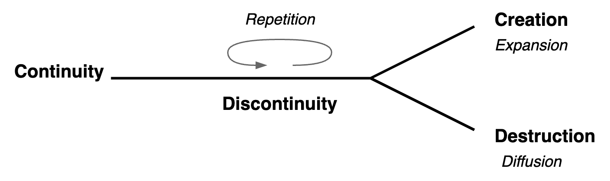

# Structure

[toc]

## Overview

Structure can be persistent or changing. Change may repeat itself or dissolve into uniformity.

## Dual Model

Two types of structure.

- `~` Dynamic structure. Fluid, like a wave.
- `+` Static structure. Static, a grid (matrix).

|                    | Dynamic Structure       | Static Structure           |
| ------------------ | ----------------------- | -------------------------- |
| **Preservation**   | *Embedded* in a subject | *Enforced* upon a subject  |
| **Form**           | Distributed (networks)  | Centralized (hierarchical) |
| **Relation**       | Guidance, similarity    | Control, equality          |
| **Generalization** | Unique                  | Absolute, universal        |

### Learning

|            | Dynamic Learning           | Static Learning              |
| ---------- | -------------------------- | ---------------------------- |
| **Core**   | Application                | Understanding                |
| **Origin** | Unplanned, natural         | Planned                      |
| **How**    | Practice, intuition        | Deconstruction               |
| **What**   | Stories, examples, fiction | Rules, lists, absolute facts |

### Society

|            | Dynamic Structure           | Static Structure                                             |
| ---------- | --------------------------- | ------------------------------------------------------------ |
| **Core**   | Inherent purpose            | External purpose                                             |
| **Origin** | Evolved                     | Designed, planned                                            |
| **How**    | Shared responsibility       | [Government](https://en.wikipedia.org/wiki/Separation_of_powers) |
| **What**   | Culture, rituals, mythology | Laws, policies                                               |

