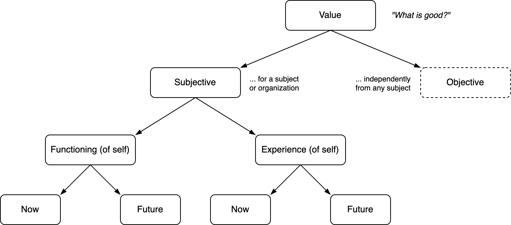
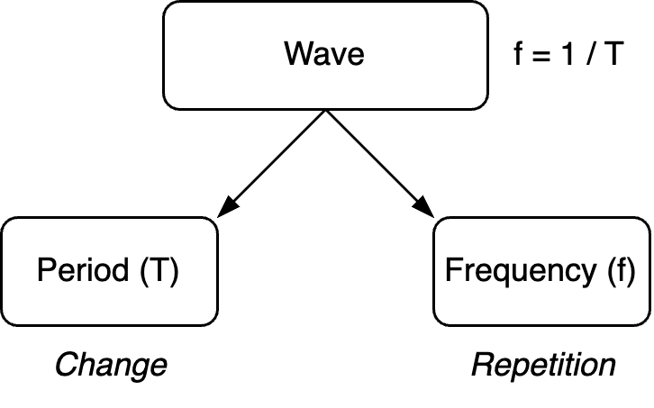

# Value

[toc]

## Overview

> What is good, anyway?

Value considers what is *good* and *bad*. It can be divided into subjective and objective value.

- Subjective value is dependent on a given structure. A subject, organization or system. It considers the functioning of this subject and its experience.
- Objective value does not take into account subjectivity. It is based on [quality](quality).

**Objective value** is universal. It can be described as "quality". It may be measured objectively, e.g. in terms of accuracy, consistency durability or reliability. It is not necessarily unbiassed, as objects can be seen through different lenses, that each emphasize different qualities.

**Subjective value** relates to a specific subject (person). As subjects, humans have feelings of delight and aversion towards different objects. In some cases this feelings may be shared within a culture or population. The boundary between objective and subjective value is not trivial. For example, the term *common sense* hints to universality, while describing a subjective mind.

**Beauty** is a feature that relates to both types. The following components contribute to it:

- Contrast. Complexity / richness. Tension + release. Harmony, dissonance and resolution.
- Uniqueness. Difference with the status quo. Novelty.
- Cohesion. Unity. The audience's ability to understand (recognize) the signal.
- Sensitivity. Resilience to change.

**Excellence** is a more objectively-oriented feature. Living up to a potential. Being effective. The term is not contingent on an observer.

**Products** that contain exclusively objective value are neglected in some way. E.g. an art piece that is locked up in a vault and forgotten about.

**Dynamic and static value**

This distinction has parallels with [establishment](https://en.wikipedia.org/wiki/The_Establishment) and [avant-garde](https://en.wikipedia.org/wiki/Avant-garde).

- The dynamic component emphasizes *change* (novelty). It explains why experience decays after repetition.

- The static component emphasizes structure and tradition.

## Society

A society is a group of subjects that care for each other. In this context, the term "good" can be made more specific.  In short, good is the sum of:

- That what is good for you.
- That what is good for others.

A caveat of this methodoloy it requires a boundary to what is part of a society. It does not provide a method to compare e.g. [human](https://en.wikipedia.org/wiki/Human_rights) and [animal rights](https://en.wikipedia.org/wiki/Animal_rights).

### Conflict

When multipe subjects are involved, there is a risk that desires conflict. This produces the need for [discernment](https://en.wikipedia.org/wiki/Viveka). This is the ability to distinguish between what you *like* and what is *good* for you (society).

When resources are constraint, there is a need to share and distribute resources in a fair way. This produces the need for self-discipline ([dispassion](https://en.wikipedia.org/wiki/Nonattachment_(philosophy))). E.g. to consume in moderation.

### Specifics

In the English language, there exist many (near) synonyms of goodness. E.g. harmony, happiness, peace, well-being.

Actions that improve the following are considered **good** - in most conditions.

- Health and well-being of the members. Caring for self and others.
- Trust. Open communication, honesty.
- Gratitude and expressing gratitude. Appreciation, respect. Eagerness, motivation.
- Resilience. Creativity.

The following are considered **bad** - in most conditions.

- Dishonesty.
- Lack of self discipline. Lack of endurance. Inability to concentrate. Carelessness.
- Doing things in the *wrong* way.
- Always being inflexible. Not being able stubborn. Extreme pessimism. Lack of faith.

