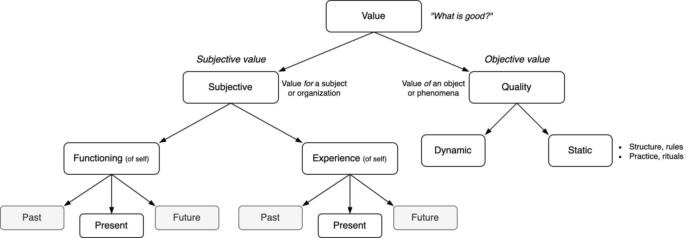

# Value

> What is good, anyway?

Value considers what is *good* and *bad*. It can be divided into subjective and objective value.

- Subjective value is dependent on a given structure. A subject, organization or system. It considers the functioning of this subject and its experience.
- Objective value does not take into account subjectivity. It is based on [quality](domains.md).

**Subjective & objective value**

1. The former is universal. It can be described as "quality". It may be measured objectively, e.g. in terms of accuracy, consistency durability or reliability. It is not necessarily unbiassed, as objects can be seen through different lenses, that each emphasize different qualities.
2. The latter relates to a specific subject (person). As subjects, humans have feelings of delight and aversion towards different objects. In some cases this feelings may be shared within a culture or population. The boundary between objective and subjective value is not trivial. For example, the term *common sense* hints to universality, while describing a subjective mind.

*Beauty* is a feature that relates to both types. The following components contribute to it:

- Contrast. Complexity / richness. Tension + release. Harmony, dissonance and resolution.
- Uniqueness. Difference with the status quo. Novelty.
- Cohesion. Unity. The audience's ability to understand (recognize) the signal.
- Sensitivity. Resilience to change.

*Excellence* is a more objectively-oriented feature. Living up to a potential. Being effective. The term is not contingent on an observer.

Products that contain exclusively objective value are neglected in some way. E.g. an art piece that is locked up in a vault and forgotten about.

**Dynamic and static value**

Another dimension to view value is dynamic and static value. The distinction has parallels with [establishment](https://en.wikipedia.org/wiki/The_Establishment) and [avant-garde](https://en.wikipedia.org/wiki/Avant-garde).

- The dynamic component emphasizes *change* (novelty). It explains why experience decays after repetition.

- The static component emphasizes structure and tradition.