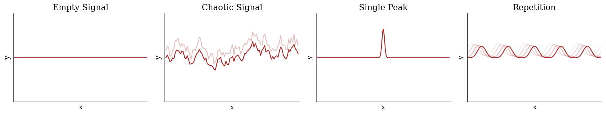
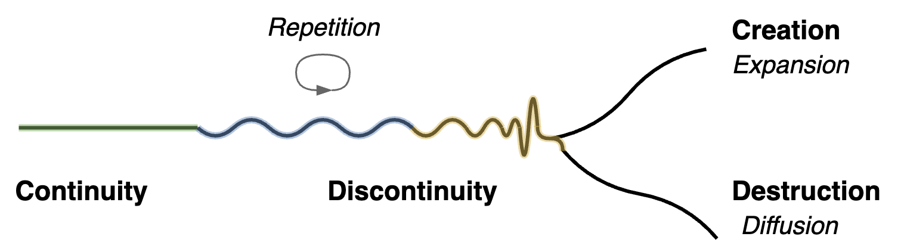
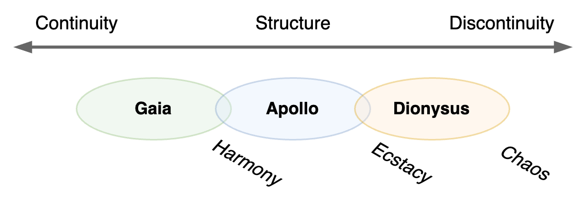
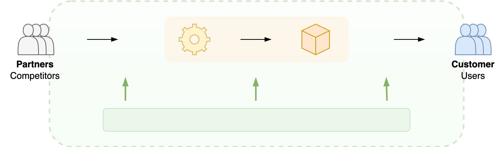
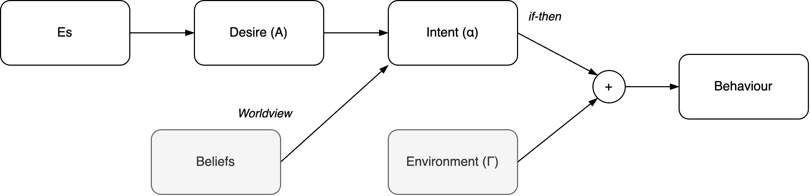
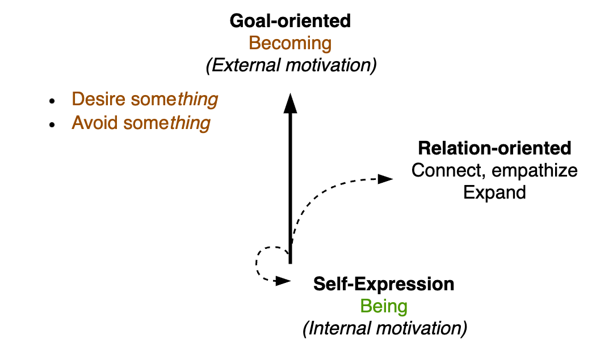
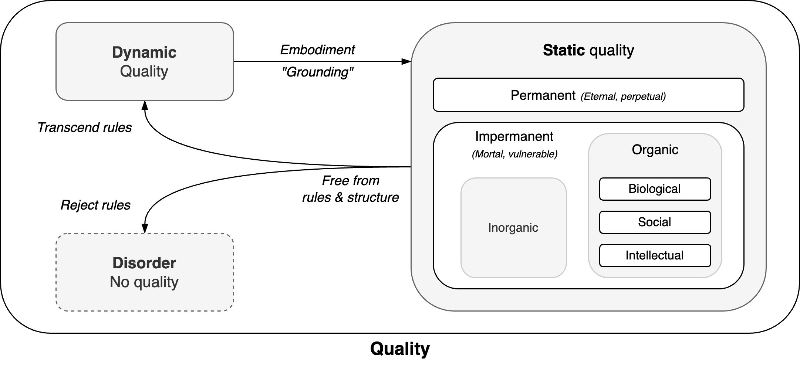

# Worldview

The world consists of difference. Anything needs to differ to be observable. We can distinguish **structure** and **disturbance**.

[toc]

## Overview

1. The world consists of uniformity and **disturbance**.
2. Distrurbance can have **structure** or no structure (chaos). Structures may be created or destroyed.
3. Structures are interpreted as **entities** and **organizations**.
  4. Entities are defined through difference (boundaries). They have a beginning and ending. An inside and an outside.
  5. Entities have an internal organization.
  6. Organizations are connections of entities. Entities are connected to other entities.
  7. The function of organizations is their desire.
8. **Entities** are subject to forces.
9. **Agents** are entities that act.
  10. Acting is either goal-oriented, relation-oriented or self-expression.
  11. Agents have experience.
  12. Experience is a result of quality, sensitivity and dynamics.
13. Quality is dynamic, static or absent.

## Hierarchy

The world consists of emptiness and disturbance. Disturbance is the opposite of emptiness. It can be random (chaotic) or structured.

In one dimension, signals may look like noise, peaks or [waves](../math/waves.md).

Plots in two dimensions

 

This generalizes to multiple dimensions.

Peaks may form clusters, which in turn may form form greater peaks.

### Dynamics

Disturbance relate to space or time. Waves may seemingly move over water,

Disturbance can be structured. New structures can be created and destroyed. The beginning and ending of entities are disturbances. Their rise and fall.

The *personifications* of these forces are Gaia, Apollo and Dionysus. Apollo is the deity of structure and harmony. Dionysus is associated with drama and ecstacy.

### Entities & Organizations

Structures have an inside and an ouside:

- **Entities**, when viewed from outside. Entities have a function and a lifecycle.
- **Organizations**, when viewed from inside.

An entity has a begin and end. A structure revolves: it is created and destructed.

- E.g. a tree has an origin and a maturity: `🌱🪴🌳🍂`

An organization is a connection of entities. It evolves, as the underlying entities evolve. It has internal dynamics.

- E.g. a tree consists of leaves: `🍃🍃🍃🍃`

This duality is fundamental. There is a two-step transformation process in between, called *double articulation*.

1. Assemblage. A set of entities are assembled into an organization.
2. Expression. The organization fulfills a purpose within a broader context. It's function is expressed in this context.

#### Connections & Relations

Organizations are connections connections of entities. Entities within an organization are connected to each other the organization itself is often connected to other organizations.

Entities are characterized by:

- The product of the internal dynamics. Its desire. A **functional view**.
- Its relation to other entities. A **social view**.

The functional view emphasises the production process. It leads to an outcome.

The social view emphasises the relation to other entities. E.g. partners and customers.

#### Functional View

An entity may have many functions. Therefore one can define multiple functional views.

Fundamentally there are three types of functions.

### Subjects

Some entities are subjects to **forces**. A force attracts an entity. This is a subjective phenomena. The force is a result of biassed view of the other entity.

### Agents

**Agents** are entities that act in some way. The result of their behaviour is descibed as their desire. Desire is promoted by attraction.

Desire and beliefs guide the reasoning process of the agent. This forms an intent. Based on the environment this leads to specific behaviour.

#### Acting

Acting ranges from **being** to **becoming**.

- Self-expression is a form of being.
- Goal-oriented behaviour is a form of becoming. It targets an external goal.
- Relation-oriented behaviour falls in between the two. It's a social form of expression that results in the formation of bonds (networks).

An alternative perspective is from acceptance to rejection. The latter results in desire to change (becoming).

#### Experience

Agents have **experience**. One can *discern* between:

- What they *like*.
- What is *good* for them.

### Quality

...

Any structure has quality. An absense of quality it leads to disorder and chaos. Quality itself can be separated into dynamic and static quality. The latter includes static patterns, repetition, rules and rituals.

1. **Dynamic** quality transcends static quality.
2. **Static** quality consists of 5 [domains](#Domains).

### Systems

Systems are organizations that...

