# Models

[toc]

## Contrasts

Acceptance-control ([empowerment-power](../alignment/alignment.md), [surrendering-authority](../alignment/leadership-styles.md))

Push-pull

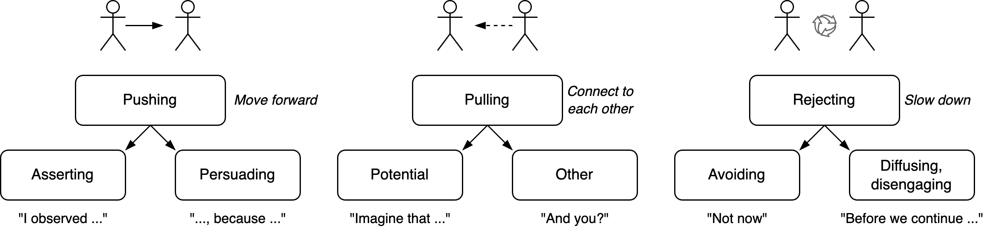

## Junctions

   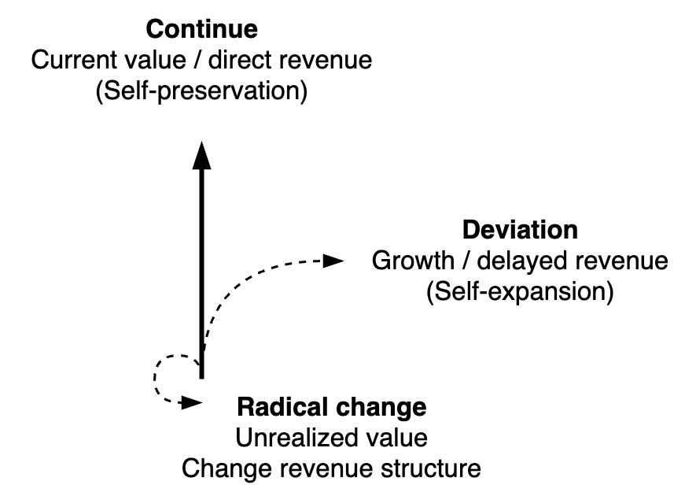   

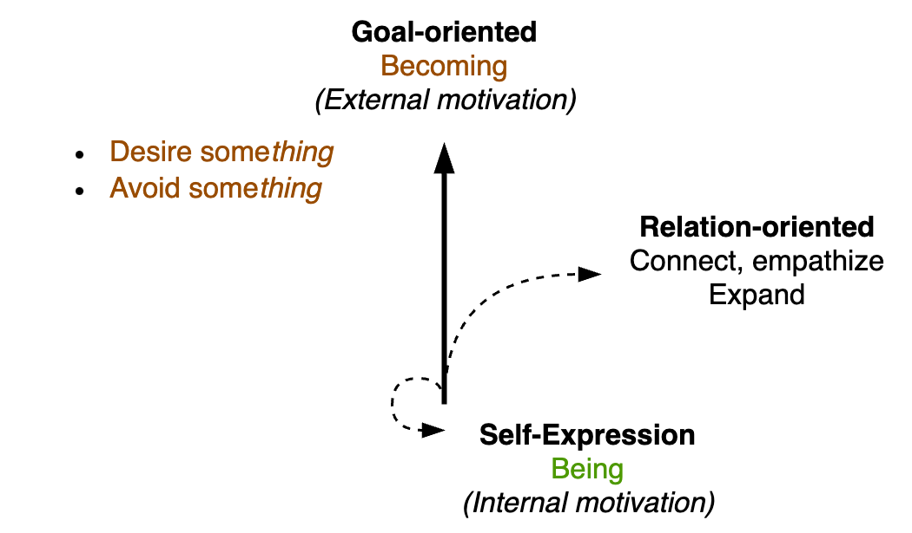

## Triangles

People-oriented (who), result-oriented (what), thought-oriented (meta-how).

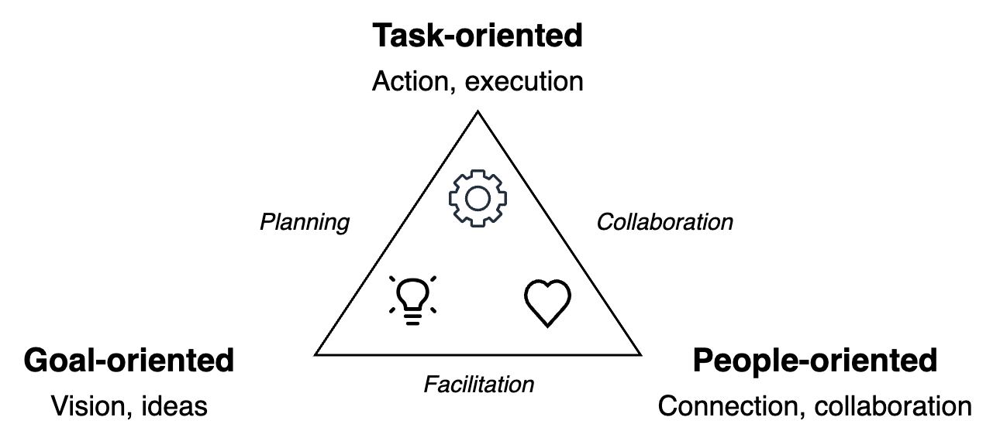  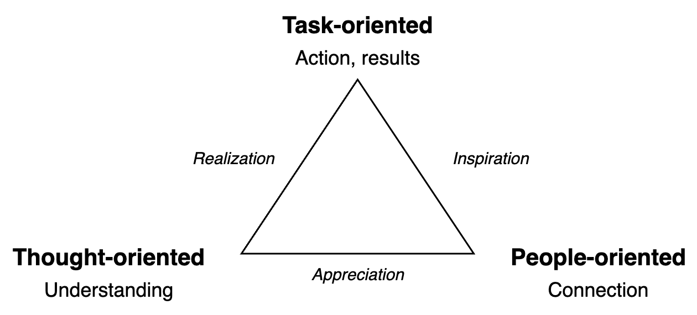

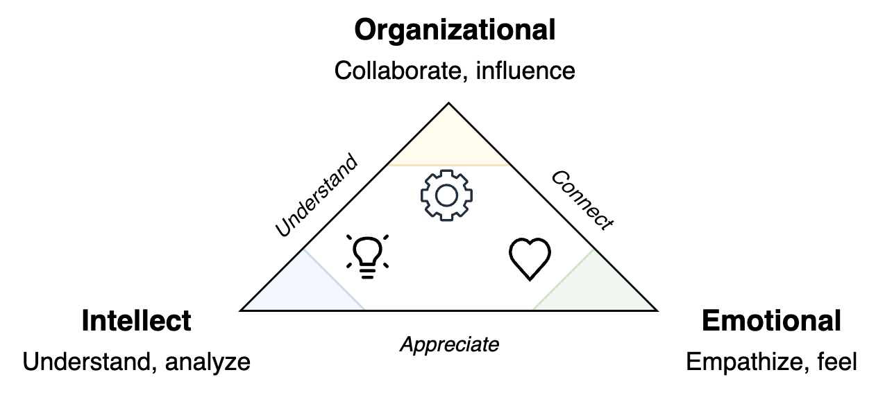

### Communication

Experience

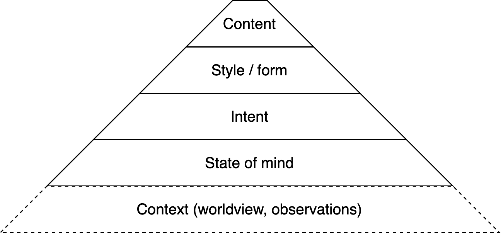

## Pyramids

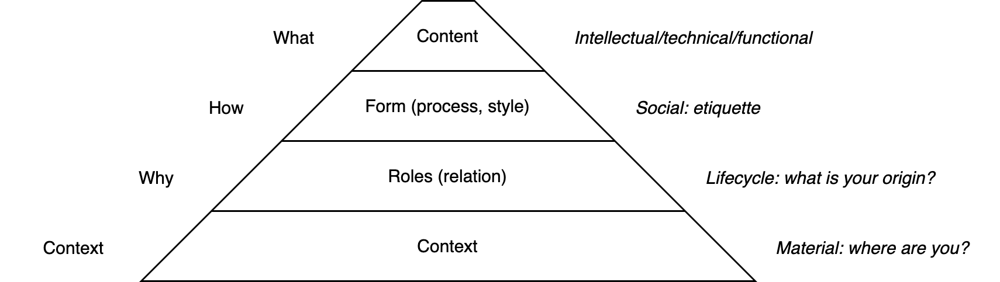

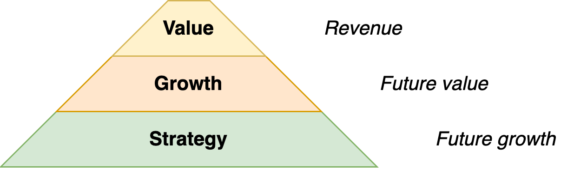 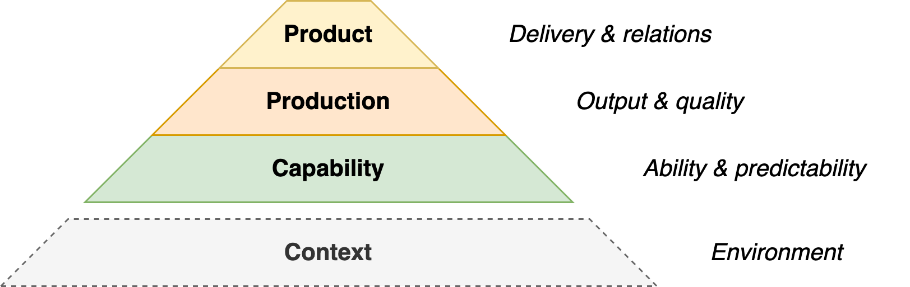

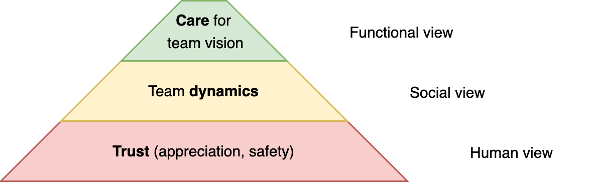

## Quadrants

### Psychology

Psychological needs

Pleasantness and activation

Personality

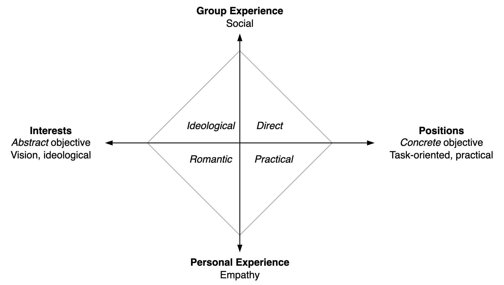

Confidence, trust, reputation

## Venn Diagrams

Organizational roles

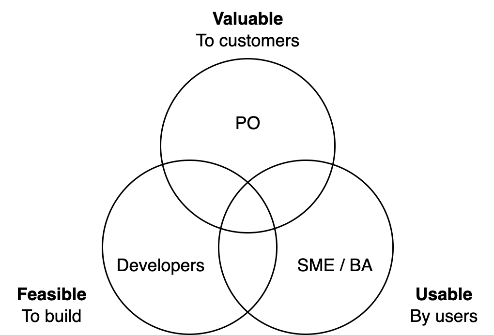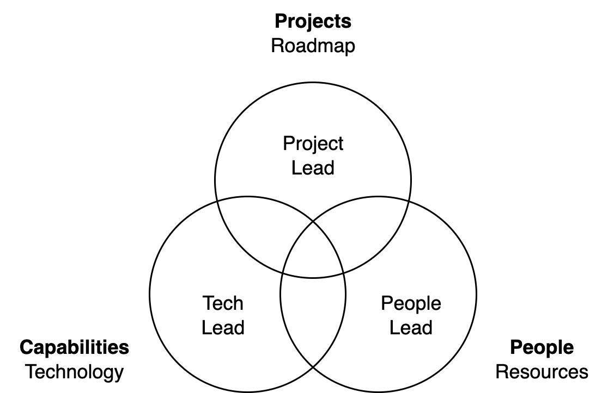

Outside and inside views.

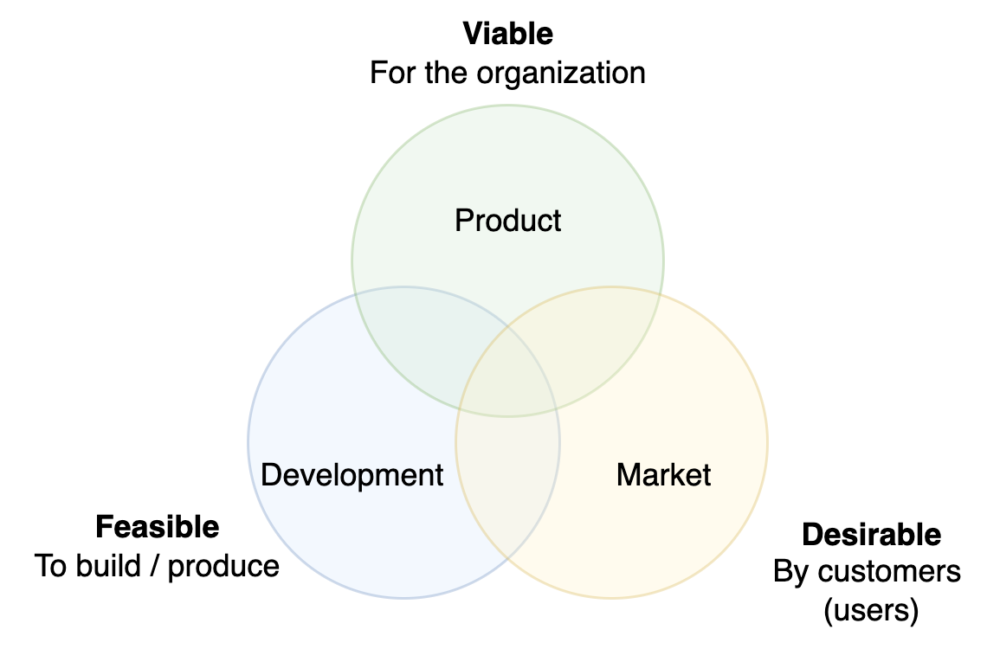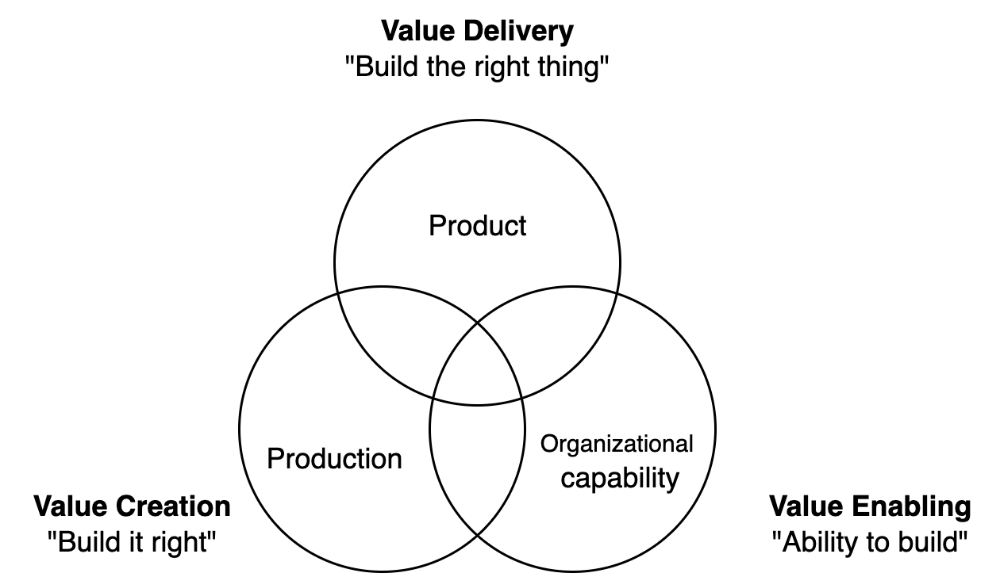

## Product

Outcome & impact

Focus

 

            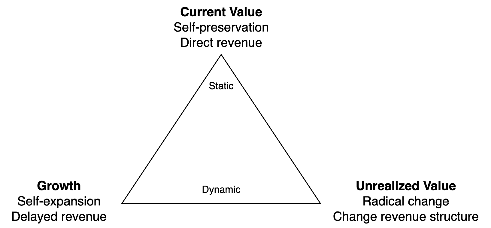

Scope

   

