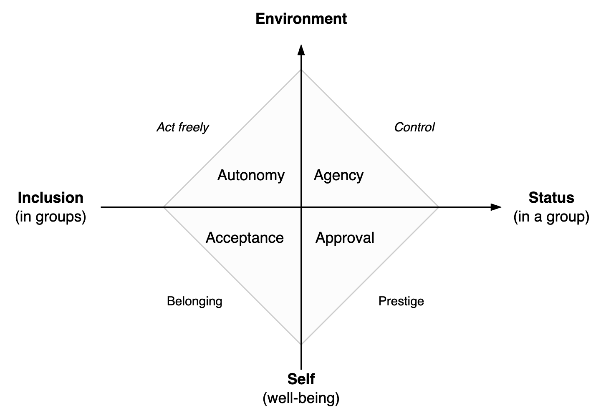
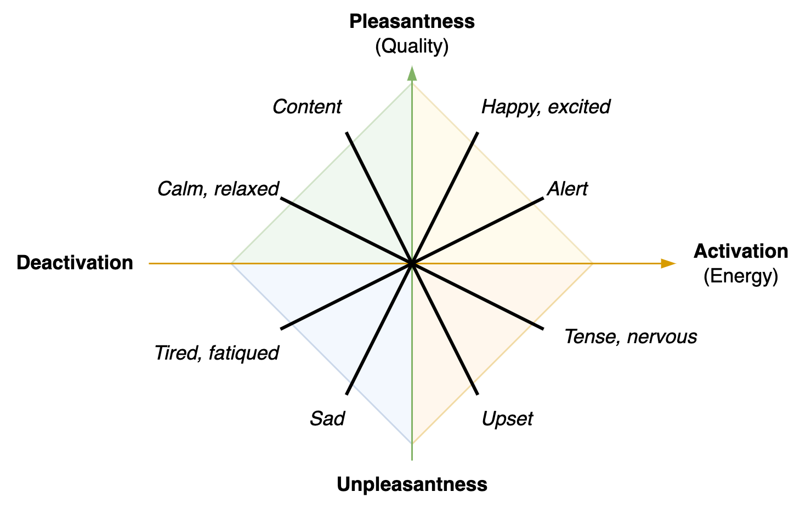
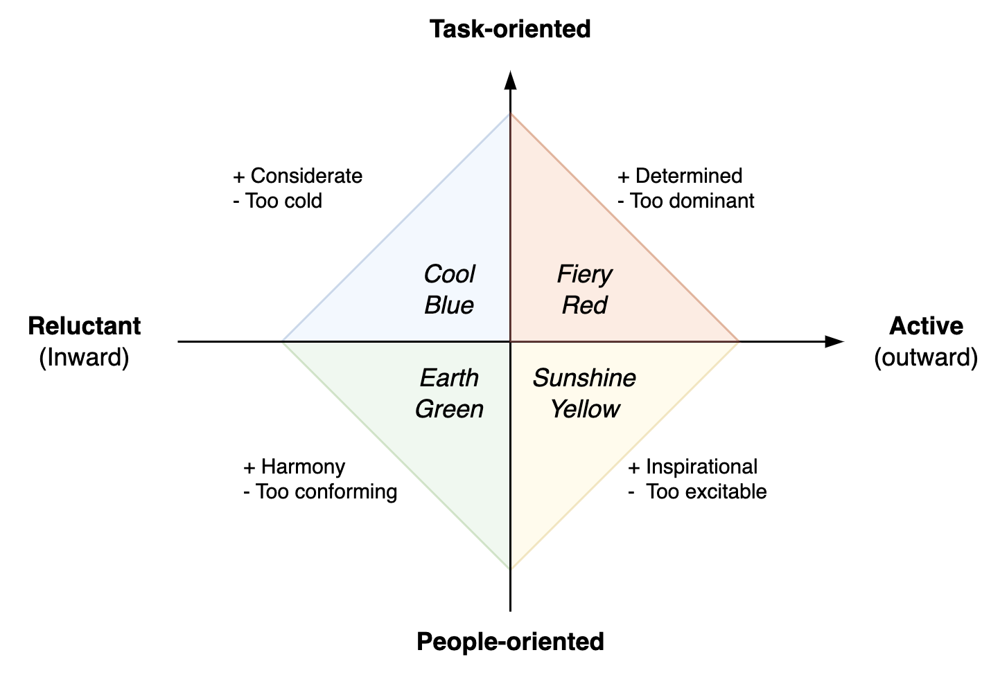
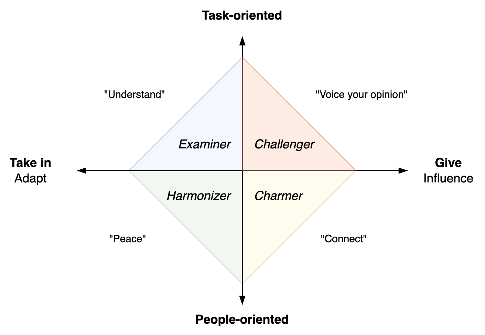
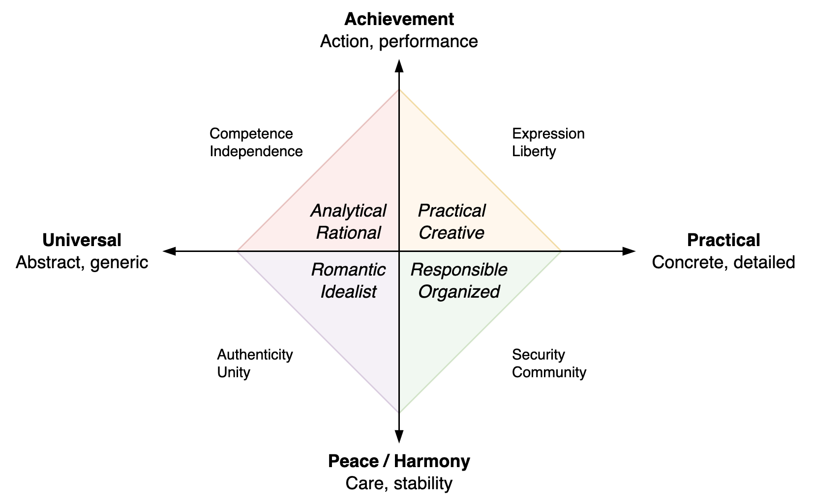
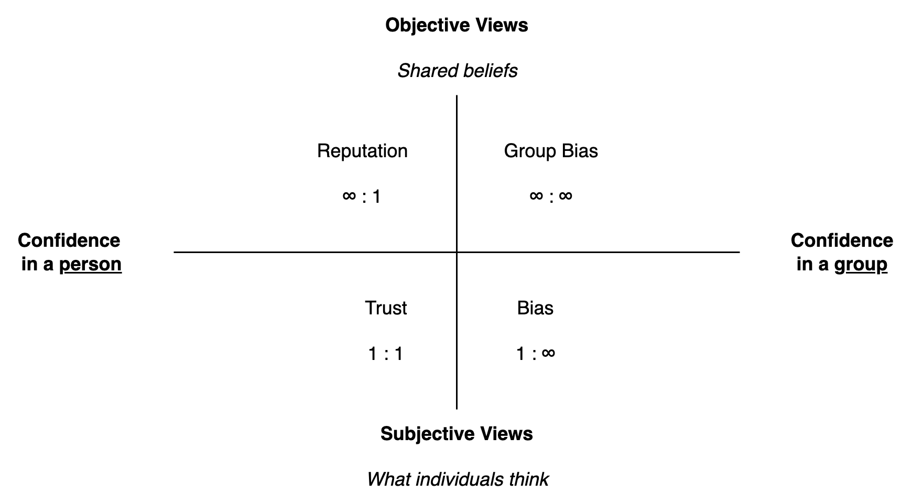

# Models

[toc]

## Contrasts

Acceptance-control ([empowerment-power](../alignment/alignment.md), [surrendering-authority](../alignment/leadership-styles.md))

Push-pull

## Junctions

      

## Triangles

People-oriented (who), result-oriented (what), thought-oriented (meta-how).

  

### Communication

Experience

## Pyramids

 

## Quadrants

### Psychology

Psychological needs

Pleasantness and activation

Personality

Confidence, trust, reputation

## Venn Diagrams

Organizational roles

Outside and inside views.

## Product

Outcome & impact

Focus

 

            

Scope

   

