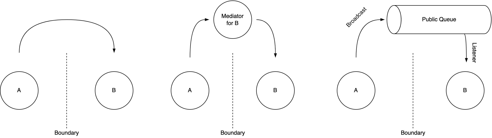

# Organizational Structure

[toc]

Let an **organization** be defined as *an interdependent set of components that work together towards a common goal*.  The alignment, autonomy and coordination of these components complicates the path to the goal.

The optimal structure of an organization is highly dependent on the domain and scale. At the same time, the behaviour of these systems can be surprisingly similar. Examples of organizations are:

- A government
- A company, or a specific department or team within that company
- A software application, consisting of layers such as a user-interface, a business-layer and a database.
- A system of applications, where the components are services.
- An ecosystem. E.g. a market

Control of an organization vary between being completely centralized or completely distributed. See also [programming-paradigmes](programming-paradigms.md).

- Orchestration: communication happens through *commands*. E.g. a CEO makes an order.
- Choreography: communication happens mainly by *events*. E.g. an investor broadcasts that they are offering stock at a certain price.

In addition, [power](https://qualitysafety.bmj.com/content/13/suppl_2/ii22.short) can be oriented differently. Based on the flow of information, the following categories can be distinguished.

- **Authoritative** (pathological): chain of command. Based on personal need. 
    - Hide information from competitors. Suppress risks. Associated with scapegoating.

- **Bureaucratic**: rule-oriented. Based on departmental need. Ensure fairness through equal rules.
    - Narrow responsibility. Local improvements. Associated with seeking justice

- **Generative**: performance-oriented. Welcome inquiry and support global improvements, even if they are disruptive.
    - Shared responsibility. Associated with learning and sharing.

## Effectiveness

### Goals

An organization may be optimized for a specific goal:

- Adaptiveness, agility,
- Community, e.g. learning [as a whole](https://en.wiktionary.org/wiki/scenius).
- Innovation (taking risks).
- Productivity (output or outcome).
- Quality
- Scalability
- Stability
- Sustainability

### Autonomy and Alignment per Domain

Organizations cannot be studied properly without taking into account the domain in which they live. See [learning](learning.md).

Four [*domains*](https://en.wikipedia.org/wiki/Cynefin_framework) ordered by structure are:

1. Chaotic. *"Novel practice"*.
    1. Act immediately, then evaluate, then respond.

2. Complex. *"Emergent practice"*. Learn at the same pace that the environment is changing.
    1. Probe, experiment, then evaluate, then respond
    1. Suited for "Agile"

3. Complicated. *"Good practice"*. In absence of a single best practice (golden hammer).
    1. Analyze the problem, then respond.
    1. Suited for "Lean"

4. Obvious. *"Best practice"*
    1. Categorize the situation by using existing models.

There are two fundamental dimensions of of influence. 

1. Alignment: from flexibility to consistency.
2. Autonomy: from centralized to distributed.

These dimensions are intertwined and the optimum is situational. The following image gives an example of how the level of regulation can affect the value that is produced and delivered. Other properties with similar effects are: overstaffing and up-front planning.

## Components

Real world objects should rarely be studied in isolation. The connections of an object with the outside can be categorized as follows. The overall goal of the organization should take into account the preferences of all these components - both in the short and long term.

- Owner or **Stakeholders**: the party that profits from success of the organization
- **Customer**: the party that pays to receive a service.
- **Employees**: an intermediate party that delivers services.

Note that customers and consumers of a service are not always the same group.

### Chains

**Power Structure**
Decisions are made and forwarded according to a [chain of command](https://en.wikipedia.org/wiki/Command_hierarchy). This power structure may be explicit or implicit and centralized or distributed.

**Value Delivery**
A [value chain](https://en.wikipedia.org/wiki/Value_chain) is the sequence of activities that are necessary to deliver *value* to the customer. This chain may cross departmental boundaries. If this is the case, then a small change could disrupt multiple departments.

These chains can intersect, based on the types of components in an organization.

### Organizational Scale

Scaling up an organization while maintaining centralized control is difficult. Components may compete with each other.

At certain scales, the structure incentivizes **local** optimizations due to the inherent difficulty of making changes that affect other components.

- In functional teams this could lead to strict SLAs and slow handovers.
- In feature teams this can lead to diverging features. This increases duplication.

### Hierarchy of Components

A large organization can consists of sub-organizations. E.g. departments, divisions, teams. It is not possible to specialize at every level without impacting cohesion, alignment and collaboration.

This section uses the term "team" instead of "component" for simplicity, but the categories do generalize beyond this. Moreover, different levels typically have a different structures. E.g. functional departments with cross-functional teams.

1. Functional, specialist teams (or departments or roles).
2. Feature or product teams.
3. Core + Context.

**Functional Team**
Focus on either a specific functionality or domain. E.g. a user-interface or a database. Because the team is subordinate to the whole, there is high alignment and low autonomy. There is a uniform user-interface, but every change can affect all components, which limits flexibility of the system.

**Feature or Product Team**
Focus on a product, service, or feature. E.g. a random name generator service. The independence gives the team high autonomy. This increases productivity and flexibility, but the lack of alignment to the whole can lead to over-optimization.

**Core + Context**
This design attempts to avoid the strong coupling of functional teams and the weak alignment of product teams. There are a few variants:

1. A major core component + minor contextual adapters. E.g. a [hexagonal architecture](https://en.wikipedia.org/wiki/Hexagonal_architecture_(software)).
2. A facade (or proxy) + complementing services. E.g. a front for the user, that creates the illusion of uniform system. The complementing services provide the main functionality.
3. Multiple facades.

Note that the facade and the complementing services can be either function-oriented or feature-oriented.

#### Software Organizations

Graphically, this can look like this (see image).

The bottom images (autonomy, matrix) are two extremes, where teams are optimized for a local purpose. Depend on the alignment and communication between teams the structure can be rigid.

There are two inherent boundaries between components. Often, each component is responsible (and optimized) for their own domain.

- **Functional** Boundaries. E.g. between dev, ops, sales, marketing, security, compliance.
- **Product** Boundaries. Between products or features. 

Local interaction and changes are generally much easier than non local ones.

