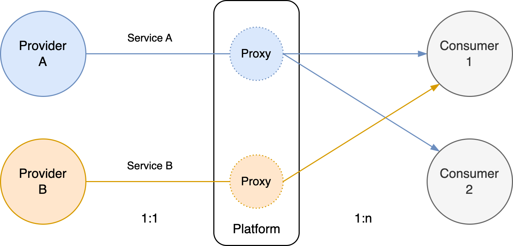

# Platform Management

A *platform* is a product that itself hosts other products. It facilitates *providers* to deliver services to third-party *consumers*. Both of these may be seen *customers*. A typical example is a [marketplace](https://en.wikipedia.org/wiki/Marketplace).

It has many parallels with the business concept [franchising](https://en.wikipedia.org/wiki/Franchising).

See also [product management](product-management.md).

**Role**

The platform can range from:

- An abstraction layer that enables consumers to be agnostic about providers. This reduces coupling and complexity for consumers. The consumer merely interacts with proxies of the original provider.
- A utility layer that either enables providers to deliver services more easily or enables consumers to receive a higher quality of services. E.g. by enforcing or providing certain security policies.
- A centralization or governance layer that provides control over the market or [landscape](https://en.wikipedia.org/wiki/Service-oriented_architecture) of services.
- A mediation or translation layer that provides a provider-specific interface to consumers.

This may be combined with the role of a [distributor](https://en.wikipedia.org/wiki/Distribution_(marketing)) (or vendor). This inverses the direction of cash flow between the platform and providers.

Finally, investment may be made to attract either providers or consumers. 

**Purpose**

For any product, the following goals apply:

- Deliver of value to customers.
- Contain operating cost and reduce waste.
- Ensure agility. Lower the cost of change.

This can be extend by taking into account the roles of providers and consumers.

- Deliver of value directly to providers.
- Facilitate delivery of value to consumers. E.g. ensure high availability, low latency, low [MTTR](https://en.wikipedia.org/wiki/Mean_time_to_repair).
- Reduce the entry barrier and operating cost of providers and consumers.
- Improve the agility of providers and consumers.

**Metrics & Performance**

The mediation role of the platform creates a bias towards stability.

