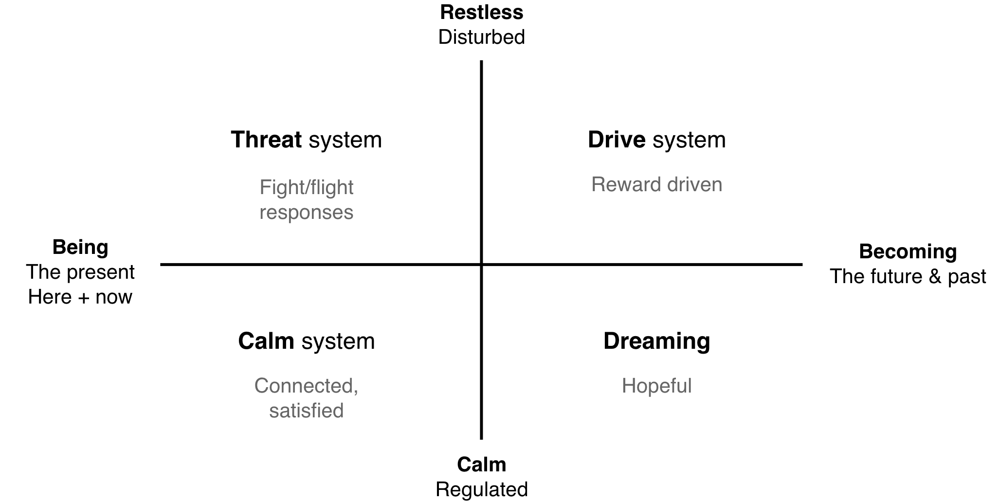

# Being and Becoming

Not to be confused with [being-becoming](../metaphysics/being-becoming.md) in philosophy.

## First dimension

## Second Dimension

> **Stress** is the distance between the world as you see it and the world as you wish it to be.

The being-becoming model can be extended by stress levels. A dimension from calmness to restlessness. See [nervous-system-triangle](nervous-system-triangle.md).

