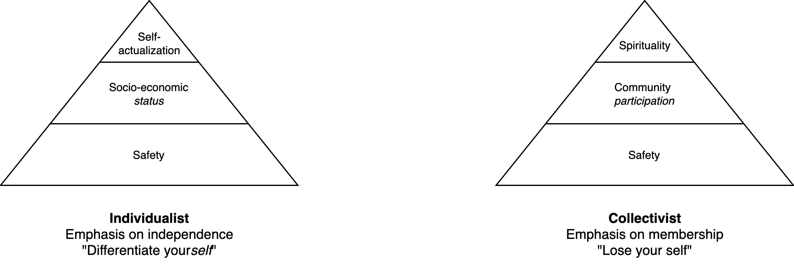
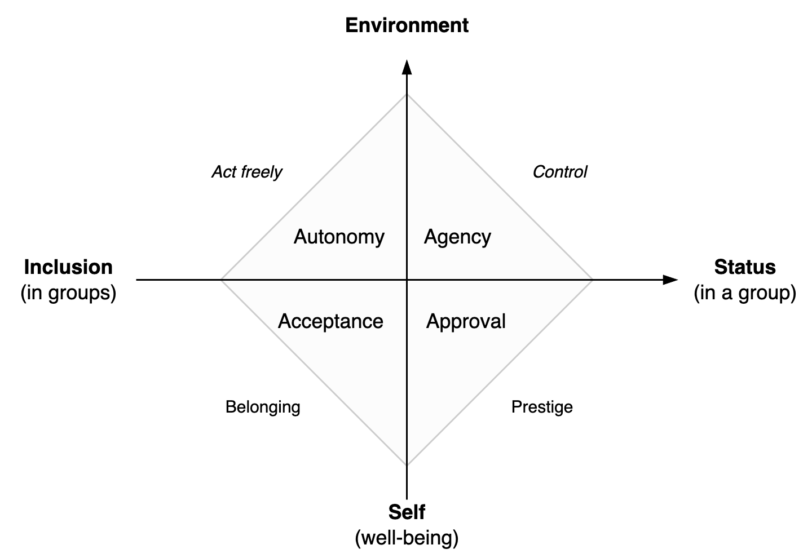

# Desire

In psychology, desire relates to an subject and a change. See [desire (subjects)](../subjects/desire.md),  [ego](ego.md) and [identity](../subjects/identity.md).

[toc]

## Pyramid Model

Two flavours of a simple model for desire and human needs.

1. The primary layer is physical and psychological safety. E.g. food, water, shelter.
2. The middle layer relates to the position (belonging) in a society. Either a status or ability to participate. A typical metric is net worth.
3. The top layer relates to forms of enlightenment. Actualizing ones true potential. Being at peace.

Typical desires:

- In a individualist culture: I want a perfect partner, and live in a big house. Then become the next CEO.
- In a collectivist culture: I want to become a great member for my community, and find inner peace.

|             | Individualist Model                          | Collectivist Model            |
| ----------- | -------------------------------------------- | ----------------------------- |
| **Success** | "My" status (social, economic, intellectual) | Community or ideology         |
| **Example** | *Want to be the best*                        | *Desire to support an other*  |
| **Bias**    | Global, objective metrics                    | Local, subjective connections |
| **Risk**    | Optimize metrics                             | Stuck in tradition            |

The difference is highlighted in **resumes**. These may either:

- Rely on self-promotion of achievements. Emphasize individual results.
- Show the relation to authorities. I.e. membership to prestigeous organizations. Contribution to team results.

**Types of needs**

Standard human needs (Maslow).

1. Survival. Physiological needs.
2. Safety. Security.
3. Acceptance, belonging, friendship, intimacy.
4. Recognition. Prestige.
5. Knowledge and understanding
6. Order and beauty
7. Self-actualization. Realizing ones potential.

In two dimensions

1. Personal. Well-being (safety) versus agency in an environment.
2. Social . Inclusion (belonging) versus status in groups (prestige).

**Jobs**

Purpose of a job

- The core method to measure self-worth.
- A means to obtain leisure.

