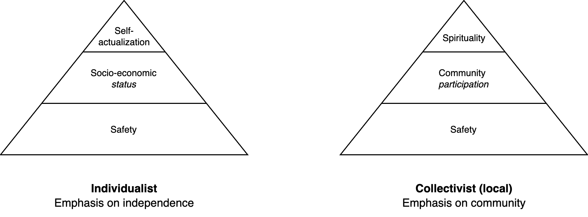

# Desire

Two flavours of a simple model for desire and human needs.

1. The primary layer is physical and psychological safety. E.g. food, water, shelter.
2. The middle layer relates to the position (belonging) in a society. Either a status or ability to participate. A typical metric is net worth.
3. The top layer relates to forms of enlightenment. Actualizing ones true potential. Being at peace.

**Types of needs**

Standard human needs (Maslow).

1. Survival. Physiological needs.
2. Safety. Security.
3. Acceptance, belonging, friendship, intimacy.
4. Recognition. Prestige.
5. Knowledge and understanding
6. Order and beauty
7. Self-actualization. Realizing ones potential.

In two dimensions

1. Personal. Well-being (safety) versus agency in an environment.
2. Social . Inclusion (belonging) versus status in groups (prestige).

