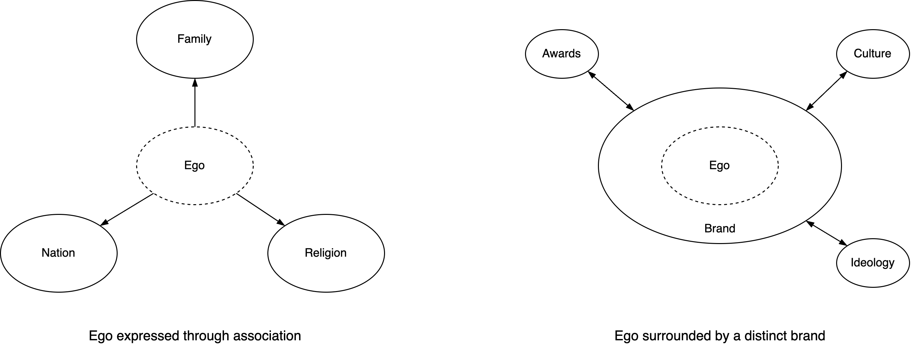

# Ego

The concept ego has a simple [definition](https://www.merriam-webster.com/dictionary/ego), but has a variety of implications, specificaly across cultures.

Alternative definitons

- A mirror-like reflection of your self.
- The false self.
- A [layer](https://en.wikipedia.org/wiki/Id,_ego_and_superego) between the id and the superego (Freud).

Expression

- In traditional cultures the ego is expressed through generic roles and associations. E.g. being a mother, a father, a christian, a muslim. Significance is given by the authority of the associations. E.g. membership of a guild.
- In modern capitalist cultures the ego is elevated to become its own *brand*. It is decoupled from its enviroment and origin. Significance is given by self-promotion. It aims to differentiate itself from other brands.

|                  | Traditional Ego                                              | Ego as a Brand                            |
| ---------------- | ------------------------------------------------------------ | ----------------------------------------- |
| **Purpose**      | Association                                                  | Differentiation                           |
| **Result**       | [Sign](https://en.wikipedia.org/wiki/Signified_and_signifier) | Symbol                                    |
| **Method**       | Identification with environment                              | Distinguish the self from its environment |
| **Significance** | Delegated to groups and institutions                         | Self-promotion                            |

See also: Byung-Chul Han.