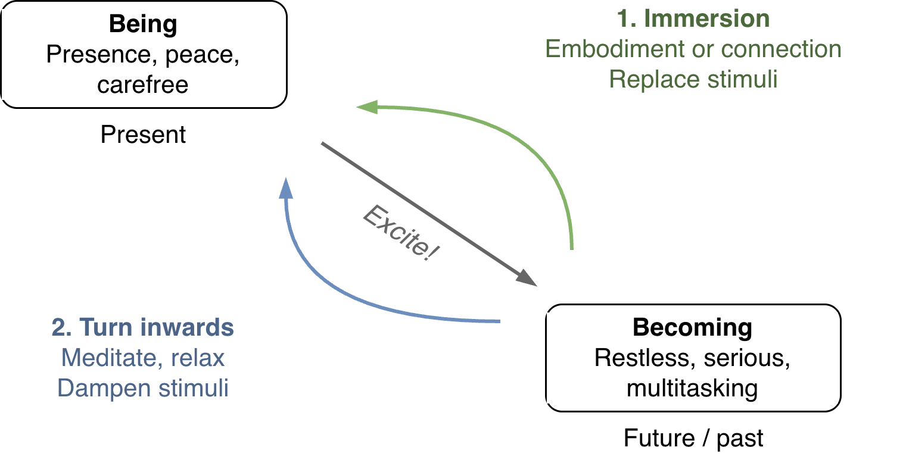
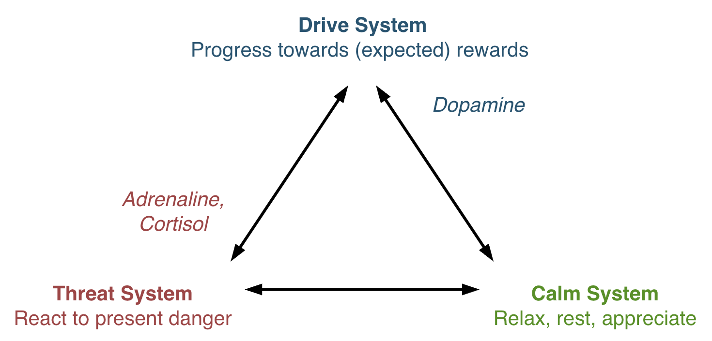
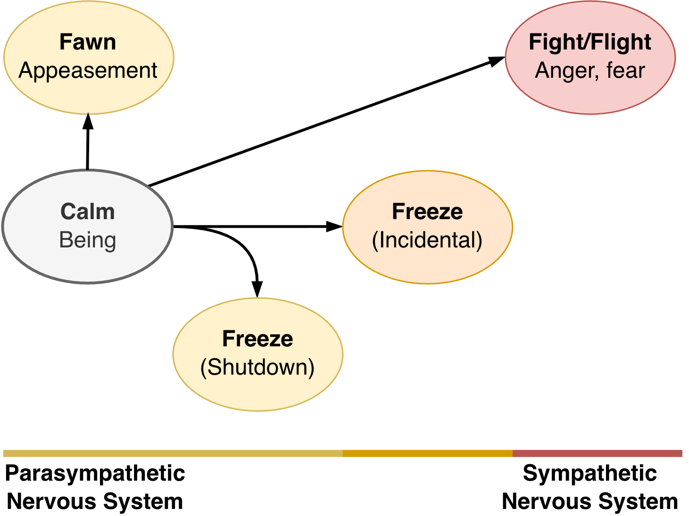
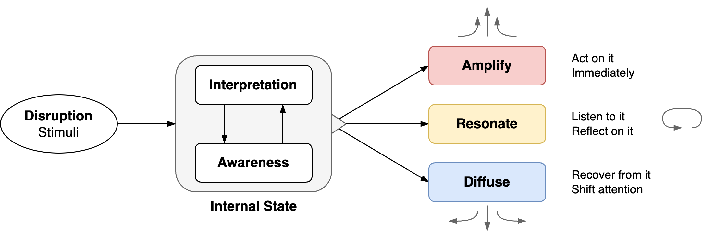
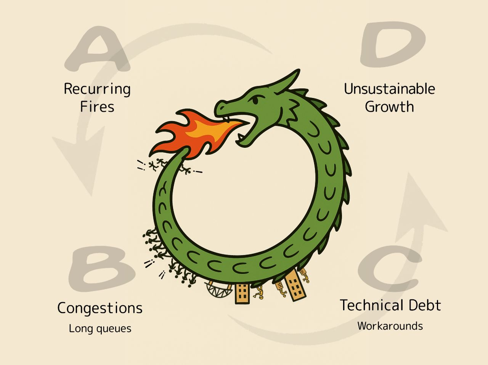

# Emotion Regulation Overview

States of the nervous system. States of mind.

[toc]

## Being-Becoming

See [being-becoming](being-becoming.md).

## Threat/Drive/Calm System

The being-becoming model can be extended by a third component: threat responses. See [nervous-system-triangle.md](nervous-system-triangle.md).

| Threat System          | Drive System               | Calm System |
| ---------------------- | -------------------------- | ----------- |
| React to threats       | Progress towards rewards   | Relax       |
| Fight/flight responses | Dopamine seeking behaviour | Peace, rest |

### Fight/Flight Responses

The threat system can be decomposed into fight/flight/freeze/fawn responses. See [nervous-system](nervous-system.md).

### Emotional Reactions

See [experience](../subjects/experience.md)

## Related Models

See [productivity-constraints](../teams/productivity-constraints.md)

