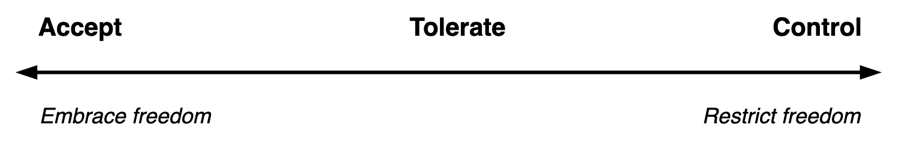
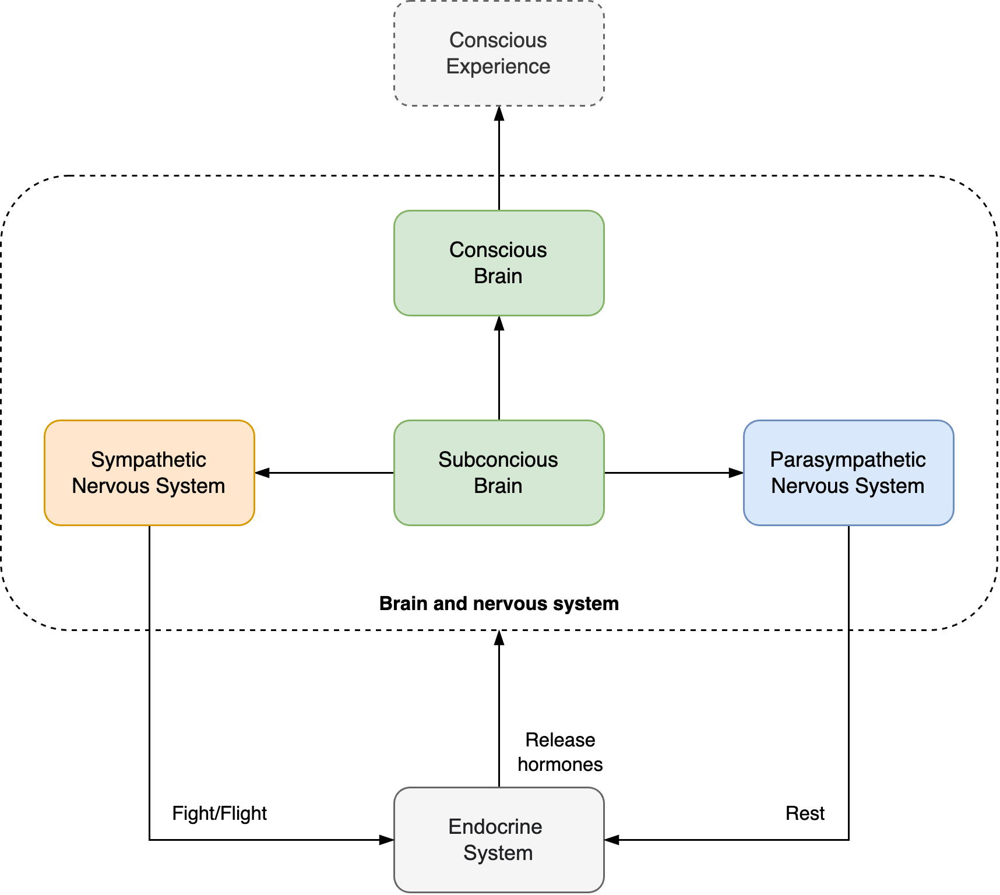
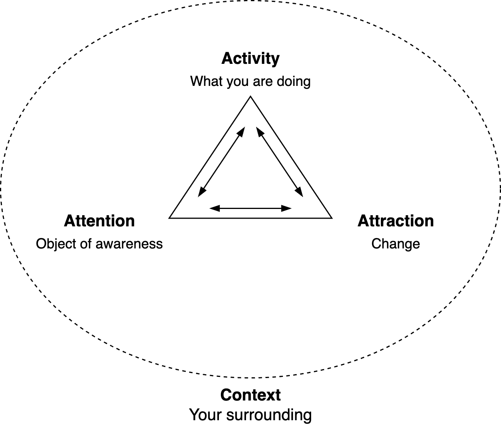

# Experience

This document focusses on conscious and human experience. It emphasises attitude, sensation and emotion. Also see [experience](../subjects/experience.md).

[toc]

## Overview

Experience can be broken down to the following. Note that all components are interrelated.

- Awareness
  - 👁️ **Perception** of the environment, including assumptions. E.g. perception of someone’s emotions.
  - 💭 Awareness of **thoughts**. Memories, fantasy, language, reasoning.
  - ❤️ Awareness of **feelings**. Bodily sensations, desires, emotions. External sensations, like empathy, emotional contagion, vicarious embarrassment.
- 💬 Behaviour. Actions and their [intent](../alignment/intent.md).
- 🏡 Context. The environment and everything else. Past events, identity, expectations.

Perception is a complex activity. It includes translations of raw sensations into cohesive interpretation. It includes things that are not directly observed. E.g. when a someone's coat hides the majority of their body, we wouldn't doubt it's existence.

- Intuitive processing. Automatic translation and inference of meaning. E.g. sub-conciously empathizing with someone.
- Bottom-up processing. Step-by-step interpretation of details, before infering meaning. E.g. noticing someone's posture, facial expressions, and then concluding they likely feel an intense emotion.

Hallucinations usually refer to perception, but thoughts could be considered hallicunations as well.

Conscious experience is not a biological or social process. It can be reduced to a set of patterns that characterize a person.

- Such patterns are called roles or habits. They are a mix of someone's desires, worldview and environment.
- They affect attention and the sense of self. See [ego](ego.md).

The states of the human body and mind can differ. A few examples.

|                                  | Good state of mind (satisfaction)              | Bad state of mind (dissatisfaction)       |
| -------------------------------- | ---------------------------------------------- | ----------------------------------------- |
| **Good state of body (comfort)** | Joy and peace, trust                           | Loss of faith, dissatisfaction, pessimism |
| **Bad state of body (unwell)**   | Winning at sports, despite physical exhaustion | Suffering from pysical injuries           |

Note that there is a difference between what you like and what is good for you.

Experience can be inward, outward, individual and social. See [integral theory](https://en.wikipedia.org/wiki/Integral_theory_(Ken_Wilber)).

|                | Inward                     | Outward                       |
| -------------- | -------------------------- | ----------------------------- |
| **Individual** | Consciousness (subjective) | Behaviour (objective)         |
| **Social**     | Culture. Shared ideas      | Processes, systems, structure |

### Acceptance & Control

Attitude towards freedom

Attitude towards the environment

### Activity

Experience is an activity. It consists of feeling (perceiving) and thinking. Both are driven by human nature, personal desires and external stimuli. Humans have limited control over their thoughts and their behaviour.

Waves interference occurs naturally. There may be harmony or dissonance. Waves can complement or disrupt each other.

Feeling does not require *acting*. Surrendering to a feeling does not mean you indulge in it. It just means you stay with it for a moment.

Attention cannot be focussed everywhere. Closing your eyes improves sensitivity of other senses.

Other dimensions

- Attention may inward or outward. Sensations can originate from senses or memories.
- Energy can be low or high. E.g. high arousal.

#### Being and becoming

Becoming can have many forms. The origin can be fear or desire. The attitude towards the environment can be submissive or aggressive. Attention can be associated or dissociated.

People perceive the world differently. They can be present, distanced or overwhelmed. They can feel in control or helpless.

There are three roles that form a [drama triangle](https://en.wikipedia.org/wiki/Karpman_drama_triangle). The villain blames others for problems. The victim is helpless and the hero saves the victim.

> How you feel ≠ what you feel.

Sensation is done with three representational systems.

- Auditory - hearing
- Kinesthetic - feeling, touching
- Visual - seeing

Note: other feelings (hunger, temperature) are left out in this model.

### Models

This model excludes the feedback loop.

Humans act as agents. See [change](../subjects/change.md).

There exist various models to explain experience of stimuli and sensations.

- "Common sense". Physiological reaction is caused by emotion, which is caused by an intense event.
- [James-Lange](https://en.wikipedia.org/wiki/James%E2%80%93Lange_theory). Emotion is a result of a by a physiological reaction to an intense event.
- [Cannon-Bard](https://en.wikipedia.org/wiki/Cannon%E2%80%93Bard_theory). Emotion and arousal are affected by subcortical brain activity (reptillian brain).
- [Schachter-Singer](https://en.wikipedia.org/wiki/Two-factor_theory_of_emotion). Emotion is a result of appraisal of a physicological reactions to an intense event.

Phases

1. Sensation. Observing stimuli. Electrical signals and hormones in the human body.
2. Perception. Registering stimuli.
3. Attention. Becoming conscious of stimuli. Feeling, hearing or seeing.
4. Memory. Virtual stimuli. Historical or imagined.

## Attention and Presence

### Reaction

There are three main types of reactions to intense feelings.

- **Act** on the feeling. Express it. Let the feeling guide your action. `feeling -> acting`
- **Immerse** yourself in the feeling. Stay with it. Without thinking. Without acting. `feeling -> feeling`
- **Resolve** the feeling.  Cope with the feeling. E.g. breath and move to let energy dissipate. `feeling -> thinking`

Immersion results in association. Feeling the feeling. The opposite is dissociation. 

Resolving can be an avoidant strategy. See [emotions](emotions.md).

### Association

> Let go.

To be present:

- Feel your feelings. Don't think, don't imagine, don't recall, don't hope, don't worry. De-emphasize the future and the past.
- Acknowledge the chaos of reality. Let go. Don't control, don't understand, don't restrict, don't block.

Note that this is not feasible in many environments.

**Presence**

The experience of a person in the present moment.

- *What is it like to be you?*
  - *Where is your attention?*
    - *What's on your mind? What do you feel?*
    - *What do you notice?* E.g. sensation.
  - *What is attracting you?* E.g. curiousity, sensuality, love.
  - *What do you need/wish?*
- *Where are you?* The surrounding.
- *What are you doing?* Activity.

All of these have negations. *What is absent? What do you not see?*

**Flow**

Move from surface level observations to disclosing deeper personal information.

### Dissociation

Dissociation can happen in many forms. A few common examles are daydreaming or taking a walk *on autopilot*, without paying attention to where you're going. 

Note that people are highly influenced by their environment. They react to subjective observations and will change their behaviour (and perception) based on cultural expectations.

Dissociation in **thoughts**.

- Thoughts that arise in your mind can be formulated in the first or second person. E.g. "I feel", "You could".

Dissociation in **experience**. This can happen gradually or disruptively:

- Being *present*. Paying attention. Being immersed in an environment.
- Being *distracted*. Either being focussed on something else, or being not focussed at all.
- Being *not yourself*. Deviating from your standard behviour. E.g. being highly emotional. This can happen as response to stressful situations.
- Showing radical changes in personality. Changes in behavioural patterns. Potential loss of memory after episodes.
- Hallucinatory experiences. Not being able to distinguish between fantasy and reality.

Note that the last type is controversial. In the western scientific community, any spiritual experiences tend to be disregarded.

**Coping styles**

- Give up. Give yourself over to the situation.
- Avoid
- Reverse. Re-interpret the situation as pleasant.

### Parts

Parts of yourself

> (Alice) I knew who I was this morning, but I’ve changed a few times since then.

People tend to experience differences as reaction to environments. A generic term for this is *parts*; which relates to the different parts of your*self*. For example, someone may talk differently towards their close family than to their work colleagues. Someone may lose their temper, and later reflect "I was not myself".

- Other terms for this concept are roles, modes, fantasies, strategies, alter egos. Recognizing parts allows people to connect to specific parts (give it a voice) and express themselves.

Two related concepts are.

- Your shadow. The part of yourself that is not visible. Subconscious patterns that influence your experience.
- Your demons. Parts of yourself that act out of guilt or shame. See [chakras](mind-body.md).

**Demons**

Demons is an analogy of the "dark" parts of the self. E.g. fears, shame, insecurities. 

> Go face your demons

Understanding your demons is a typical part of therapy and behavioural change. Healing involves recognizing patterns and learning new patterns.

> Befriend your demons

Demons do not have to be inherently bad. They can be genuine parts of the self. They often have had a benefit in certain historical situations.

## Frustration and Depression

Depression is not just a result of working too hard. Some contributing factors:

- Discrepancy between desires and reality. E.g. wanting other people to change.
- Lack of agency or compentency.
- Lack of alignment with the organization.

Contrarywise, consider the following factors.

- Following a vision with passion for the direction.
- Excelling and achieving results.
- Taking breaks after sprinting to celebrate succes and rest.
- Engagement with a community.

