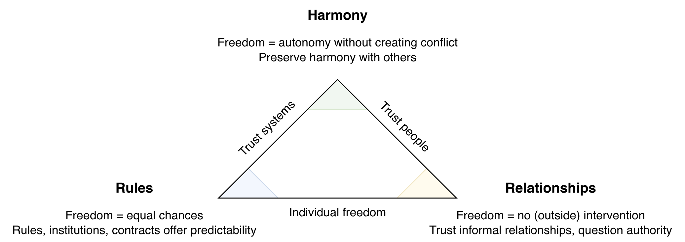

# Implicit Ideology

This document presents a basic model for ideologies (beliefs) that are embedded in society. These include values, beliefs, behaviours and other patterns. The model is comparative and does not favour any specific direction. It is inspired by the Lewis model.

Like all models, this model is wrong. It resembles specific societies in specific eras and fails to cover the majority of societies (present and historical). Instead of attempting to capture the complexity of multicultural societies, it attempts to explain the different directions societies have taken.

[toc]

## Freedom Triangle

In the **rules**-first model, freedom means equal chance and quality treatment. This is guaranteed by rules, institutions and contracts. Freedom from abusive individuals. Absense of rules would be chaotic.

In the **relationship**-first model, freedom means an absense of state intervention. The freedom to negotiate on your own. The freedom to bend rules.  A deep rejection of authority. Human warmth over cold procedure. A rule-based society would feel suffocating.

In the **harmony**-first model, freedom means an absense of conflict. To have autonomy after trust is established. See [choreography](../alignment/orchestration-choreography.md).

## Analogy

The triangle maps to a classification of society: procedural societies, relational societies and collectivist societies. Let's first explore these by an analogy: a factory for a cold procedural society, a bazaar for a relational society and a (Buddhist) temple for a collectivist society.

## Ideology Triangle

The classification of societies shows the implicit ideology. In contrast to traditional ideologies, these implicit ideologies are invisible to the members of a society. The table below presents an overview, followed by a brief description of each class.

|                    | ❄️ Procedural Society                                         | 🔥 Relational Society                                         | ☯️ Collectivist Society                                       |
| ------------------ | ------------------------------------------------------------ | ------------------------------------------------------------ | ------------------------------------------------------------ |
| **Core**           | Rules, roles, schedules, contracts, outcomes                 | Authentic informal relationships, reputation, flexibility    | Attunement, respect. Preserve harmony                        |
| **Driver**         | Performance (becoming). Protestantism, rationalism, industrialization, capitalism | Distrust "broken" institutions. Honor cultures.              | Buddhism, Confucianism. Loose power structures (choreography) |
| **Identity**       | Split identity. Different roles in different environments    | Interdependence. Shared personal, social, professional lives. | *Anatman* (non-self)                                         |
| **Morality**       | Principled. Deontological morality. Impersonal rules.        | Particularism. High context. Dignity, forgiveness.           | Moral duty, minimize friction. Long-term stability.          |
| **Accountability** | Institutions judge outcomes. Business = business             | Rules are negotiable. Personal relationships before business. | Balance                                                      |
| **Satisfaction**   | Work provides significant meaning                            | *Carpe diem. Dolce far niente*                               | Peaceful contribution. Social harmony. *Wa*                  |
| **Communication**  | Direct, factual, often professional                          | Expressive sincerity                                         | Listen first, calibrated answers. Respect                    |
| **Origin**         | UK, Germany, Benelux                                         | Southern Europe                                              | East Asia                                                    |

❄️ **Procedural Society**

1. The **core** characteristics are the heavy usage of rules and roles. Predictability is ensured through schedules and contracts. Society is driven by performance and achievement.
2. **Identity** is split into personal, social and work lives. They change their attitude based on the current role. 
3. This enables a dual **morality**. Deontology is favoured in general, while work roles allow consequentialist judgement (outcome-based) and diplomatic communication. Business = business. Ratio is highly valued.
4. Moreover, a **good life** may revolve around work. Work may provide significant meaning.
5. The results is a heavy regulated, systems-oriented culture. Full of procedures, laws and organization.

The systematic nature, mild emotional expression and the consequentialist judgement can seem cold and apathetic to other cultures.

🔥 **Relational Society**

1. The **core** characteristics are the central role of informal relationships and flexibility in everything. Sincerity and reputation are cherished. This is driven by an aversion to institutions, which can be corrupt, biassed, impersonal or unreliable. Relationships and reputation is valued instead. Relationships compensate for institutional gaps.
2. **Identity** is interdependent. Shared personal, social and professional lives. Personal relationships intertwine with business business.
3. **Morality** is highly contextual (particularism). Rules are negotiable. Some rules should be bend. Relationships come before business.
4. A **good life** consists of shared experience and leisure. Work is merely a tool. *Carpe diem. Dolce far niente.*

☯️ **Collectivist Society**

1. The **core** characteristics are attunement and respect. Society runs on a type of choreography. Implicit expectations and self-discipline, rather than tight control. It is build upon foundations of Buddhist and Confuscianist teachings.
2. **Identity** is rooted in community. The ego is far less important than in individualist societies.
3. **Morality** and ethics are balanced deontology (duty), virtue (self-discipline, sincerity) and consequences (harmony, long-term stability). Duty depends on relationships and hierarchy. Moral duty.
4. A **good life** consists of living virtuously, in peace. The "reward" is social harmony.

### Communism

Historically, communism has been most compatible with collectivist societies. The socialist nature and respect for institutions provides a basis for communist policies.

Communism fits less well with procedural societies. The presence of well working institutions lowers the need of communist solutions. Procedural societies tend to be more individualistic as well, with less support for socialist policies.

Relational societies tend to have stronger support for communist ideas. Yet, a distrust of institutions and cold procedures creates complications. Historically it clashed with anarchism in e.g. Spain.

## Desires Model

See also [desires](desires.md).

## References

- R. Lewis. *When Cultures Collide: Leading Across Cultures*