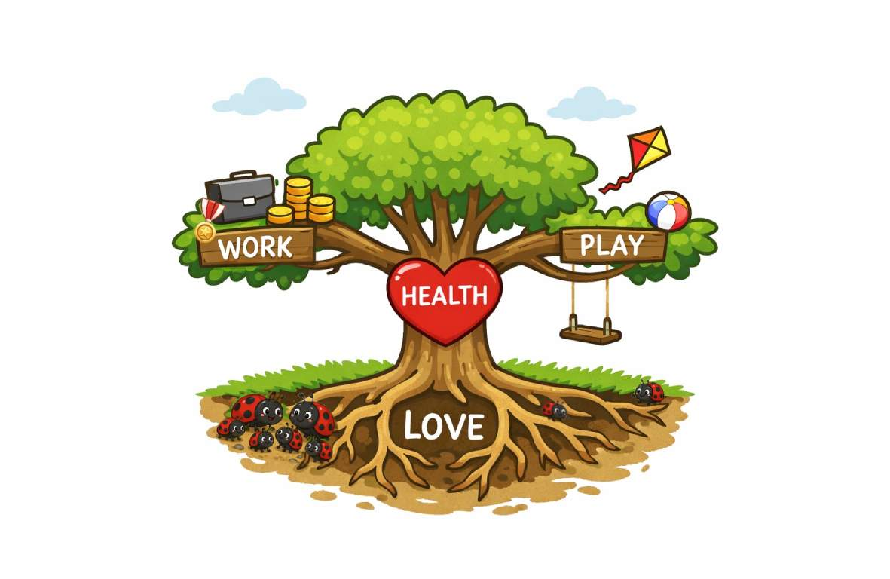
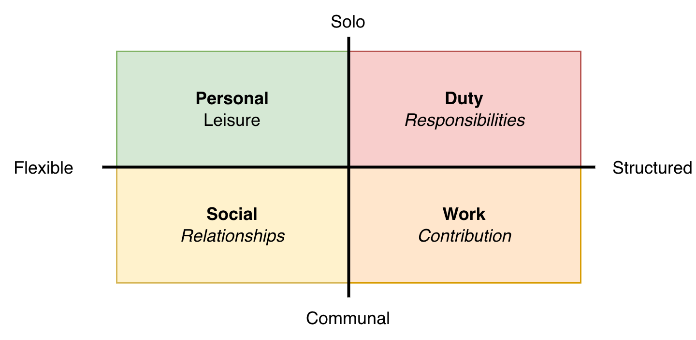

# Lifestyle

Existential questions of life. See also the guide [how to find your passion](../guides/how-to-find-your-passion.md).

## Areas of Life

The answer to *"How is it going?"*

First, consider your *being*.

- **Health**. Mental, physical, spiritual.

- **Love**. Partner, family, community, pets. Connection to others.

Second, consider activity: *becoming*. Work is about results and achievement. Play is about experience.

- **Work**. Paid and unpaid. From job to personal demands.
- **Play**. Leisure, to have fun, to be playful.

## Time Allocation

*How much of your time is spent on each area?*

(In Dutch: vrije tijd, plicht, sociaal, werk)

## Relationships

Relationships revolve around trust. Here are some more properties of (romantic) relationships. They relate both to the other partner and to the relationship itself. Connection is the core of the relationship. Each partner can take the responsibility to be open themselves and to have compassion for the partner. Alignment relates to the whole: it involves the ability to resolve conflict together.

|           | Strengthen relationship                         | Degrade relationship                                  |
| --------- | ----------------------------------------------- | ----------------------------------------------------- |
| **Core**  | Connection (intimacy, love, care)               | Distance, neglect, wihdrawal, carelessness            |
| **Self**  | Openness (honesty, vulnerability, transparency) | Closure. Stonewalling, defensiveness, lying           |
| **Other** | Compassion (empathy, respect)                   | Hostility. Judgement, criticism, contempt, resentment |
| **Whole** | Alignment (cooperation)                         | Divergence. Inability to resolve conflict             |

The four horsemen of relationships are criticism, contempt, defensiveness and stonewalling (Gottman)

## References

- Bill Burnett and Dave Evans. *Designing Your Life*