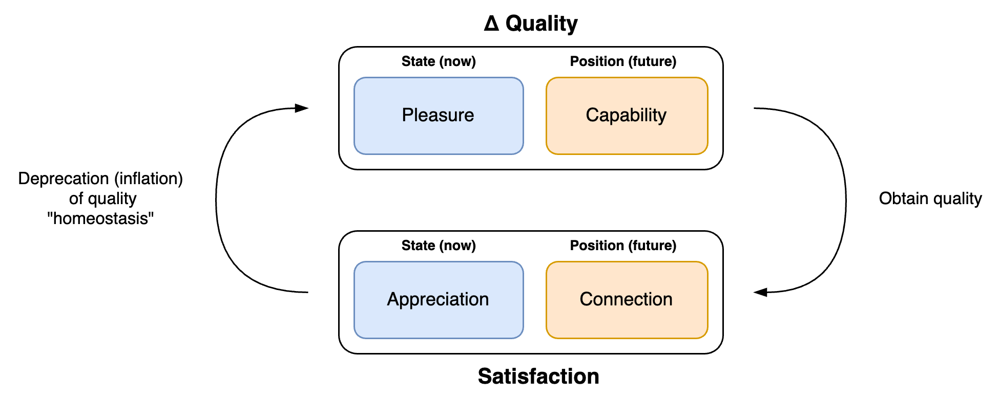
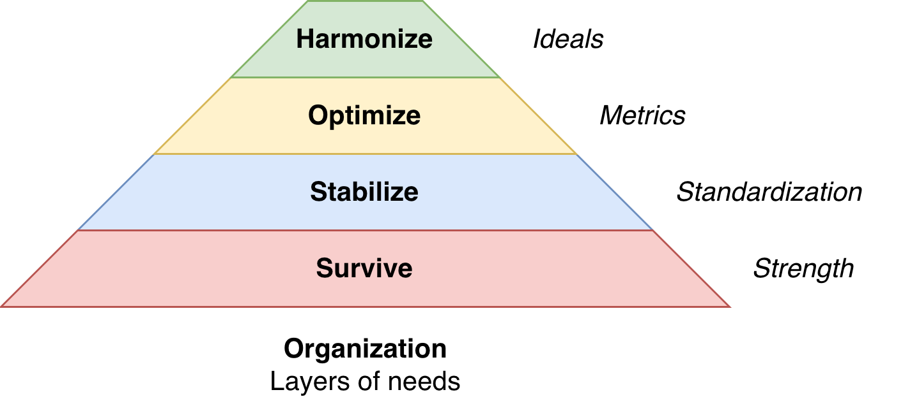

# Mind and Body

One of the most [controversial](https://en.wikipedia.org/wiki/Mind%E2%80%93body_problem) subjects is the relation between the mind and the human body. Both are studied in the academic fields psychology and biology. Consciousness itself is not yet understood by science.

[toc]

## Overview

Biologically, the mind is contingent upon the brain and the [nervous system](nervous-system.md). 

## Triune Brain

This [model](https://en.wikipedia.org/wiki/Triune_brain) distinguishes three functional layers that complement each other. They follow the evolutionairy progression from reptiles to mammals.

|                 | Reptillian Brain                                      | Limbic Brain                                                 | Neocortex                                                    |
| --------------- | ----------------------------------------------------- | ------------------------------------------------------------ | ------------------------------------------------------------ |
| **Core**        | Core, autonomous (life sustaining) functioning        | Senses, feelings, memory                                     | Language and imagination                                     |
| **Examples**    | Breathing, sleeping                                   | Fight and flight responses                                   | [Executive functions](https://en.wikipedia.org/wiki/Executive_functions) |
| **Formal name** | [Brain stem](https://en.wikipedia.org/wiki/Brainstem) | [Paleomamalian cortex](https://en.wikipedia.org/wiki/Limbic_system) | Neomamalian brain                                            |

Development

- The reptilian section brain is developed before childbirth.
- The mamalian sections of the brain are developed in early childhood. E.g. a baby that explores the world.

### Desire

The triune brain can be mapped to the [4-domains](../metaphysics/domains.md) model. Consider two core [desires](../subjects/desire.md):

- Satisfaction. Whether your needs are met.
- Δ Pleasure. Change in pleasure. More pleasure and less pain.

|                  | Reptillian Brain     | Limbic Brain                    | Neocortex                |
| ---------------- | -------------------- | ------------------------------- | ------------------------ |
| **Satisfaction** | Biological needs     | Social needs, connection        | Intellectual needs       |
| **Δ Pleasure**   | Reproduction, habits | Attention, appreciation, status | Discovery, understanding |

## Chakras

Chakras are a model that connects matter and spirit. It connects the material to the immaterial, mind and body, subject and object. The connection is bidirectional:

- **Embodiment**. From virtual (spirit) to real. From immaterial to material.
  - Theme: Grounding, static patterns. Safety, stability, security.
- **Transcendence**. From material to immaterial. From mortal to immortal.
  - Theme: Universality, freedom, liberation. *Het ongrijpbare*

Their are seven chakras, located near the major ganglia.

|       |      | Location              | Right    | Theme                       | Purpose           | Value                 | Demon       |
| ----- | ---- | --------------------- | -------- | --------------------------- | ----------------- | --------------------- | ----------- |
| **1** | 🔴    | Coccyx (Tailbone)     | To be    | Survival, safety, stability | Self-preservation | Grounding             | Fear        |
| **2** | 🟠    | Root of genitals      | To feel  | Sex, desire                 | Satisfaction      | Feeling               | Guilt       |
| **3** | 🟡    | Celiac plexus (Navel) | To act   | Macht, *wil*                | Agency            | Assertiveness, focus  | Shame       |
| **4** | 🟢    | Near Heart            | To love  | Love, relations             | Self-acceptance   | Balance               | Sadness     |
| **5** | 🔵    | Throat                | To speak | (Verbal) Communication      | Self-expression   | Clarity, transparency | Lies        |
| **6** | 🟣    | Forehead              | To see   | Intuition, imagination      | Self-reflection   | Imagination           | Illusion    |
| **7** | 🟣    | Crown                 | To know  | Consciousness               | Self-conscious    | Wisdom                | Attachement |

### Other Needs

See [desire (organizations)](systems/desire.md).

