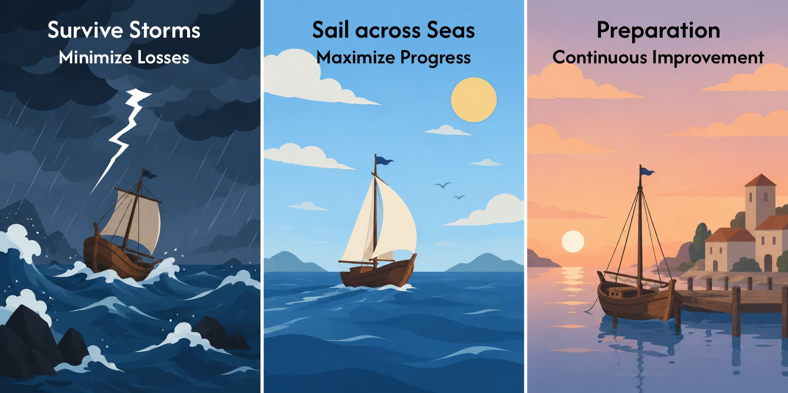
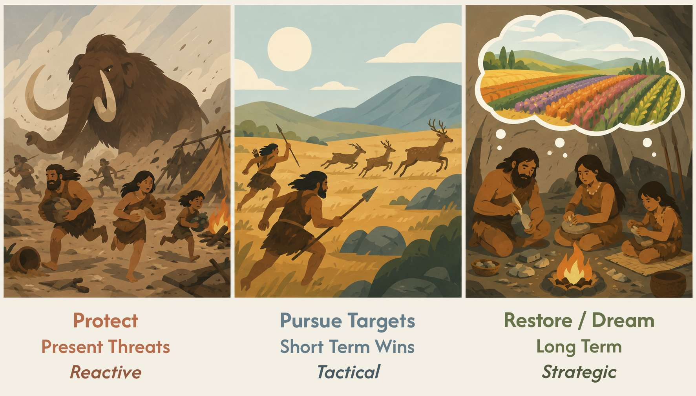

# Threat/Drive/Calm System

See the [Three Systems Model](https://balancedminds.com/three-system-model/).

| Threat System          | Drive System               | Calm System |
| ---------------------- | -------------------------- | ----------- |
| React to threats       | Progress towards rewards   | Relax       |
| Fight/flight responses | Dopamine seeking behaviour | Peace, rest |

Notes

- Dreaming and imagination would fit in the calm system.
- Sexual arousal can fit in all three systems. The drive system is the most typical, as the body is activated and full of desire. The calm system will be active in more softer forms. Activation of the threat system can work in tow fashions. To heighten arousal (excitement) or to produce anxiety or other stressful emotions.

### Analogy: Ships

### Analogy: Hunter-Gatherers

From present threats to future potential.

## Fight/Flight Responses

The threat system can be decomposed into **fight/flight/freeze/fawn** responses.

